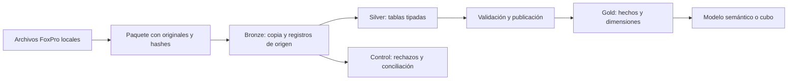

# C34 · Visual FoxPro a SQL Server

Proyecto de integración de datos para migrar una base de Visual FoxPro (`DBF` y `FPT`) a SQL Server y preparar un modelo analítico de contabilidad, compras y ventas con arquitectura **Medallion: Bronze → Silver → Gold**.

El repositorio contiene código Python, scripts SQL y documentación de uso. **Los datos originales, paquetes de carga, reportes de perfilado y credenciales son locales y están excluidos de Git.**

## Estado del proyecto

- Extracción local de DBF/FPT con conservación de originales y hashes.
- Carga de Bronze y transformación a tablas Silver con trazabilidad y registro de rechazos.
- Scripts de relaciones candidatas para Silver, sujetos a validación de negocio.
- Modelo dimensional inicial de Gold implementado principalmente con **vistas**. `gold.DimFecha` es una tabla física.
- La conversión de Gold a tablas físicas y su ETL de actualización es una siguiente etapa; todavía no está implementada.
- La carga y ejecución de SQL se realizan manualmente por el usuario. Las comprobaciones locales no sustituyen la validación en SQL Server.

## Arquitectura



| Capa | Función |
|---|---|
| Bronze | Conservar los archivos originales, registros físicos, marca de eliminado, metadatos y errores de lectura |
| Silver | Interpretar tipos, memos y NULL de FoxPro; separar filas ilegibles y mantener vínculos con Bronze |
| Gold | Presentar cabeceras y movimientos contables con dimensiones de empresa, fecha, período, cuenta, operación y moneda |
| Control | Registrar conciliaciones, rechazos y la versión publicada de cada empresa/ejercicio |

La implementación utiliza una base SQL Server con esquemas separados. Aplica el patrón Medallion de forma relacional; no crea infraestructura de Fabric, Databricks ni un lakehouse.

## Estructura

```text
.
├── README.md
├── requirements.txt
├── .gitignore
├── .gitattributes
├── scripts/
│   ├── analisis/
│   │   ├── inventariar_dbf.py
│   │   ├── generar_modelo.py
│   │   └── revisar_cobertura.py
│   └── etl/
│       ├── preparar_paquete.py
│       ├── cargar.py
│       ├── esquema.py
│       ├── generar_ddl.py
│       ├── test_conexion.py
│       └── verificar_local.py
├── sql/
│   ├── medallion/
│   │   ├── 00_crear_base.sql
│   │   ├── 01_crear_capas.sql
│   │   ├── 02_modelo_gold.sql
│   │   ├── 03_relaciones_silver_opcionales.sql
│   │   └── 04_verificar_y_publicar.sql
│   └── referencia/
│       └── C34_tablas_relaciones.sql
├── C34Data/                  # Local: archivos FoxPro e inventario
├── config/                   # Local: conexion.json
├── local/                    # Local: paquetes, reportes y archivo anterior
└── .venv/                    # Local: entorno Python
```

Las carpetas locales no se incluyen al clonar el repositorio: deben crearse o recibirse por el canal autorizado para los datos.

`scripts/etl/esquema.py` es el contrato de estructura usado por el cargador. Solo contiene definiciones de columnas y relaciones; no contiene registros, estadísticas ni credenciales. Está versionado para que el cargador no dependa de un reporte privado.

## Requisitos

- Python 3.10 o posterior con entorno virtual.
- SQL Server 2022 como motor objetivo y SSMS para ejecutar los scripts.
- Microsoft ODBC Driver 18 for SQL Server.
- Dependencias Python de `requirements.txt`.
- Copia autorizada de los archivos DBF y FPT correspondientes al ejercicio.

SQL Server 2022 corresponde al motor 16.x. La versión de SSMS es independiente; el primer script permite consultar la versión del servidor.

Desde PowerShell, situado en la raíz del proyecto:

```powershell
# Crear el entorno solo si no existe.
py -m venv .venv
.\.venv\Scripts\python.exe -m pip install -r requirements.txt
```

No es necesario activar el entorno: los comandos usan su ejecutable directamente.

## Configurar la conexión

Crea `config/conexion.json`. Este archivo está excluido de Git.

```json
{
  "servidor": "localhost\\SQLEXPRESS",
  "base": "C34_BI",
  "driver": "ODBC Driver 18 for SQL Server",
  "autenticacion": "windows",
  "usuario": "",
  "confiar_certificado_local": false
}
```

El servidor es un ejemplo; utiliza el nombre de instancia con el que te conectas en SSMS. Para autenticación SQL, cambia `autenticacion` a `sql` y completa `usuario`. El programa solicita la contraseña por consola sin guardarla.

La conexión usa cifrado. Si una instancia local de laboratorio utiliza un certificado autofirmado, `confiar_certificado_local: true` permite conectarse omitiendo su validación. Para un servidor compartido utiliza la configuración de certificados indicada por su administrador.

Una vez creada la base, puedes probar la conexión sin cargar datos:

```powershell
.\.venv\Scripts\python.exe scripts\etl\test_conexion.py
```

## Crear el modelo SQL

Ejecuta manualmente en SSMS, en este orden:

1. `sql/medallion/00_crear_base.sql`: consulta el motor y crea `C34_BI` si no existe.
2. `sql/medallion/01_crear_capas.sql`: crea las capas y sus tablas. Se ejecuta una sola vez; no es una migración incremental de esquema.
3. `sql/medallion/02_modelo_gold.sql`: crea las vistas Gold y `control.PublicarGold`.

El SQL de `sql/referencia/` es el modelo previo en el esquema `c34`. No es necesario ejecutarlo para utilizar Medallion.

Si cambias el nombre de base, actualízalo tanto en los scripts SQL como en `config/conexion.json`. Los scripts no se ejecutan por el hecho de abrir o clonar este repositorio.

## Preparar y cargar un ejercicio

Ejemplo para los archivos originales guardados localmente en `C34Data/tempc34`:

```powershell
# Extracción local. No conecta a SQL Server.
.\.venv\Scripts\python.exe scripts\etl\preparar_paquete.py --origen C34Data\tempc34 --salida local\paquetes\2020

# Validación local. No conecta a SQL Server.
.\.venv\Scripts\python.exe scripts\etl\cargar.py validar-paquete --paquete local\paquetes\2020

# Estos dos comandos SÍ cargan datos en SQL Server.
.\.venv\Scripts\python.exe scripts\etl\cargar.py bronze --paquete local\paquetes\2020 --empresa C34 --ejercicio 2020
.\.venv\Scripts\python.exe scripts\etl\cargar.py silver --lote 1
```

Sustituye `1` por el **LoteId real** que imprime Bronze. El identificador de empresa debe permanecer estable entre ejercicios. Si el paquete ya está preparado, omite la extracción: el programa no sobrescribe una carpeta existente.

Bronze conserva el ZIP original y una representación de cada registro. Silver lee desde Bronze, interpreta los tipos y envía las filas con errores conocidos a `control.Rechazo`. Una carga fallida revierte su transacción; una carga ya completada se reconoce para evitar duplicados.

## Relaciones y publicación

Después de cargar Silver:

1. Revisa conciliaciones y rechazos con el paso A de `04_verificar_y_publicar.sql`.
2. Confirma las relaciones propuestas. `03_relaciones_silver_opcionales.sql` solo las aplica cuando cambias `@Aplicar` de `0` a `1`; SQL Server comprueba los datos con `WITH CHECK`.
3. Publica el lote manualmente:

```sql
USE [C34_BI];
EXEC control.PublicarGold @LoteId=1;
```

4. Ejecuta las consultas posteriores de `04_verificar_y_publicar.sql` para comparar conteos e importes de Silver y Gold.

Antes de publicar, el procedimiento comprueba claves, referencias y ejercicio de las tablas necesarias para Gold. Los problemas de negocio de otras áreas requieren revisión adicional; cargar Silver no certifica todas las relaciones del origen.

Gold permanece vacío hasta publicar. Sus objetos principales están en **Views** de SSMS, excepto `gold.DimFecha`, que está en **Tables**.

## Modelo analítico

- `gold.FactAsiento`: una cabecera contable.
- `gold.FactMovimientoContable`: una línea contable, con trazabilidad a su cabecera.
- Dimensiones compartidas: empresa, fecha, período y operación. Cuenta y moneda se relacionan con el detalle.
- `gold.VentasRegistradas` y `gold.ComprasRegistradas`: vistas de cabeceras clasificadas según el catálogo de operaciones.

El conjunto es una constelación de estrellas. La futura construcción de tablas Gold físicas o de un cubo/modelo semántico debe mantener esos niveles de detalle.

No sumes el total de una cabecera después de unirla a sus líneas: se repetiría por cada detalle. Los importes conservan su significado de origen; antes de certificar indicadores, confirma moneda, signos, anulaciones y tratamiento de apertura/cierre. No se genera un hecho de inventario sin movimientos por producto suficientes.

## Incorporar otros años

Guarda cada entrega en una carpeta independiente, prepara otro paquete y repite Bronze → Silver → publicación con el ejercicio correspondiente. No recrees las tablas por cada año.

- Conserva empresa, año y lote para evitar colisiones entre números de operación.
- Confirma si la entrega es anual, acumulada o una corrección.
- Si cambian las columnas o tipos, Silver se detiene; revisa el esquema antes de continuar.
- Las versiones corregidas pueden publicarse con `@ReemplazarPublicacion=1`, después de revisar sus diferencias. Los lotes anteriores permanecen conservados y Gold muestra la versión elegida.
- El generador DDL no sustituye una migración de esquema de una base que ya tiene datos.

## Análisis local y regeneración

Los scripts de análisis usan por defecto `C34Data/tempc34` y guardan los reportes privados en `local/reportes`:

```powershell
.\.venv\Scripts\python.exe scripts\analisis\inventariar_dbf.py
.\.venv\Scripts\python.exe scripts\analisis\generar_modelo.py
.\.venv\Scripts\python.exe scripts\analisis\revisar_cobertura.py
```

El inventario inicial puede omitir una tabla que tenga errores de lectura; el perfilado posterior registra errores por campo y es el que usa la preparación de paquetes.

Para regenerar el DDL y el contrato de estructura desde `local/reportes/perfil.json`:

```powershell
.\.venv\Scripts\python.exe scripts\etl\generar_ddl.py
```

La auditoría `scripts/etl/verificar_local.py` está orientada a la copia inicial de 2020 y comprueba sus resultados esperados. Para una nueva entrega usa primero `cargar.py validar-paquete`; los controles de 2020 no deben tomarse como valores esperados de otros ejercicios.

## Publicación en GitHub

`.gitignore` utiliza una lista de archivos permitidos. Solo se proponen para versionado:

- Scripts `.py` dentro de `scripts/`.
- Consultas y DDL `.sql` dentro de `sql/`.
- Este README, dependencias y configuración de Git.

Quedan excluidos `C34Data/`, `config/`, `local/`, `.venv/`, paquetes, JSON de datos, logs, cachés y otros archivos no permitidos. No coloques contraseñas ni registros privados dentro de archivos de código permitidos, ni uses `git add -f` sobre carpetas privadas.

Antes de preparar tu commit, revisa:

```powershell
git status --short
git ls-files --others --exclude-standard
git diff --stat
```

Los archivos que ya estuvieron en commits anteriores no desaparecen del historial por añadir una exclusión. Esta reorganización no reescribe el historial ni realiza commits o publicaciones.
