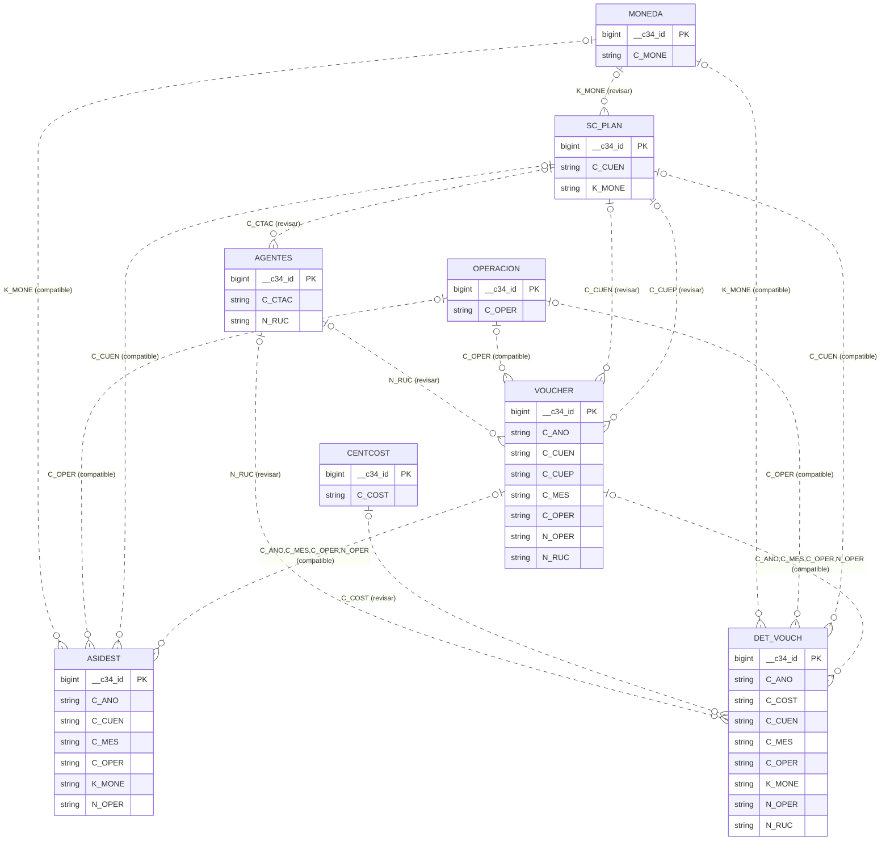
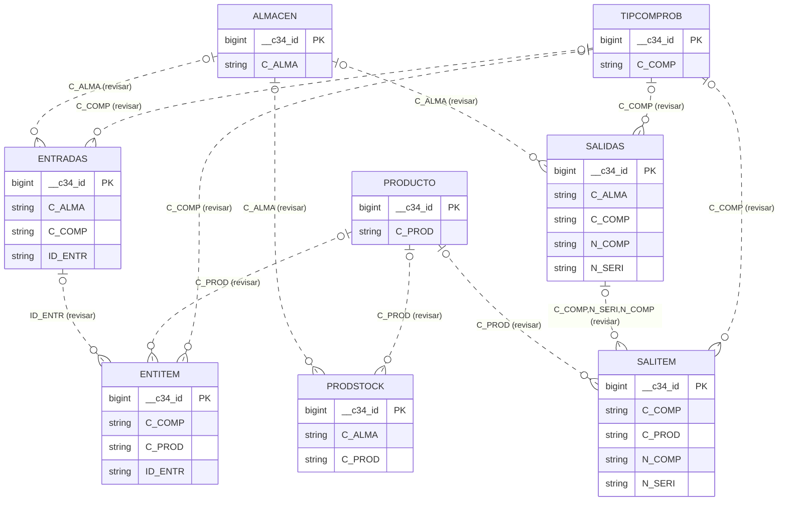
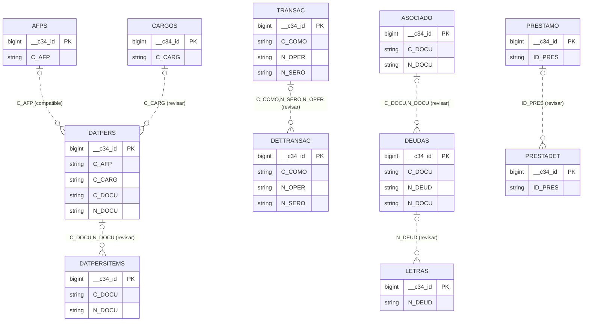

# C34: plan de migración y modelo entidad-relación

Fecha: 8 de octubre de 2026. Fuente: `C34Data/tempc34` y `C34Data/inventario_dbf.csv`.

## Alcance y resultado del procesamiento

Se leyeron las 110 tablas DBF y sus memos FPT. Hay **22,026 registros activos**, **0 registros marcados como eliminados** y **55 tablas vacías**. Se detectaron **1 errores de interpretación** en registros activos. Las 30 diferencias de estructura/conteo con el inventario se detallan abajo.

Se generó el esquema SQL, sin conectar a SQL Server ni cargar registros. Los DBF/FPT se abrieron en lectura y sus hashes SHA-256 no cambiaron durante el procesamiento. El detalle reproducible está en `perfil.json` y el generador en `generar_modelo.py`.

No se encontraron DBC ni CDX en la carpeta. Las relaciones son hipótesis basadas en nombres, estructura y comparación completa de claves de registros activos; no son relaciones originales recuperadas. Una coincidencia de datos no confirma por sí sola la regla de negocio. No se extraen reglas, triggers ni índices de la aplicación FoxPro.

## Hallazgos que requieren atención

- `AGENTES` no figura en el inventario original y contiene 2.069 filas. El registro físico 2020, campo `L_AGEN`, tiene el byte `0x8D`, no definido en Windows-1252. El script original captura errores por tabla y puede haber omitido esta tabla por ese motivo. Confirmar el texto con el sistema original antes de corregirlo; no usar reemplazo silencioso de caracteres.
- Las estadísticas separan errores de lectura de valores NULL. El valor ilegible no se usa para confirmar claves. No se generaron registros transformados ni se sustituyeron datos en los archivos fuente.
- `DET_VOUCH → VOUCHER`: los 7.346 detalles coinciden con una cabecera mediante `(C_AÑO, C_MES, C_OPER, N_OPER)` y la clave de cabecera es única en la copia.
- `AGENTES.N_RUC` tiene 39 repeticiones adicionales respecto de valores distintos, contando vacíos. No se puede imponer como clave única sin revisar la identificación de agentes.
- `CTAPDT.C_CUEN → SC_PLAN.C_CUEN` deja 21 filas sin correspondencia; `AGENTES.C_UBIG → UBIGEO.C_UBIG`, 54; `BIENES → VOUCHER`, 10. Pueden ser problemas de datos o hipótesis de relación incorrectas.
- `VOUCHER.C_ISLA → ISLAS.C_ISLA` deja 1.453 referencias sin padre; `ISLAS` está vacía. Confirmar si son códigos predeterminados o si falta ese catálogo.

## Plan de trabajo

| Etapa | Trabajo y criterio de salida | Estado |
|---|---|---|
| 1. Diagnóstico | Leer cabeceras, tipos, memos, bitmap NULL, conteos y contrastar inventario | Realizado |
| 2. Modelo inicial | Crear las 110 tablas, proponer relaciones simples y compuestas, medir duplicados y huérfanos | Realizado; semántica pendiente |
| 3. Confirmación funcional | Confirmar claves, relaciones, ámbito de empresa/año, códigos vacíos y registros eliminados con el sistema original | Pendiente |
| 4. Preparar SQL Server | Elegir instancia/base y ejecutar sección 1 del SQL en una base de desarrollo | Lo realizará el usuario |
| 5. ETL | Cargar primero maestros y luego cabeceras/detalles; lectura decimal exacta, Unicode, fechas y NULL; registrar rechazos | Pendiente |
| 6. Conciliación | Comparar filas por tabla, nulos, sumas monetarias por moneda/período y documentos, claves duplicadas y huérfanos | Pendiente |
| 7. Integridad | Aplicar UNIQUE/FK aprobadas con WITH CHECK; diseñar índices según consultas reales | Pendiente |
| 8. Puesta en servicio | Copia estable final, repetir conciliación, respaldo, cambio de aplicación y posibilidad de retorno | Pendiente |

## Decisiones de diseño

- Esquema SQL `c34`; nombres originales, incluida la Ñ de `C_AÑO`. Se añade `__c34_id bigint IDENTITY` como PK técnica independiente de las claves del negocio.
- `C` → `nvarchar(n)`; `N` → `decimal(longitud, decimales)`; `I` → `int`; `D` → `date`; `T` → `datetime2(3)`; `L` → `bit`; `M` → `nvarchar(max)` o binario según bandera. La longitud numérica incluye signo/separador en DBF: usarla como precisión SQL deja margen sin reducir los dígitos.
- Codificación indicada en las 110 cabeceras: Windows-1252. Se utiliza decodificación estricta. Se conservan los ceros iniciales de códigos/documentos. Validar visualmente nombres y textos en la futura carga.
- Los campos originales se crean nullable para la carga inicial. Esto no afirma que todos sean opcionales en el negocio. El diccionario muestra la bandera nullable original.
- `_NullFlags` es un bitmap interno, no una entidad ni una clave. Se conserva como varbinary para trazabilidad y se aplica al leer valores; el importador futuro también debe hacerlo.
- La comparación de claves conserva mayúsculas y acentos. El DDL usa `Latin1_General_100_BIN2`. El perfil solo retira espacios finales de claves; no normaliza ni corrige datos.
- El perfil de relaciones excluye filas marcadas como eliminadas; se contabilizan aparte y no se han interpretado sus campos. Confirmar su política de conservación antes de cargar.
- No se agregan eliminaciones en cascada. Las FK y UNIQUE candidatas están separadas de la creación inicial.

## Cómo usar el archivo SQL

1. Abrir `C34_tablas_relaciones.sql` en SSMS y seleccionar la base de desarrollo. El script no crea la base ni contiene INSERT.
2. Ejecutar la sección 1 para crear todas las tablas dentro de una transacción. Si existe una tabla con ese nombre en `c34`, se detiene sin sobrescribirla.
3. Cargar y conciliar los datos cuando se prepare el ETL. Los campos `__c34_id` los genera SQL Server.
4. Revisar funcionalmente cada relación compatible. Ejecutar solo la sección 2, con `@AplicarRelaciones = 1`, para agregar sus UNIQUE/FK. Por defecto vale 0. No ejecutar otra vez la sección 1.
5. La sección 3 contiene propuestas comentadas que requieren resolver huérfanos, vacíos, tipos o falta de evidencia. Antes de activarlas hay que definir una clave UNIQUE válida del padre.

El SQL se revisó por correspondencia con los metadatos y cobertura de tablas/campos. No se ha ejecutado ni compilado en un motor SQL Server. Las FK se comprueban nuevamente al aplicarlas; su activación repetida requiere gestionar los nombres ya existentes.

## Evidencia de relaciones

| Estado | Cantidad | Interpretación |
|---|---:|---|
| CLAVE_PADRE_NO_VALIDA | 9 | La clave del padre contiene duplicados o vacíos. |
| COMPATIBLE_EN_DATOS | 34 | Padre único/completo, tipos iguales, claves hijas completas y sin huérfanos; pendiente confirmación funcional. |
| HUERFANOS | 6 | Hay claves hijas que no existen en el padre propuesto. |
| REVISAR_VACIOS | 9 | Hay claves hijas vacías; definir opcionalidad/normalización. |
| SIN_EVIDENCIA | 150 | No hay suficientes filas pobladas para validar. |

Los conteos de huérfanos son filas, no valores distintos. Las claves vacías se cuentan aparte y no se confunden con coincidencias válidas. Las claves compuestas se comparan completas.

## Diagramas entidad-relación por área

Las líneas discontinuas representan relaciones propuestas, no restricciones activas. La cardinalidad `0..1` a `0..N` es la cardinalidad de diseño candidata, pendiente validación. Un diagrama no corrige los problemas registrados en la matriz. Se incluyen los vínculos principales para que sea legible; la matriz posterior contiene todas las candidatas y el diccionario todas las tablas.

### Contabilidad

### Compras, ventas e inventario

### Personas y financiamiento

En los diagramas se usa `N` por `Ñ` solo en las etiquetas técnicas para portabilidad. `string` es una representación simplificada; los tipos exactos están en el diccionario y en SQL.

## Matriz completa de relaciones propuestas

| Hija (campos) | Padre (campos) | Estado | Evaluadas | Vacías hija | Huérfanas | Duplicadas padre | Vacías padre |
|---|---|---|---:|---:|---:|---:|---:|
| DATPERS (C_AFP) | AFPS (C_AFP) | COMPATIBLE_EN_DATOS | 15 | 0 | 0 | 0 | 0 |
| IMPOAFPS (C_AFP) | AFPS (C_AFP) | COMPATIBLE_EN_DATOS | 132 | 0 | 0 | 0 | 0 |
| ITEMINGEGR (C_AFP) | AFPS (C_AFP) | REVISAR_VACIOS | 5 | 16 | 0 | 0 | 0 |
| CTACTE (N_RUC) | AGENTES (N_RUC) | CLAVE_PADRE_NO_VALIDA | 1 | 0 | 0 | 39 | 0 |
| DET_VOUCH (N_RUC) | AGENTES (N_RUC) | CLAVE_PADRE_NO_VALIDA | 7011 | 335 | 0 | 39 | 0 |
| ENTRADAS (N_RUC) | AGENTES (N_RUC) | CLAVE_PADRE_NO_VALIDA | 0 | 0 | 0 | 39 | 0 |
| LISTCOMPA (N_RUC) | AGENTES (N_RUC) | CLAVE_PADRE_NO_VALIDA | 0 | 0 | 0 | 39 | 0 |
| PRESTAMO (N_RUC) | AGENTES (N_RUC) | CLAVE_PADRE_NO_VALIDA | 0 | 0 | 0 | 39 | 0 |
| SALIDAS (N_RUC) | AGENTES (N_RUC) | CLAVE_PADRE_NO_VALIDA | 0 | 0 | 0 | 39 | 0 |
| VOUCHER (N_RUC) | AGENTES (N_RUC) | CLAVE_PADRE_NO_VALIDA | 1429 | 99 | 0 | 39 | 0 |
| AGRESPRO (N_RUC, N_ITEM, N_CRED) | AGRECRED (N_RUC, N_ITEM, N_CRED) | SIN_EVIDENCIA | 0 | 0 | 0 | 0 | 0 |
| ENTRADAS (C_ALMA) | ALMACEN (C_ALMA) | SIN_EVIDENCIA | 0 | 0 | 0 | 0 | 0 |
| PRODSTOCK (C_ALMA) | ALMACEN (C_ALMA) | SIN_EVIDENCIA | 0 | 0 | 0 | 0 | 0 |
| SALIDAS (C_ALMA) | ALMACEN (C_ALMA) | SIN_EVIDENCIA | 0 | 0 | 0 | 0 | 0 |
| SISPROP (C_ALMA) | ALMACEN (C_ALMA) | COMPATIBLE_EN_DATOS | 1 | 0 | 0 | 0 | 0 |
| ALMCOMB (C_TANQ) | ALMCOMBCA (C_TANQ) | SIN_EVIDENCIA | 0 | 0 | 0 | 0 | 0 |
| SURTIDOR (C_TANQ) | ALMCOMBCA (C_TANQ) | SIN_EVIDENCIA | 0 | 0 | 0 | 0 | 0 |
| DEUDAS (C_DOCU, N_DOCU) | ASOCIADO (C_DOCU, N_DOCU) | SIN_EVIDENCIA | 0 | 0 | 0 | 0 | 0 |
| MEDICION (C_DOCU, N_DOCU) | ASOCIADO (C_DOCU, N_DOCU) | SIN_EVIDENCIA | 0 | 0 | 0 | 0 | 0 |
| SC_PLAN (C_BANC) | BANCOS (C_BANC) | REVISAR_VACIOS | 1 | 5188 | 0 | 0 | 0 |
| TRANSAC (C_BANC) | BANCOS (C_BANC) | SIN_EVIDENCIA | 0 | 0 | 0 | 0 | 0 |
| DEPBIEN (C_BIEN) | BIENES (C_BIEN) | COMPATIBLE_EN_DATOS | 204 | 0 | 0 | 0 | 0 |
| DATPERS (C_CARG) | CARGOS (C_CARG) | SIN_EVIDENCIA | 0 | 15 | 0 | 0 | 0 |
| DATPERSITEMS (C_COST) | CENTCOST (C_COST) | SIN_EVIDENCIA | 0 | 0 | 0 | 0 | 0 |
| DET_VOUCH (C_COST) | CENTCOST (C_COST) | SIN_EVIDENCIA | 0 | 7346 | 0 | 0 | 0 |
| ENTITEM (C_COST) | CENTCOST (C_COST) | SIN_EVIDENCIA | 0 | 0 | 0 | 0 | 0 |
| ENTRADAS (C_COST) | CENTCOST (C_COST) | SIN_EVIDENCIA | 0 | 0 | 0 | 0 | 0 |
| SALIDAS (C_COST) | CENTCOST (C_COST) | SIN_EVIDENCIA | 0 | 0 | 0 | 0 | 0 |
| SALITEM (C_COST) | CENTCOST (C_COST) | SIN_EVIDENCIA | 0 | 0 | 0 | 0 | 0 |
| ENTRADAS (C_TRAN) | CONDUCTOR (C_TRAN) | SIN_EVIDENCIA | 0 | 0 | 0 | 0 | 0 |
| SALIDAS (C_TRAN) | CONDUCTOR (C_TRAN) | SIN_EVIDENCIA | 0 | 0 | 0 | 0 | 0 |
| DETCTACTE (N_DEUD) | CTACTE (N_DEUD) | COMPATIBLE_EN_DATOS | 1 | 0 | 0 | 0 | 0 |
| DATPERSITEMS (C_DOCU, N_DOCU) | DATPERS (C_DOCU, N_DOCU) | SIN_EVIDENCIA | 0 | 0 | 0 | 0 | 0 |
| PRODUCTO (C_DES1) | DESPROD1 (C_DES1) | SIN_EVIDENCIA | 0 | 1 | 0 | 0 | 0 |
| PRODUCTO (C_DES2) | DESPROD2 (C_DES2) | SIN_EVIDENCIA | 0 | 1 | 0 | 0 | 0 |
| PRODUCTO (C_DES3) | DESPROD3 (C_DES3) | SIN_EVIDENCIA | 0 | 1 | 0 | 0 | 0 |
| PRODUCTO (C_DES4) | DESPROD4 (C_DES4) | SIN_EVIDENCIA | 0 | 1 | 0 | 0 | 0 |
| PRODUCTO (C_DES5) | DESPROD5 (C_DES5) | SIN_EVIDENCIA | 0 | 1 | 0 | 0 | 0 |
| LETRAS (N_DEUD) | DEUDAS (N_DEUD) | SIN_EVIDENCIA | 0 | 0 | 0 | 0 | 0 |
| ENTITEM (ID_ENTR) | ENTRADAS (ID_ENTR) | SIN_EVIDENCIA | 0 | 0 | 0 | 0 | 0 |
| CAJA (C_ISLA) | ISLAS (C_ISLA) | SIN_EVIDENCIA | 0 | 0 | 0 | 0 | 0 |
| REGCRON (C_ISLA) | ISLAS (C_ISLA) | SIN_EVIDENCIA | 0 | 0 | 0 | 0 | 0 |
| SALIDAS (C_ISLA) | ISLAS (C_ISLA) | SIN_EVIDENCIA | 0 | 0 | 0 | 0 | 0 |
| SURTIDOR (C_ISLA) | ISLAS (C_ISLA) | SIN_EVIDENCIA | 0 | 0 | 0 | 0 | 0 |
| VOUCHER (C_ISLA) | ISLAS (C_ISLA) | HUERFANOS | 1453 | 75 | 1453 | 0 | 0 |
| MATASIEDET (C_MATR) | MATASIE (C_MATR) | SIN_EVIDENCIA | 0 | 0 | 0 | 0 | 0 |
| VOUCHER (C_MATR) | MATASIE (C_MATR) | SIN_EVIDENCIA | 0 | 1528 | 0 | 0 | 0 |
| CONCEPTO (C_META) | METAPPTO (C_META) | SIN_EVIDENCIA | 0 | 0 | 0 | 0 | 0 |
| DET_VOUCH (C_META) | METAPPTO (C_META) | SIN_EVIDENCIA | 0 | 7346 | 0 | 0 | 0 |
| ENTITEM (C_META) | METAPPTO (C_META) | SIN_EVIDENCIA | 0 | 0 | 0 | 0 | 0 |
| PRESPTO (C_META) | METAPPTO (C_META) | SIN_EVIDENCIA | 0 | 0 | 0 | 0 | 0 |
| ASIDEST (K_MONE) | MONEDA (C_MONE) | COMPATIBLE_EN_DATOS | 586 | 0 | 0 | 0 | 0 |
| BIENES (K_MONEC) | MONEDA (C_MONE) | SIN_EVIDENCIA | 0 | 17 | 0 | 0 | 0 |
| CONCEPTO (K_MONE) | MONEDA (C_MONE) | SIN_EVIDENCIA | 0 | 0 | 0 | 0 | 0 |
| CONCPAGOS (K_MONE) | MONEDA (C_MONE) | SIN_EVIDENCIA | 0 | 0 | 0 | 0 | 0 |
| CTACTE (K_MONE) | MONEDA (C_MONE) | COMPATIBLE_EN_DATOS | 1 | 0 | 0 | 0 | 0 |
| DATPERS (K_MONE) | MONEDA (C_MONE) | SIN_EVIDENCIA | 0 | 15 | 0 | 0 | 0 |
| DETCTACTE (K_MONE) | MONEDA (C_MONE) | COMPATIBLE_EN_DATOS | 1 | 0 | 0 | 0 | 0 |
| DETTRANSAC (K_MONE) | MONEDA (C_MONE) | SIN_EVIDENCIA | 0 | 0 | 0 | 0 | 0 |
| DET_VOUCH (K_MONE) | MONEDA (C_MONE) | COMPATIBLE_EN_DATOS | 7346 | 0 | 0 | 0 | 0 |
| DEUDAS (K_MONE) | MONEDA (C_MONE) | SIN_EVIDENCIA | 0 | 0 | 0 | 0 | 0 |
| ENTRADAS (K_MONE) | MONEDA (C_MONE) | SIN_EVIDENCIA | 0 | 0 | 0 | 0 | 0 |
| LETRAS (K_MONE) | MONEDA (C_MONE) | SIN_EVIDENCIA | 0 | 0 | 0 | 0 | 0 |
| PRESTAMO (K_MONE) | MONEDA (C_MONE) | SIN_EVIDENCIA | 0 | 0 | 0 | 0 | 0 |
| PRODUCTO (K_MONE) | MONEDA (C_MONE) | SIN_EVIDENCIA | 0 | 1 | 0 | 0 | 0 |
| RENDCAJA (K_MONE) | MONEDA (C_MONE) | SIN_EVIDENCIA | 0 | 0 | 0 | 0 | 0 |
| SALIDAS (K_MONE) | MONEDA (C_MONE) | SIN_EVIDENCIA | 0 | 0 | 0 | 0 | 0 |
| SC_PLAN (K_MONE) | MONEDA (C_MONE) | REVISAR_VACIOS | 1 | 5188 | 0 | 0 | 0 |
| SISPROP (K_MONE) | MONEDA (C_MONE) | COMPATIBLE_EN_DATOS | 1 | 0 | 0 | 0 | 0 |
| DET_VOUCH (K_MOVI) | MVTOCTA (K_MOVI) | SIN_EVIDENCIA | 0 | 7346 | 0 | 0 | 0 |
| REGCHEQS (K_MOVI) | MVTOCTA (K_MOVI) | SIN_EVIDENCIA | 0 | 0 | 0 | 0 | 0 |
| ASIDEST (C_OPER) | OPERACION (C_OPER) | COMPATIBLE_EN_DATOS | 586 | 0 | 0 | 0 | 0 |
| BIENES (C_OPER) | OPERACION (C_OPER) | REVISAR_VACIOS | 13 | 4 | 0 | 0 | 0 |
| CONCEPTO (C_OPER) | OPERACION (C_OPER) | SIN_EVIDENCIA | 0 | 0 | 0 | 0 | 0 |
| CTACTE (C_OPER) | OPERACION (C_OPER) | COMPATIBLE_EN_DATOS | 1 | 0 | 0 | 0 | 0 |
| DATPERSITEMS (C_OPER) | OPERACION (C_OPER) | SIN_EVIDENCIA | 0 | 0 | 0 | 0 | 0 |
| DEPBIEN (C_OPER) | OPERACION (C_OPER) | REVISAR_VACIOS | 72 | 132 | 0 | 0 | 0 |
| DETCTACTE (C_OPER) | OPERACION (C_OPER) | COMPATIBLE_EN_DATOS | 1 | 0 | 0 | 0 | 0 |
| DETTRANSAC (C_OPER) | OPERACION (C_OPER) | SIN_EVIDENCIA | 0 | 0 | 0 | 0 | 0 |
| DET_VOUCH (C_OPER) | OPERACION (C_OPER) | COMPATIBLE_EN_DATOS | 7346 | 0 | 0 | 0 | 0 |
| ENTITEM (C_OPER) | OPERACION (C_OPER) | SIN_EVIDENCIA | 0 | 0 | 0 | 0 | 0 |
| ENTRADAS (C_OPER) | OPERACION (C_OPER) | SIN_EVIDENCIA | 0 | 0 | 0 | 0 | 0 |
| FORMATO3_13 (C_OPER) | OPERACION (C_OPER) | SIN_EVIDENCIA | 0 | 0 | 0 | 0 | 0 |
| FORMATO3_14 (C_OPER) | OPERACION (C_OPER) | SIN_EVIDENCIA | 0 | 0 | 0 | 0 | 0 |
| FORMATO3_15 (C_OPER) | OPERACION (C_OPER) | SIN_EVIDENCIA | 0 | 0 | 0 | 0 | 0 |
| FORMATO3_16 (C_OPER) | OPERACION (C_OPER) | SIN_EVIDENCIA | 0 | 0 | 0 | 0 | 0 |
| FORMATO3_19 (C_OPER) | OPERACION (C_OPER) | SIN_EVIDENCIA | 0 | 0 | 0 | 0 | 0 |
| FORMATO3_8 (C_OPER) | OPERACION (C_OPER) | SIN_EVIDENCIA | 0 | 0 | 0 | 0 | 0 |
| FORMATO3_9 (C_OPER) | OPERACION (C_OPER) | SIN_EVIDENCIA | 0 | 0 | 0 | 0 | 0 |
| LISTCOMPA (C_OPER) | OPERACION (C_OPER) | SIN_EVIDENCIA | 0 | 0 | 0 | 0 | 0 |
| REGCHEQS (C_OPER) | OPERACION (C_OPER) | SIN_EVIDENCIA | 0 | 0 | 0 | 0 | 0 |
| RENDCAJA (C_OPER) | OPERACION (C_OPER) | SIN_EVIDENCIA | 0 | 0 | 0 | 0 | 0 |
| SALIDAS (C_OPER) | OPERACION (C_OPER) | SIN_EVIDENCIA | 0 | 0 | 0 | 0 | 0 |
| SALITEM (C_OPER) | OPERACION (C_OPER) | SIN_EVIDENCIA | 0 | 0 | 0 | 0 | 0 |
| VOUCHER (C_OPER) | OPERACION (C_OPER) | COMPATIBLE_EN_DATOS | 1528 | 0 | 0 | 0 | 0 |
| PPTO_DET (C_PPTO) | PRESPTO (C_PPTO) | SIN_EVIDENCIA | 0 | 0 | 0 | 0 | 0 |
| PRESTADET (ID_PRES) | PRESTAMO (ID_PRES) | SIN_EVIDENCIA | 0 | 0 | 0 | 0 | 0 |
| AGRESPRO (C_PROD) | PRODUCTO (C_PROD) | SIN_EVIDENCIA | 0 | 0 | 0 | 0 | 0 |
| ENTITEM (C_PROD) | PRODUCTO (C_PROD) | SIN_EVIDENCIA | 0 | 0 | 0 | 0 | 0 |
| GENPVPROD (C_PROD) | PRODUCTO (C_PROD) | SIN_EVIDENCIA | 0 | 0 | 0 | 0 | 0 |
| MEDIPROD (C_PROD) | PRODUCTO (C_PROD) | COMPATIBLE_EN_DATOS | 1 | 0 | 0 | 0 | 0 |
| PRODSTOCK (C_PROD) | PRODUCTO (C_PROD) | SIN_EVIDENCIA | 0 | 0 | 0 | 0 | 0 |
| REGCRON (C_PROD) | PRODUCTO (C_PROD) | SIN_EVIDENCIA | 0 | 0 | 0 | 0 | 0 |
| SALITEM (C_PROD) | PRODUCTO (C_PROD) | SIN_EVIDENCIA | 0 | 0 | 0 | 0 | 0 |
| SURTIDOR (C_PROD) | PRODUCTO (C_PROD) | SIN_EVIDENCIA | 0 | 0 | 0 | 0 | 0 |
| SALITEM (C_COMP, N_SERI, N_COMP) | SALIDAS (C_COMP, N_SERI, N_COMP) | SIN_EVIDENCIA | 0 | 0 | 0 | 0 | 0 |
| AGENTES (C_CTAC) | SC_PLAN (C_CUEN) | SIN_EVIDENCIA | 0 | 2069 | 0 | 0 | 0 |
| ASIDEST (C_CUEN) | SC_PLAN (C_CUEN) | COMPATIBLE_EN_DATOS | 586 | 0 | 0 | 0 | 0 |
| CALCREI (C_CUEN) | SC_PLAN (C_CUEN) | SIN_EVIDENCIA | 0 | 0 | 0 | 0 | 0 |
| CONCEPTO (C_DEBE) | SC_PLAN (C_CUEN) | SIN_EVIDENCIA | 0 | 0 | 0 | 0 | 0 |
| CONCEPTO (C_HABE) | SC_PLAN (C_CUEN) | SIN_EVIDENCIA | 0 | 0 | 0 | 0 | 0 |
| CONCPAGOS (C_CUEN) | SC_PLAN (C_CUEN) | SIN_EVIDENCIA | 0 | 0 | 0 | 0 | 0 |
| CTACTE (C_CUEN) | SC_PLAN (C_CUEN) | COMPATIBLE_EN_DATOS | 1 | 0 | 0 | 0 | 0 |
| CTAPDT (C_CUEN) | SC_PLAN (C_CUEN) | HUERFANOS | 1284 | 0 | 21 | 0 | 0 |
| DATPERSITEMS (C_DEBE) | SC_PLAN (C_CUEN) | SIN_EVIDENCIA | 0 | 0 | 0 | 0 | 0 |
| DATPERSITEMS (C_HABE) | SC_PLAN (C_CUEN) | SIN_EVIDENCIA | 0 | 0 | 0 | 0 | 0 |
| DET_VOUCH (C_CUEN) | SC_PLAN (C_CUEN) | COMPATIBLE_EN_DATOS | 7346 | 0 | 0 | 0 | 0 |
| ENTRADAS (C_CUEP) | SC_PLAN (C_CUEN) | SIN_EVIDENCIA | 0 | 0 | 0 | 0 | 0 |
| FACTORES (C_CUEN) | SC_PLAN (C_CUEN) | SIN_EVIDENCIA | 0 | 0 | 0 | 0 | 0 |
| FORMATO3_13 (C_CUEN) | SC_PLAN (C_CUEN) | SIN_EVIDENCIA | 0 | 0 | 0 | 0 | 0 |
| FORMATO3_15 (C_CUEN) | SC_PLAN (C_CUEN) | SIN_EVIDENCIA | 0 | 0 | 0 | 0 | 0 |
| FORMATO3_8 (C_CUEN) | SC_PLAN (C_CUEN) | SIN_EVIDENCIA | 0 | 0 | 0 | 0 | 0 |
| FORMATO3_9 (C_CUEN) | SC_PLAN (C_CUEN) | SIN_EVIDENCIA | 0 | 0 | 0 | 0 | 0 |
| ITEMINGEGR (C_DEBE) | SC_PLAN (C_CUEN) | HUERFANOS | 8 | 13 | 2 | 0 | 0 |
| ITEMINGEGR (C_HABE) | SC_PLAN (C_CUEN) | HUERFANOS | 14 | 7 | 5 | 0 | 0 |
| LISTCOMPA (C_CUE2) | SC_PLAN (C_CUEN) | SIN_EVIDENCIA | 0 | 0 | 0 | 0 | 0 |
| LISTCOMPA (C_CUE3) | SC_PLAN (C_CUEN) | SIN_EVIDENCIA | 0 | 0 | 0 | 0 | 0 |
| LISTCOMPA (C_CUE4) | SC_PLAN (C_CUEN) | SIN_EVIDENCIA | 0 | 0 | 0 | 0 | 0 |
| LISTCOMPA (C_CUEN) | SC_PLAN (C_CUEN) | SIN_EVIDENCIA | 0 | 0 | 0 | 0 | 0 |
| MATASIEDET (C_DEBE) | SC_PLAN (C_CUEN) | SIN_EVIDENCIA | 0 | 0 | 0 | 0 | 0 |
| MATASIEDET (C_HABE) | SC_PLAN (C_CUEN) | SIN_EVIDENCIA | 0 | 0 | 0 | 0 | 0 |
| PRESTAMO (C_DEBE) | SC_PLAN (C_CUEN) | SIN_EVIDENCIA | 0 | 0 | 0 | 0 | 0 |
| PRESTAMO (C_HABE) | SC_PLAN (C_CUEN) | SIN_EVIDENCIA | 0 | 0 | 0 | 0 | 0 |
| PRODUCTO (C_CTAC) | SC_PLAN (C_CUEN) | COMPATIBLE_EN_DATOS | 1 | 0 | 0 | 0 | 0 |
| PRODUCTO (C_CTAM) | SC_PLAN (C_CUEN) | SIN_EVIDENCIA | 0 | 1 | 0 | 0 | 0 |
| PRODUCTO (C_CTAV) | SC_PLAN (C_CUEN) | COMPATIBLE_EN_DATOS | 1 | 0 | 0 | 0 | 0 |
| RENDCAJA (C_CUEN) | SC_PLAN (C_CUEN) | SIN_EVIDENCIA | 0 | 0 | 0 | 0 | 0 |
| SALIDAS (C_CUEP) | SC_PLAN (C_CUEN) | SIN_EVIDENCIA | 0 | 0 | 0 | 0 | 0 |
| SISPROP (C_CUEN) | SC_PLAN (C_CUEN) | COMPATIBLE_EN_DATOS | 1 | 0 | 0 | 0 | 0 |
| VOUCHER (C_CUEN) | SC_PLAN (C_CUEN) | REVISAR_VACIOS | 1428 | 100 | 0 | 0 | 0 |
| VOUCHER (C_CUEP) | SC_PLAN (C_CUEN) | REVISAR_VACIOS | 1429 | 99 | 0 | 0 | 0 |
| DATPERS (C_SITU) | SITUACION (C_SITU) | COMPATIBLE_EN_DATOS | 15 | 0 | 0 | 0 | 0 |
| DET_VOUCH (K_SITU) | SITUMVTOCTA (K_SITU) | SIN_EVIDENCIA | 0 | 7346 | 0 | 0 | 0 |
| REGCHEQS (K_SITU) | SITUMVTOCTA (K_SITU) | SIN_EVIDENCIA | 0 | 0 | 0 | 0 | 0 |
| OPERACION (C_TL08) | TABLA08 (C_TL08) | SIN_EVIDENCIA | 0 | 14 | 0 | 0 | 0 |
| VOUCHER (C_TL19S) | TABLA19S (C_TL19S) | SIN_EVIDENCIA | 0 | 1528 | 0 | 0 | 0 |
| VOUCHER (C_TL30) | TABLA30 (C_TL30) | SIN_EVIDENCIA | 0 | 1528 | 0 | 0 | 0 |
| ENTITEM (C_TALL) | TALLAS (C_TALL) | SIN_EVIDENCIA | 0 | 0 | 0 | 0 | 0 |
| PRODUCTO (C_TALL) | TALLAS (C_TALL) | SIN_EVIDENCIA | 0 | 1 | 0 | 0 | 0 |
| SALITEM (C_TALL) | TALLAS (C_TALL) | SIN_EVIDENCIA | 0 | 0 | 0 | 0 | 0 |
| CAJA (C_COMP) | TIPCOMPROB (C_COMP) | SIN_EVIDENCIA | 0 | 0 | 0 | 0 | 0 |
| CTACTE (C_COMP) | TIPCOMPROB (C_COMP) | COMPATIBLE_EN_DATOS | 1 | 0 | 0 | 0 | 0 |
| ENTITEM (C_COMP) | TIPCOMPROB (C_COMP) | SIN_EVIDENCIA | 0 | 0 | 0 | 0 | 0 |
| ENTRADAS (C_COMP) | TIPCOMPROB (C_COMP) | SIN_EVIDENCIA | 0 | 0 | 0 | 0 | 0 |
| FORMATO3_15 (C_COMP) | TIPCOMPROB (C_COMP) | SIN_EVIDENCIA | 0 | 0 | 0 | 0 | 0 |
| LISTCOMPA (C_COMP) | TIPCOMPROB (C_COMP) | SIN_EVIDENCIA | 0 | 0 | 0 | 0 | 0 |
| RENDCAJA (C_COMP) | TIPCOMPROB (C_COMP) | SIN_EVIDENCIA | 0 | 0 | 0 | 0 | 0 |
| SALIDAS (C_COMP) | TIPCOMPROB (C_COMP) | SIN_EVIDENCIA | 0 | 0 | 0 | 0 | 0 |
| SALITEM (C_COMP) | TIPCOMPROB (C_COMP) | SIN_EVIDENCIA | 0 | 0 | 0 | 0 | 0 |
| SISPROP (C_COMP) | TIPCOMPROB (C_COMP) | COMPATIBLE_EN_DATOS | 1 | 0 | 0 | 0 | 0 |
| TRANSAC (C_COMP) | TIPCOMPROB (C_COMP) | SIN_EVIDENCIA | 0 | 0 | 0 | 0 | 0 |
| VOUCHER (C_COMP) | TIPCOMPROB (C_COMP) | REVISAR_VACIOS | 1429 | 99 | 0 | 0 | 0 |
| AGENTES (C_DOCU) | TIPDCTOS (C_DOCU) | SIN_EVIDENCIA | 0 | 2069 | 0 | 0 | 0 |
| ASOCIADO (C_DOCU) | TIPDCTOS (C_DOCU) | SIN_EVIDENCIA | 0 | 0 | 0 | 0 | 0 |
| CTACTE (C_DOCU) | TIPDCTOS (C_DOCU) | COMPATIBLE_EN_DATOS | 1 | 0 | 0 | 0 | 0 |
| DATPERS (C_DOCU) | TIPDCTOS (C_DOCU) | COMPATIBLE_EN_DATOS | 15 | 0 | 0 | 0 | 0 |
| DATPERSITEMS (C_DOCU) | TIPDCTOS (C_DOCU) | SIN_EVIDENCIA | 0 | 0 | 0 | 0 | 0 |
| DEUDAS (C_DOCU) | TIPDCTOS (C_DOCU) | SIN_EVIDENCIA | 0 | 0 | 0 | 0 | 0 |
| ENTRADAS (C_DOCU) | TIPDCTOS (C_DOCU) | SIN_EVIDENCIA | 0 | 0 | 0 | 0 | 0 |
| FORMATO3_13 (C_DOCU) | TIPDCTOS (C_DOCU) | SIN_EVIDENCIA | 0 | 0 | 0 | 0 | 0 |
| FORMATO3_14 (C_DOCU) | TIPDCTOS (C_DOCU) | SIN_EVIDENCIA | 0 | 0 | 0 | 0 | 0 |
| FORMATO3_16 (C_DOCU) | TIPDCTOS (C_DOCU) | SIN_EVIDENCIA | 0 | 0 | 0 | 0 | 0 |
| FORMATO3_8 (C_DOCU) | TIPDCTOS (C_DOCU) | SIN_EVIDENCIA | 0 | 0 | 0 | 0 | 0 |
| MEDICION (C_DOCU) | TIPDCTOS (C_DOCU) | SIN_EVIDENCIA | 0 | 0 | 0 | 0 | 0 |
| PRESTAMO (C_DOCU) | TIPDCTOS (C_DOCU) | SIN_EVIDENCIA | 0 | 0 | 0 | 0 | 0 |
| SALIDAS (C_DOCU) | TIPDCTOS (C_DOCU) | SIN_EVIDENCIA | 0 | 0 | 0 | 0 | 0 |
| TRANSAC (C_DOCU) | TIPDCTOS (C_DOCU) | SIN_EVIDENCIA | 0 | 0 | 0 | 0 | 0 |
| VENDEDOR (C_DOCU) | TIPDCTOS (C_DOCU) | COMPATIBLE_EN_DATOS | 1 | 0 | 0 | 0 | 0 |
| VOUCHER (C_DOCU) | TIPDCTOS (C_DOCU) | REVISAR_VACIOS | 677 | 851 | 0 | 0 | 0 |
| PRODUCTO (K_EXIS) | TIPEXPROD (K_EXIS) | COMPATIBLE_EN_DATOS | 1 | 0 | 0 | 0 | 0 |
| DET_VOUCH (K_MEDP) | TIPMEDPAGO (K_MEDP) | SIN_EVIDENCIA | 0 | 7346 | 0 | 0 | 0 |
| ENTRADAS (K_MEDP) | TIPMEDPAGO (K_MEDP) | SIN_EVIDENCIA | 0 | 0 | 0 | 0 | 0 |
| SALIDAS (K_MEDP) | TIPMEDPAGO (K_MEDP) | SIN_EVIDENCIA | 0 | 0 | 0 | 0 | 0 |
| TIPPAGO (K_MEDP) | TIPMEDPAGO (K_MEDP) | SIN_EVIDENCIA | 0 | 3 | 0 | 0 | 0 |
| VOUCHER (K_MEDP) | TIPMEDPAGO (K_MEDP) | SIN_EVIDENCIA | 0 | 1528 | 0 | 0 | 0 |
| ENTRADAS (C_TIPO) | TIPOPER (C_TIPO) | SIN_EVIDENCIA | 0 | 0 | 0 | 0 | 0 |
| SALIDAS (C_TIPO) | TIPOPER (C_TIPO) | SIN_EVIDENCIA | 0 | 0 | 0 | 0 | 0 |
| ENTITEM (K_MEDI) | TIPOUNID (K_MEDI) | SIN_EVIDENCIA | 0 | 0 | 0 | 0 | 0 |
| MEDIPROD (K_MEDI) | TIPOUNID (K_MEDI) | COMPATIBLE_EN_DATOS | 1 | 0 | 0 | 0 | 0 |
| SALITEM (K_MEDI) | TIPOUNID (K_MEDI) | SIN_EVIDENCIA | 0 | 0 | 0 | 0 | 0 |
| DATPERSITEMS (C_PLAN) | TIPPLA (C_PLAN) | SIN_EVIDENCIA | 0 | 0 | 0 | 0 | 0 |
| ASOCIADO (K_SERV) | TIPSERV (K_SERV) | CLAVE_PADRE_NO_VALIDA | 0 | 0 | 0 | 4 | 0 |
| DATPERS (K_SERV) | TIPSERV (K_SERV) | CLAVE_PADRE_NO_VALIDA | 0 | 15 | 0 | 4 | 0 |
| DETTRANSAC (C_COMO, N_SERO, N_OPER) | TRANSAC (C_COMO, N_SERO, N_OPER) | SIN_EVIDENCIA | 0 | 0 | 0 | 0 | 0 |
| DATPERS (C_UBIC) | UBICA (C_UBIC) | SIN_EVIDENCIA | 0 | 15 | 0 | 0 | 0 |
| AGENTES (C_UBIG) | UBIGEO (C_UBIG) | HUERFANOS | 137 | 1932 | 54 | 0 | 0 |
| SALIDAS (C_UBIG) | UBIGEO (C_UBIG) | SIN_EVIDENCIA | 0 | 0 | 0 | 0 | 0 |
| CAJA (C_VEND) | VENDEDOR (C_VEND) | SIN_EVIDENCIA | 0 | 0 | 0 | 0 | 0 |
| SALIDAS (C_VEND) | VENDEDOR (C_VEND) | SIN_EVIDENCIA | 0 | 0 | 0 | 0 | 0 |
| SISPROP (C_VEND) | VENDEDOR (C_VEND) | COMPATIBLE_EN_DATOS | 1 | 0 | 0 | 0 | 0 |
| ASIDEST (C_AÑO, C_MES, C_OPER, N_OPER) | VOUCHER (C_AÑO, C_MES, C_OPER, N_OPER) | COMPATIBLE_EN_DATOS | 586 | 0 | 0 | 0 | 0 |
| BIENES (C_AÑO, C_MES, C_OPER, N_OPER) | VOUCHER (C_AÑO, C_MES, C_OPER, N_OPER) | HUERFANOS | 13 | 4 | 10 | 0 | 0 |
| CTACTE (C_AÑO, C_MES, C_OPER, N_OPER) | VOUCHER (C_AÑO, C_MES, C_OPER, N_OPER) | COMPATIBLE_EN_DATOS | 1 | 0 | 0 | 0 | 0 |
| DET_VOUCH (C_AÑO, C_MES, C_OPER, N_OPER) | VOUCHER (C_AÑO, C_MES, C_OPER, N_OPER) | COMPATIBLE_EN_DATOS | 7346 | 0 | 0 | 0 | 0 |
| ENTRADAS (C_AÑO, C_MES, C_OPER, N_OPER) | VOUCHER (C_AÑO, C_MES, C_OPER, N_OPER) | SIN_EVIDENCIA | 0 | 0 | 0 | 0 | 0 |
| LISTCOMPA (C_AÑO, C_MES, C_OPER, N_OPER) | VOUCHER (C_AÑO, C_MES, C_OPER, N_OPER) | SIN_EVIDENCIA | 0 | 0 | 0 | 0 | 0 |
| RENDCAJA (C_AÑO, C_MES, C_OPER, N_OPER) | VOUCHER (C_AÑO, C_MES, C_OPER, N_OPER) | SIN_EVIDENCIA | 0 | 0 | 0 | 0 | 0 |
| SALIDAS (C_AÑO, C_MES, C_OPER, N_OPER) | VOUCHER (C_AÑO, C_MES, C_OPER, N_OPER) | SIN_EVIDENCIA | 0 | 0 | 0 | 0 | 0 |

## Comparación con el inventario

- AGENTES.C_AGEN: ausente o estructura/conteo distinto al CSV
- AGENTES.L_AGEN: ausente o estructura/conteo distinto al CSV
- AGENTES.L_RESP: ausente o estructura/conteo distinto al CSV
- AGENTES.L_DIRE: ausente o estructura/conteo distinto al CSV
- AGENTES.L_GIRO: ausente o estructura/conteo distinto al CSV
- AGENTES.N_RUC: ausente o estructura/conteo distinto al CSV
- AGENTES.N_TELE: ausente o estructura/conteo distinto al CSV
- AGENTES.N_CELU: ausente o estructura/conteo distinto al CSV
- AGENTES.C_TIPA: ausente o estructura/conteo distinto al CSV
- AGENTES.L_OBSE: ausente o estructura/conteo distinto al CSV
- AGENTES.C_USUA: ausente o estructura/conteo distinto al CSV
- AGENTES.F_DIGI: ausente o estructura/conteo distinto al CSV
- AGENTES.EMAIL: ausente o estructura/conteo distinto al CSV
- AGENTES.S_LIMI: ausente o estructura/conteo distinto al CSV
- AGENTES.F_APRO: ausente o estructura/conteo distinto al CSV
- AGENTES.F_LIMI: ausente o estructura/conteo distinto al CSV
- AGENTES.Q_FLET: ausente o estructura/conteo distinto al CSV
- AGENTES.F_IMPOR: ausente o estructura/conteo distinto al CSV
- AGENTES.F_EXPOR: ausente o estructura/conteo distinto al CSV
- AGENTES.K_AGEN: ausente o estructura/conteo distinto al CSV
- AGENTES.L_APAT: ausente o estructura/conteo distinto al CSV
- AGENTES.L_AMAT: ausente o estructura/conteo distinto al CSV
- AGENTES.L_NOM1: ausente o estructura/conteo distinto al CSV
- AGENTES.L_NOM2: ausente o estructura/conteo distinto al CSV
- AGENTES.Q_ESTA: ausente o estructura/conteo distinto al CSV
- AGENTES.C_UBIG: ausente o estructura/conteo distinto al CSV
- AGENTES.L_COND: ausente o estructura/conteo distinto al CSV
- AGENTES.C_CTAC: ausente o estructura/conteo distinto al CSV
- AGENTES.C_DOCU: ausente o estructura/conteo distinto al CSV
- AGENTES._NullFlags: ausente o estructura/conteo distinto al CSV

## Inventario de tablas

| Tabla | Activas | Eliminadas | Campos DBF |
|---|---:|---:|---:|
| AFPS | 5 | 0 | 4 |
| AGENTES | 2069 | 0 | 30 |
| AGENTRESP | 0 | 0 | 10 |
| AGRECRED | 0 | 0 | 11 |
| AGRESPRO | 0 | 0 | 12 |
| ALMACEN | 1 | 0 | 5 |
| ALMCOMB | 0 | 0 | 3 |
| ALMCOMBCA | 0 | 0 | 5 |
| ASIDEST | 586 | 0 | 14 |
| ASOCIADO | 0 | 0 | 32 |
| BANCOS | 33 | 0 | 4 |
| BIENES | 17 | 0 | 59 |
| CAJA | 0 | 0 | 14 |
| CALCREI | 0 | 0 | 4 |
| CARGOS | 3 | 0 | 4 |
| CENTCOST | 1 | 0 | 5 |
| CODADUANA | 30 | 0 | 2 |
| CONCEPTO | 0 | 0 | 13 |
| CONCPAGOS | 0 | 0 | 5 |
| CONDUCTOR | 0 | 0 | 12 |
| CTACTE | 1 | 0 | 40 |
| CTAPDT | 1284 | 0 | 1 |
| DATPERS | 15 | 0 | 40 |
| DATPERSITEMS | 0 | 0 | 17 |
| DEPBIEN | 204 | 0 | 8 |
| DESPROD1 | 0 | 0 | 4 |
| DESPROD2 | 0 | 0 | 4 |
| DESPROD3 | 0 | 0 | 4 |
| DESPROD4 | 0 | 0 | 4 |
| DESPROD5 | 0 | 0 | 4 |
| DESTINO | 494 | 0 | 8 |
| DET_VOUCH | 7346 | 0 | 43 |
| DETCTACTE | 1 | 0 | 19 |
| DETTRANSAC | 0 | 0 | 16 |
| DEUDAS | 0 | 0 | 25 |
| ENTITEM | 0 | 0 | 39 |
| ENTRADAS | 0 | 0 | 52 |
| FACTORES | 0 | 0 | 6 |
| FBALANCE | 190 | 0 | 6 |
| FESF | 84 | 0 | 9 |
| FORMATO3_13 | 0 | 0 | 10 |
| FORMATO3_14 | 0 | 0 | 7 |
| FORMATO3_15 | 0 | 0 | 12 |
| FORMATO3_16 | 0 | 0 | 16 |
| FORMATO3_19 | 0 | 0 | 14 |
| FORMATO3_8 | 0 | 0 | 13 |
| FORMATO3_9 | 0 | 0 | 10 |
| FORMATO7_2 | 0 | 0 | 32 |
| FORMATO7_3 | 0 | 0 | 12 |
| FORMATO7_4 | 0 | 0 | 5 |
| FORMATOS | 56 | 0 | 14 |
| GENPVPROD | 0 | 0 | 26 |
| IMPOAFPS | 132 | 0 | 10 |
| ISLAS | 0 | 0 | 3 |
| ITEMINGEGR | 21 | 0 | 10 |
| LETRAS | 0 | 0 | 9 |
| LIBREG | 31 | 0 | 2 |
| LISTCOMPA | 0 | 0 | 48 |
| LYRDET | 32 | 0 | 13 |
| LYRELECT | 55 | 0 | 3 |
| MATASIE | 0 | 0 | 3 |
| MATASIEDET | 0 | 0 | 5 |
| MEDICION | 0 | 0 | 10 |
| MEDIPROD | 1 | 0 | 19 |
| METAPPTO | 0 | 0 | 2 |
| MONEDA | 3 | 0 | 6 |
| MVTOCTA | 4 | 0 | 3 |
| NIVPLAN | 6 | 0 | 2 |
| OPERACION | 14 | 0 | 9 |
| PPTO_DET | 0 | 0 | 7 |
| PRESPTO | 0 | 0 | 19 |
| PRESTADET | 0 | 0 | 14 |
| PRESTAMO | 0 | 0 | 36 |
| PRODSTOCK | 0 | 0 | 4 |
| PRODUCTO | 1 | 0 | 43 |
| REGACCES | 26 | 0 | 4 |
| REGCHEQS | 0 | 0 | 16 |
| REGCRON | 0 | 0 | 12 |
| REGDATOS | 117 | 0 | 5 |
| RENDCAJA | 0 | 0 | 30 |
| SALDCTA | 0 | 0 | 5 |
| SALIDAS | 0 | 0 | 74 |
| SALITEM | 0 | 0 | 37 |
| SC_PLAN | 5189 | 0 | 20 |
| SISPROP | 1 | 0 | 154 |
| SITUACION | 4 | 0 | 4 |
| SITUMVTOCTA | 3 | 0 | 2 |
| SURTIDOR | 0 | 0 | 5 |
| TABLA08 | 31 | 0 | 3 |
| TABLA19S | 44 | 0 | 3 |
| TABLA30 | 5 | 0 | 2 |
| TALLAS | 0 | 0 | 6 |
| TARIFAGUA | 0 | 0 | 3 |
| TIPCAMBIO | 361 | 0 | 5 |
| TIPCLICAJ | 5 | 0 | 2 |
| TIPCOMPROB | 35 | 0 | 28 |
| TIPDCTOS | 6 | 0 | 5 |
| TIPEXPROD | 6 | 0 | 2 |
| TIPINTAN | 3 | 0 | 2 |
| TIPMEDPAGO | 20 | 0 | 4 |
| TIPOPER | 17 | 0 | 2 |
| TIPOUNID | 20 | 0 | 6 |
| TIPPAGO | 3 | 0 | 8 |
| TIPPLA | 4 | 0 | 2 |
| TIPSERV | 27 | 0 | 4 |
| TRANSAC | 0 | 0 | 20 |
| UBICA | 10 | 0 | 4 |
| UBIGEO | 1840 | 0 | 4 |
| VENDEDOR | 1 | 0 | 12 |
| VOUCHER | 1528 | 0 | 86 |

## Diccionario de datos completo

Se conservan nombres técnicos; las descripciones funcionales deben confirmarse con el sistema original. “Único completo” describe esta copia, no declara una clave de negocio.

### AFPS

| Campo | FoxPro | SQL Server | NULL en FoxPro | Nulos activos | Errores lectura | Vacíos texto | Distintos no vacíos | Único completo |
|---|---|---|---|---:|---:|---:|---:|---|
| C_AFP | C(2,0) | nvarchar(2) | No | 0 | 0 | 0 | 5 | Sí |
| L_AFP | C(20,0) | nvarchar(20) | No | 0 | 0 | 0 | 5 | Sí |
| C_USUA | C(15,0) | nvarchar(15) | No | 0 | 0 | 5 | 0 | No |
| F_DIGI | T(8,0) | datetime2(3) | No | 5 | 0 | 0 | 0 | No |

### AGENTES

| Campo | FoxPro | SQL Server | NULL en FoxPro | Nulos activos | Errores lectura | Vacíos texto | Distintos no vacíos | Único completo |
|---|---|---|---|---:|---:|---:|---:|---|
| C_AGEN | C(6,0) | nvarchar(6) | No | 0 | 0 | 0 | 2069 | Sí |
| L_AGEN | C(150,0) | nvarchar(150) | No | 0 | 1 | 0 | 2022 | No |
| L_RESP | C(50,0) | nvarchar(50) | No | 0 | 0 | 2068 | 1 | No |
| L_DIRE | C(150,0) | nvarchar(150) | No | 0 | 0 | 1062 | 948 | No |
| L_GIRO | C(80,0) | nvarchar(80) | No | 0 | 0 | 2069 | 0 | No |
| N_RUC | C(11,0) | nvarchar(11) | No | 0 | 0 | 0 | 2030 | No |
| N_TELE | C(15,0) | nvarchar(15) | No | 0 | 0 | 2069 | 0 | No |
| N_CELU | C(15,0) | nvarchar(15) | No | 0 | 0 | 2069 | 0 | No |
| C_TIPA | N(1,0) | decimal(1,0) | No | 0 | 0 | 0 | 2 | No |
| L_OBSE | C(100,0) | nvarchar(100) | No | 0 | 0 | 2069 | 0 | No |
| C_USUA | C(15,0) | nvarchar(15) | No | 0 | 0 | 1832 | 1 | No |
| F_DIGI | T(8,0) | datetime2(3) | No | 1832 | 0 | 0 | 17 | No |
| EMAIL | C(80,0) | nvarchar(80) | No | 0 | 0 | 2069 | 0 | No |
| S_LIMI | N(15,2) | decimal(15,2) | No | 2069 | 0 | 0 | 0 | No |
| F_APRO | D(8,0) | date | No | 2069 | 0 | 0 | 0 | No |
| F_LIMI | D(8,0) | date | No | 2069 | 0 | 0 | 0 | No |
| Q_FLET | N(1,0) | decimal(1,0) | No | 1729 | 0 | 0 | 1 | No |
| F_IMPOR | T(8,0) | datetime2(3) | No | 2069 | 0 | 0 | 0 | No |
| F_EXPOR | T(8,0) | datetime2(3) | No | 2069 | 0 | 0 | 0 | No |
| K_AGEN | C(1,0) | nvarchar(1) | No | 0 | 0 | 2069 | 0 | No |
| L_APAT | C(20,0) | nvarchar(20) | No | 0 | 0 | 1873 | 157 | No |
| L_AMAT | C(20,0) | nvarchar(20) | No | 0 | 0 | 1881 | 155 | No |
| L_NOM1 | C(20,0) | nvarchar(20) | No | 0 | 0 | 1880 | 130 | No |
| L_NOM2 | C(20,0) | nvarchar(20) | No | 0 | 0 | 2038 | 26 | No |
| Q_ESTA | C(15,0) | nvarchar(15) | Sí | 0 | 0 | 1932 | 3 | No |
| C_UBIG | C(6,0) | nvarchar(6) | Sí | 0 | 0 | 1932 | 37 | No |
| L_COND | C(15,0) | nvarchar(15) | Sí | 0 | 0 | 1932 | 3 | No |
| C_CTAC | C(12,0) | nvarchar(12) | Sí | 0 | 0 | 2069 | 0 | No |
| C_DOCU | C(2,0) | nvarchar(2) | Sí | 0 | 0 | 2069 | 0 | No |
| _NullFlags | 0(1,0) | varbinary(1) | No | 0 | 0 | 0 | 1 | No |

### AGENTRESP

| Campo | FoxPro | SQL Server | NULL en FoxPro | Nulos activos | Errores lectura | Vacíos texto | Distintos no vacíos | Único completo |
|---|---|---|---|---:|---:|---:|---:|---|
| N_RUC | C(11,0) | nvarchar(11) | No | 0 | 0 | 0 | 0 | No |
| N_ITEM | C(3,0) | nvarchar(3) | No | 0 | 0 | 0 | 0 | No |
| L_RESP | C(80,0) | nvarchar(80) | No | 0 | 0 | 0 | 0 | No |
| L_DIRE | C(80,0) | nvarchar(80) | No | 0 | 0 | 0 | 0 | No |
| N_TELE | C(30,0) | nvarchar(30) | No | 0 | 0 | 0 | 0 | No |
| L_OBSE | C(80,0) | nvarchar(80) | No | 0 | 0 | 0 | 0 | No |
| C_USUA | C(15,0) | nvarchar(15) | No | 0 | 0 | 0 | 0 | No |
| F_DIGI | T(8,0) | datetime2(3) | No | 0 | 0 | 0 | 0 | No |
| C_USUAM | C(15,0) | nvarchar(15) | No | 0 | 0 | 0 | 0 | No |
| F_DIGIM | T(8,0) | datetime2(3) | No | 0 | 0 | 0 | 0 | No |

### AGRECRED

| Campo | FoxPro | SQL Server | NULL en FoxPro | Nulos activos | Errores lectura | Vacíos texto | Distintos no vacíos | Único completo |
|---|---|---|---|---:|---:|---:|---:|---|
| N_RUC | C(11,0) | nvarchar(11) | No | 0 | 0 | 0 | 0 | No |
| N_ITEM | C(3,0) | nvarchar(3) | No | 0 | 0 | 0 | 0 | No |
| N_CRED | C(3,0) | nvarchar(3) | No | 0 | 0 | 0 | 0 | No |
| F_DESD | D(8,0) | date | No | 0 | 0 | 0 | 0 | No |
| F_HAST | D(8,0) | date | No | 0 | 0 | 0 | 0 | No |
| Q_ESTA | N(1,0) | decimal(1,0) | No | 0 | 0 | 0 | 0 | No |
| N_DIAS | N(2,0) | decimal(2,0) | No | 0 | 0 | 0 | 0 | No |
| C_USUA | C(15,0) | nvarchar(15) | No | 0 | 0 | 0 | 0 | No |
| F_DIGI | T(8,0) | datetime2(3) | No | 0 | 0 | 0 | 0 | No |
| C_USUAM | C(15,0) | nvarchar(15) | No | 0 | 0 | 0 | 0 | No |
| F_DIGIM | T(8,0) | datetime2(3) | No | 0 | 0 | 0 | 0 | No |

### AGRESPRO

| Campo | FoxPro | SQL Server | NULL en FoxPro | Nulos activos | Errores lectura | Vacíos texto | Distintos no vacíos | Único completo |
|---|---|---|---|---:|---:|---:|---:|---|
| N_RUC | C(11,0) | nvarchar(11) | No | 0 | 0 | 0 | 0 | No |
| N_ITEM | C(3,0) | nvarchar(3) | No | 0 | 0 | 0 | 0 | No |
| N_CRED | C(3,0) | nvarchar(3) | No | 0 | 0 | 0 | 0 | No |
| N_ORDE | C(2,0) | nvarchar(2) | No | 0 | 0 | 0 | 0 | No |
| C_PROD | C(12,0) | nvarchar(12) | No | 0 | 0 | 0 | 0 | No |
| S_CANT | N(11,4) | decimal(11,4) | No | 0 | 0 | 0 | 0 | No |
| S_PUNIT | N(11,4) | decimal(11,4) | No | 0 | 0 | 0 | 0 | No |
| S_TOTA | N(11,4) | decimal(11,4) | No | 0 | 0 | 0 | 0 | No |
| C_USUA | C(15,0) | nvarchar(15) | No | 0 | 0 | 0 | 0 | No |
| F_DIGI | T(8,0) | datetime2(3) | No | 0 | 0 | 0 | 0 | No |
| C_USUAM | C(15,0) | nvarchar(15) | No | 0 | 0 | 0 | 0 | No |
| F_DIGIM | T(8,0) | datetime2(3) | No | 0 | 0 | 0 | 0 | No |

### ALMACEN

| Campo | FoxPro | SQL Server | NULL en FoxPro | Nulos activos | Errores lectura | Vacíos texto | Distintos no vacíos | Único completo |
|---|---|---|---|---:|---:|---:|---:|---|
| C_ALMA | C(3,0) | nvarchar(3) | No | 0 | 0 | 0 | 1 | Sí |
| L_ALMA | C(40,0) | nvarchar(40) | No | 0 | 0 | 0 | 1 | Sí |
| C_CODE | C(4,0) | nvarchar(4) | No | 0 | 0 | 1 | 0 | No |
| C_USUA | C(15,0) | nvarchar(15) | No | 0 | 0 | 1 | 0 | No |
| F_DIGI | T(8,0) | datetime2(3) | No | 1 | 0 | 0 | 0 | No |

### ALMCOMB

| Campo | FoxPro | SQL Server | NULL en FoxPro | Nulos activos | Errores lectura | Vacíos texto | Distintos no vacíos | Único completo |
|---|---|---|---|---:|---:|---:|---:|---|
| F_REGS | D(8,0) | date | No | 0 | 0 | 0 | 0 | No |
| C_TANQ | C(2,0) | nvarchar(2) | No | 0 | 0 | 0 | 0 | No |
| S_STOK | N(15,4) | decimal(15,4) | No | 0 | 0 | 0 | 0 | No |

### ALMCOMBCA

| Campo | FoxPro | SQL Server | NULL en FoxPro | Nulos activos | Errores lectura | Vacíos texto | Distintos no vacíos | Único completo |
|---|---|---|---|---:|---:|---:|---:|---|
| C_TANQ | C(2,0) | nvarchar(2) | No | 0 | 0 | 0 | 0 | No |
| L_TANQ | C(25,0) | nvarchar(25) | No | 0 | 0 | 0 | 0 | No |
| S_CAPA | N(15,4) | decimal(15,4) | No | 0 | 0 | 0 | 0 | No |
| S_CAMA | N(15,4) | decimal(15,4) | No | 0 | 0 | 0 | 0 | No |
| S_MARG | N(15,4) | decimal(15,4) | No | 0 | 0 | 0 | 0 | No |

### ASIDEST

| Campo | FoxPro | SQL Server | NULL en FoxPro | Nulos activos | Errores lectura | Vacíos texto | Distintos no vacíos | Único completo |
|---|---|---|---|---:|---:|---:|---:|---|
| C_OPER | C(2,0) | nvarchar(2) | No | 0 | 0 | 0 | 4 | No |
| C_MES | C(2,0) | nvarchar(2) | No | 0 | 0 | 0 | 12 | No |
| C_AÑO | C(4,0) | nvarchar(4) | No | 0 | 0 | 0 | 1 | No |
| N_OPER | C(7,0) | nvarchar(7) | No | 0 | 0 | 0 | 63 | No |
| N_ITEM | C(4,0) | nvarchar(4) | No | 0 | 0 | 0 | 8 | No |
| K_MONE | C(1,0) | nvarchar(1) | No | 0 | 0 | 0 | 2 | No |
| S_TIPC | N(11,3) | decimal(11,3) | No | 0 | 0 | 0 | 82 | No |
| C_CUEN | C(12,0) | nvarchar(12) | No | 0 | 0 | 0 | 21 | No |
| S_DEBE | N(20,7) | decimal(20,7) | No | 72 | 0 | 0 | 179 | No |
| S_HABE | N(20,7) | decimal(20,7) | No | 72 | 0 | 0 | 179 | No |
| F_DIGI | T(8,0) | datetime2(3) | No | 0 | 0 | 0 | 230 | No |
| C_USUA | C(15,0) | nvarchar(15) | No | 0 | 0 | 0 | 1 | No |
| F_IMPOR | T(8,0) | datetime2(3) | No | 586 | 0 | 0 | 0 | No |
| F_EXPOR | T(8,0) | datetime2(3) | No | 586 | 0 | 0 | 0 | No |

### ASOCIADO

| Campo | FoxPro | SQL Server | NULL en FoxPro | Nulos activos | Errores lectura | Vacíos texto | Distintos no vacíos | Único completo |
|---|---|---|---|---:|---:|---:|---:|---|
| C_DOCU | C(2,0) | nvarchar(2) | No | 0 | 0 | 0 | 0 | No |
| N_DOCU | C(12,0) | nvarchar(12) | No | 0 | 0 | 0 | 0 | No |
| L_APAT | C(80,0) | nvarchar(80) | No | 0 | 0 | 0 | 0 | No |
| L_AMAT | C(25,0) | nvarchar(25) | No | 0 | 0 | 0 | 0 | No |
| L_NOMB | C(25,0) | nvarchar(25) | No | 0 | 0 | 0 | 0 | No |
| L_DIRE | C(50,0) | nvarchar(50) | No | 0 | 0 | 0 | 0 | No |
| N_RUC | C(11,0) | nvarchar(11) | No | 0 | 0 | 0 | 0 | No |
| N_DNI | C(8,0) | nvarchar(8) | No | 0 | 0 | 0 | 0 | No |
| N_TELE | C(40,0) | nvarchar(40) | No | 0 | 0 | 0 | 0 | No |
| N_COL1 | C(15,0) | nvarchar(15) | No | 0 | 0 | 0 | 0 | No |
| N_COL2 | C(8,0) | nvarchar(8) | No | 0 | 0 | 0 | 0 | No |
| N_COL3 | C(8,0) | nvarchar(8) | No | 0 | 0 | 0 | 0 | No |
| MAIL | C(80,0) | nvarchar(80) | No | 0 | 0 | 0 | 0 | No |
| F_INGR | D(8,0) | date | No | 0 | 0 | 0 | 0 | No |
| F_NACI | D(8,0) | date | No | 0 | 0 | 0 | 0 | No |
| F_ULTP | D(8,0) | date | No | 0 | 0 | 0 | 0 | No |
| L_FOTO | C(30,0) | nvarchar(30) | No | 0 | 0 | 0 | 0 | No |
| L_OBSE | C(100,0) | nvarchar(100) | No | 0 | 0 | 0 | 0 | No |
| C_ESTC | C(1,0) | nvarchar(1) | No | 0 | 0 | 0 | 0 | No |
| N_DERH | C(2,0) | nvarchar(2) | No | 0 | 0 | 0 | 0 | No |
| K_SEXO | N(1,0) | decimal(1,0) | No | 0 | 0 | 0 | 0 | No |
| EMAIL | C(80,0) | nvarchar(80) | No | 0 | 0 | 0 | 0 | No |
| K_PERS | C(1,0) | nvarchar(1) | No | 0 | 0 | 0 | 0 | No |
| L_UNIV | C(100,0) | nvarchar(100) | No | 0 | 0 | 0 | 0 | No |
| Q_HABI | N(1,0) | decimal(1,0) | No | 0 | 0 | 0 | 0 | No |
| N_GRAD | C(1,0) | nvarchar(1) | No | 0 | 0 | 0 | 0 | No |
| C_CONC | C(4,0) | nvarchar(4) | No | 0 | 0 | 0 | 0 | No |
| C_CONC1 | C(4,0) | nvarchar(4) | No | 0 | 0 | 0 | 0 | No |
| K_SERV | C(1,0) | nvarchar(1) | No | 0 | 0 | 0 | 0 | No |
| Q_MEDI | C(1,0) | nvarchar(1) | No | 0 | 0 | 0 | 0 | No |
| F_DIGI | D(8,0) | date | No | 0 | 0 | 0 | 0 | No |
| C_USUA | C(15,0) | nvarchar(15) | No | 0 | 0 | 0 | 0 | No |

### BANCOS

| Campo | FoxPro | SQL Server | NULL en FoxPro | Nulos activos | Errores lectura | Vacíos texto | Distintos no vacíos | Único completo |
|---|---|---|---|---:|---:|---:|---:|---|
| C_BANC | C(2,0) | nvarchar(2) | No | 0 | 0 | 0 | 33 | Sí |
| L_BANC | C(30,0) | nvarchar(30) | No | 0 | 0 | 0 | 33 | Sí |
| C_USUA | C(15,0) | nvarchar(15) | No | 0 | 0 | 33 | 0 | No |
| F_DIGI | T(8,0) | datetime2(3) | No | 33 | 0 | 0 | 0 | No |

### BIENES

| Campo | FoxPro | SQL Server | NULL en FoxPro | Nulos activos | Errores lectura | Vacíos texto | Distintos no vacíos | Único completo |
|---|---|---|---|---:|---:|---:|---:|---|
| C_AÑO | C(4,0) | nvarchar(4) | No | 0 | 0 | 4 | 7 | No |
| C_MES | C(2,0) | nvarchar(2) | No | 0 | 0 | 4 | 9 | No |
| C_OPER | C(2,0) | nvarchar(2) | No | 0 | 0 | 4 | 1 | No |
| N_OPER | C(7,0) | nvarchar(7) | No | 0 | 0 | 4 | 10 | No |
| N_ITEM | C(4,0) | nvarchar(4) | No | 0 | 0 | 4 | 1 | No |
| C_BIEN | C(10,0) | nvarchar(10) | No | 0 | 0 | 0 | 17 | Sí |
| L_BIEN | C(80,0) | nvarchar(80) | No | 0 | 0 | 0 | 12 | No |
| F_ADQU | D(8,0) | date | No | 0 | 0 | 0 | 16 | No |
| S_LIBR | N(15,2) | decimal(15,2) | No | 0 | 0 | 0 | 16 | No |
| S_RESI | N(15,2) | decimal(15,2) | No | 0 | 0 | 0 | 1 | No |
| S_DEPA | N(15,2) | decimal(15,2) | No | 0 | 0 | 0 | 11 | No |
| Q_ESTA | N(1,0) | decimal(1,0) | No | 0 | 0 | 0 | 2 | No |
| F_BAJA | D(8,0) | date | No | 12 | 0 | 0 | 4 | No |
| L_UBIC | C(40,0) | nvarchar(40) | No | 0 | 0 | 17 | 0 | No |
| C_CTAA | C(12,0) | nvarchar(12) | No | 0 | 0 | 0 | 9 | No |
| C_CTAD | C(12,0) | nvarchar(12) | No | 0 | 0 | 6 | 4 | No |
| C_CTAG | C(12,0) | nvarchar(12) | No | 0 | 0 | 6 | 4 | No |
| N_MES | N(4,0) | decimal(4,0) | No | 0 | 0 | 0 | 3 | No |
| S_PORC | N(6,2) | decimal(6,2) | No | 0 | 0 | 0 | 3 | No |
| N_MESD | N(4,0) | decimal(4,0) | No | 3 | 0 | 0 | 1 | No |
| L_MARC | C(20,0) | nvarchar(20) | No | 0 | 0 | 8 | 4 | No |
| L_MODE | C(20,0) | nvarchar(20) | No | 0 | 0 | 8 | 8 | No |
| L_SERI | C(20,0) | nvarchar(20) | No | 0 | 0 | 10 | 7 | No |
| K_METD | C(1,0) | nvarchar(1) | No | 0 | 0 | 0 | 1 | No |
| N_AUTM | C(20,0) | nvarchar(20) | No | 0 | 0 | 17 | 0 | No |
| S_INIC | N(11,2) | decimal(11,2) | No | 3 | 0 | 0 | 1 | No |
| S_ADQA | N(11,2) | decimal(11,2) | No | 3 | 0 | 0 | 1 | No |
| S_MEJO | N(11,2) | decimal(11,2) | No | 3 | 0 | 0 | 1 | No |
| S_RETI | N(11,2) | decimal(11,2) | No | 3 | 0 | 0 | 1 | No |
| S_BAJA | N(11,2) | decimal(11,2) | No | 3 | 0 | 0 | 1 | No |
| S_OTRA | N(11,2) | decimal(11,2) | No | 3 | 0 | 0 | 1 | No |
| S_HIST | N(11,2) | decimal(11,2) | No | 3 | 0 | 0 | 1 | No |
| S_INFL | N(11,2) | decimal(11,2) | No | 3 | 0 | 0 | 1 | No |
| S_AJUS | N(11,2) | decimal(11,2) | No | 3 | 0 | 0 | 1 | No |
| F_INIC | D(8,0) | date | No | 0 | 0 | 0 | 16 | No |
| S_DEPR | N(11,2) | decimal(11,2) | No | 3 | 0 | 0 | 1 | No |
| S_DEPB | N(11,2) | decimal(11,2) | No | 3 | 0 | 0 | 1 | No |
| S_DEPO | N(11,2) | decimal(11,2) | No | 3 | 0 | 0 | 1 | No |
| S_DEPAH | N(11,2) | decimal(11,2) | No | 3 | 0 | 0 | 1 | No |
| S_AJUSID | N(11,2) | decimal(11,2) | No | 3 | 0 | 0 | 1 | No |
| S_DEPAAI | N(11,2) | decimal(11,2) | No | 3 | 0 | 0 | 1 | No |
| C_COSTB | C(4,0) | nvarchar(4) | No | 0 | 0 | 17 | 0 | No |
| C_USUA | C(15,0) | nvarchar(15) | No | 0 | 0 | 0 | 1 | No |
| F_DIGI | T(8,0) | datetime2(3) | No | 0 | 0 | 0 | 17 | Sí |
| C_TAB19 | C(1,0) | nvarchar(1) | Sí | 0 | 0 | 17 | 0 | No |
| C_TAB18 | C(1,0) | nvarchar(1) | Sí | 0 | 0 | 17 | 0 | No |
| S_IMPOME | N(11,2) | decimal(11,2) | Sí | 17 | 0 | 0 | 0 | No |
| K_MONEC | C(1,0) | nvarchar(1) | Sí | 0 | 0 | 17 | 0 | No |
| S_TIPCC | N(7,4) | decimal(7,4) | Sí | 17 | 0 | 0 | 0 | No |
| S_TIPC31 | N(7,4) | decimal(7,4) | Sí | 17 | 0 | 0 | 0 | No |
| S_AJUSDIF | N(11,2) | decimal(11,2) | Sí | 17 | 0 | 0 | 0 | No |
| S_MONAC | N(11,2) | decimal(11,2) | Sí | 17 | 0 | 0 | 0 | No |
| Q_ARRF | N(1,0) | decimal(1,0) | Sí | 17 | 0 | 0 | 0 | No |
| F_ARRE | D(8,0) | date | Sí | 17 | 0 | 0 | 0 | No |
| F_INIARRE | D(8,0) | date | Sí | 17 | 0 | 0 | 0 | No |
| N_CUOTARRE | N(5,0) | decimal(5,0) | Sí | 17 | 0 | 0 | 0 | No |
| S_TOTARRE | N(11,2) | decimal(11,2) | Sí | 17 | 0 | 0 | 0 | No |
| N_CONARR | C(20,0) | nvarchar(20) | Sí | 0 | 0 | 17 | 0 | No |
| _NullFlags | 0(2,0) | varbinary(2) | No | 0 | 0 | 0 | 1 | No |

### CAJA

| Campo | FoxPro | SQL Server | NULL en FoxPro | Nulos activos | Errores lectura | Vacíos texto | Distintos no vacíos | Único completo |
|---|---|---|---|---:|---:|---:|---:|---|
| N_REGI | C(10,0) | nvarchar(10) | No | 0 | 0 | 0 | 0 | No |
| C_CONC | C(4,0) | nvarchar(4) | No | 0 | 0 | 0 | 0 | No |
| F_OPER | D(8,0) | date | No | 0 | 0 | 0 | 0 | No |
| F_COMP | D(8,0) | date | No | 0 | 0 | 0 | 0 | No |
| C_COMP | C(2,0) | nvarchar(2) | No | 0 | 0 | 0 | 0 | No |
| N_SERI | C(4,0) | nvarchar(4) | No | 0 | 0 | 0 | 0 | No |
| N_COMP | C(10,0) | nvarchar(10) | No | 0 | 0 | 0 | 0 | No |
| S_IMPO | N(11,2) | decimal(11,2) | No | 0 | 0 | 0 | 0 | No |
| L_OBSE | C(90,0) | nvarchar(90) | No | 0 | 0 | 0 | 0 | No |
| C_VEND | C(2,0) | nvarchar(2) | No | 0 | 0 | 0 | 0 | No |
| C_ISLA | C(1,0) | nvarchar(1) | No | 0 | 0 | 0 | 0 | No |
| C_TURN | C(2,0) | nvarchar(2) | No | 0 | 0 | 0 | 0 | No |
| F_DIGI | T(8,0) | datetime2(3) | No | 0 | 0 | 0 | 0 | No |
| C_USUA | C(15,0) | nvarchar(15) | No | 0 | 0 | 0 | 0 | No |

### CALCREI

| Campo | FoxPro | SQL Server | NULL en FoxPro | Nulos activos | Errores lectura | Vacíos texto | Distintos no vacíos | Único completo |
|---|---|---|---|---:|---:|---:|---:|---|
| C_CUEN | C(12,0) | nvarchar(12) | No | 0 | 0 | 0 | 0 | No |
| C_CREI | C(12,0) | nvarchar(12) | No | 0 | 0 | 0 | 0 | No |
| C_USUA | C(15,0) | nvarchar(15) | No | 0 | 0 | 0 | 0 | No |
| F_DIGI | T(8,0) | datetime2(3) | No | 0 | 0 | 0 | 0 | No |

### CARGOS

| Campo | FoxPro | SQL Server | NULL en FoxPro | Nulos activos | Errores lectura | Vacíos texto | Distintos no vacíos | Único completo |
|---|---|---|---|---:|---:|---:|---:|---|
| C_CARG | C(3,0) | nvarchar(3) | No | 0 | 0 | 0 | 3 | Sí |
| L_CARG | C(60,0) | nvarchar(60) | No | 0 | 0 | 0 | 3 | Sí |
| C_USUA | C(15,0) | nvarchar(15) | No | 0 | 0 | 3 | 0 | No |
| F_DIGI | T(8,0) | datetime2(3) | No | 3 | 0 | 0 | 0 | No |

### CENTCOST

| Campo | FoxPro | SQL Server | NULL en FoxPro | Nulos activos | Errores lectura | Vacíos texto | Distintos no vacíos | Único completo |
|---|---|---|---|---:|---:|---:|---:|---|
| C_COST | C(4,0) | nvarchar(4) | No | 0 | 0 | 0 | 1 | Sí |
| L_COST | C(90,0) | nvarchar(90) | No | 0 | 0 | 0 | 1 | Sí |
| L_REFE | C(90,0) | nvarchar(90) | No | 0 | 0 | 1 | 0 | No |
| C_USUA | C(15,0) | nvarchar(15) | No | 0 | 0 | 1 | 0 | No |
| F_DIGI | T(8,0) | datetime2(3) | No | 1 | 0 | 0 | 0 | No |

### CODADUANA

| Campo | FoxPro | SQL Server | NULL en FoxPro | Nulos activos | Errores lectura | Vacíos texto | Distintos no vacíos | Único completo |
|---|---|---|---|---:|---:|---:|---:|---|
| C_ADUA | C(3,0) | nvarchar(3) | No | 0 | 0 | 0 | 30 | Sí |
| L_ADUA | C(50,0) | nvarchar(50) | No | 0 | 0 | 0 | 30 | Sí |

### CONCEPTO

| Campo | FoxPro | SQL Server | NULL en FoxPro | Nulos activos | Errores lectura | Vacíos texto | Distintos no vacíos | Único completo |
|---|---|---|---|---:|---:|---:|---:|---|
| C_CONC | C(4,0) | nvarchar(4) | No | 0 | 0 | 0 | 0 | No |
| L_CONC | C(50,0) | nvarchar(50) | No | 0 | 0 | 0 | 0 | No |
| C_DEBE | C(12,0) | nvarchar(12) | No | 0 | 0 | 0 | 0 | No |
| C_HABE | C(12,0) | nvarchar(12) | No | 0 | 0 | 0 | 0 | No |
| C_OPER | C(2,0) | nvarchar(2) | No | 0 | 0 | 0 | 0 | No |
| K_GAST | N(1,0) | decimal(1,0) | No | 0 | 0 | 0 | 0 | No |
| K_MONE | C(1,0) | nvarchar(1) | No | 0 | 0 | 0 | 0 | No |
| S_IMPO | N(11,2) | decimal(11,2) | No | 0 | 0 | 0 | 0 | No |
| C_PPTO | C(12,0) | nvarchar(12) | No | 0 | 0 | 0 | 0 | No |
| C_META | C(3,0) | nvarchar(3) | No | 0 | 0 | 0 | 0 | No |
| Q_PERI | N(1,0) | decimal(1,0) | No | 0 | 0 | 0 | 0 | No |
| Q_CAMB | N(1,0) | decimal(1,0) | No | 0 | 0 | 0 | 0 | No |
| Q_INAF | N(1,0) | decimal(1,0) | No | 0 | 0 | 0 | 0 | No |

### CONCPAGOS

| Campo | FoxPro | SQL Server | NULL en FoxPro | Nulos activos | Errores lectura | Vacíos texto | Distintos no vacíos | Único completo |
|---|---|---|---|---:|---:|---:|---:|---|
| C_CONC | C(4,0) | nvarchar(4) | No | 0 | 0 | 0 | 0 | No |
| L_CONC | C(80,0) | nvarchar(80) | No | 0 | 0 | 0 | 0 | No |
| C_CUEN | C(14,0) | nvarchar(14) | No | 0 | 0 | 0 | 0 | No |
| S_IMPO | N(11,2) | decimal(11,2) | No | 0 | 0 | 0 | 0 | No |
| K_MONE | C(1,0) | nvarchar(1) | No | 0 | 0 | 0 | 0 | No |

### CONDUCTOR

| Campo | FoxPro | SQL Server | NULL en FoxPro | Nulos activos | Errores lectura | Vacíos texto | Distintos no vacíos | Único completo |
|---|---|---|---|---:|---:|---:|---:|---|
| C_TRAN | C(3,0) | nvarchar(3) | No | 0 | 0 | 0 | 0 | No |
| L_TRAN | C(40,0) | nvarchar(40) | No | 0 | 0 | 0 | 0 | No |
| L_DIRE | C(40,0) | nvarchar(40) | No | 0 | 0 | 0 | 0 | No |
| N_PLAC | C(10,0) | nvarchar(10) | No | 0 | 0 | 0 | 0 | No |
| N_RUC | C(11,0) | nvarchar(11) | No | 0 | 0 | 0 | 0 | No |
| N_LICC | C(15,0) | nvarchar(15) | No | 0 | 0 | 0 | 0 | No |
| L_MARC | C(15,0) | nvarchar(15) | No | 0 | 0 | 0 | 0 | No |
| L_REMO | C(20,0) | nvarchar(20) | No | 0 | 0 | 0 | 0 | No |
| N_CONS | C(20,0) | nvarchar(20) | No | 0 | 0 | 0 | 0 | No |
| L_CODI | C(20,0) | nvarchar(20) | No | 0 | 0 | 0 | 0 | No |
| C_USUA | C(15,0) | nvarchar(15) | No | 0 | 0 | 0 | 0 | No |
| F_DIGI | T(8,0) | datetime2(3) | No | 0 | 0 | 0 | 0 | No |

### CTACTE

| Campo | FoxPro | SQL Server | NULL en FoxPro | Nulos activos | Errores lectura | Vacíos texto | Distintos no vacíos | Único completo |
|---|---|---|---|---:|---:|---:|---:|---|
| C_AÑO | C(4,0) | nvarchar(4) | No | 0 | 0 | 0 | 1 | Sí |
| C_MES | C(2,0) | nvarchar(2) | No | 0 | 0 | 0 | 1 | Sí |
| C_OPER | C(2,0) | nvarchar(2) | No | 0 | 0 | 0 | 1 | Sí |
| N_OPER | C(7,0) | nvarchar(7) | No | 0 | 0 | 0 | 1 | Sí |
| N_ITEM | C(4,0) | nvarchar(4) | No | 0 | 0 | 1 | 0 | No |
| N_DEUD | C(23,0) | nvarchar(23) | No | 0 | 0 | 0 | 1 | Sí |
| C_CUEN | C(12,0) | nvarchar(12) | No | 0 | 0 | 0 | 1 | Sí |
| S_TOTA | N(15,2) | decimal(15,2) | No | 0 | 0 | 0 | 1 | Sí |
| S_AMOR | N(15,2) | decimal(15,2) | No | 0 | 0 | 0 | 1 | Sí |
| S_NOTC | N(15,2) | decimal(15,2) | No | 1 | 0 | 0 | 0 | No |
| S_NOTD | N(15,2) | decimal(15,2) | No | 1 | 0 | 0 | 0 | No |
| F_PROC | D(8,0) | date | No | 1 | 0 | 0 | 0 | No |
| F_DETR | D(8,0) | date | No | 1 | 0 | 0 | 0 | No |
| K_PAGO | N(1,0) | decimal(1,0) | No | 1 | 0 | 0 | 0 | No |
| K_CTA | N(1,0) | decimal(1,0) | No | 0 | 0 | 0 | 1 | Sí |
| CANCELADO | L(1,0) | bit | No | 1 | 0 | 0 | 0 | No |
| K_MONE | C(1,0) | nvarchar(1) | No | 0 | 0 | 0 | 1 | Sí |
| S_TIPC | N(11,3) | decimal(11,3) | No | 0 | 0 | 0 | 1 | Sí |
| C_COMP | C(2,0) | nvarchar(2) | No | 0 | 0 | 0 | 1 | Sí |
| N_SERI | C(4,0) | nvarchar(4) | No | 0 | 0 | 0 | 1 | Sí |
| N_COMP | C(15,0) | nvarchar(15) | No | 0 | 0 | 0 | 1 | Sí |
| F_COMP | D(8,0) | date | No | 0 | 0 | 0 | 1 | Sí |
| C_DOCU | C(2,0) | nvarchar(2) | No | 0 | 0 | 0 | 1 | Sí |
| N_RUC | C(11,0) | nvarchar(11) | No | 0 | 0 | 0 | 1 | Sí |
| F_VENC | D(8,0) | date | No | 0 | 0 | 0 | 1 | Sí |
| S_INIC | N(15,2) | decimal(15,2) | No | 1 | 0 | 0 | 0 | No |
| S_DSCT | N(15,2) | decimal(15,2) | No | 1 | 0 | 0 | 0 | No |
| C_GARA | C(11,0) | nvarchar(11) | No | 0 | 0 | 1 | 0 | No |
| TIPC | N(11,3) | decimal(11,3) | No | 1 | 0 | 0 | 0 | No |
| C_COMP1 | C(2,0) | nvarchar(2) | No | 0 | 0 | 1 | 0 | No |
| N_SERI1 | C(4,0) | nvarchar(4) | No | 0 | 0 | 1 | 0 | No |
| N_COMP1 | C(10,0) | nvarchar(10) | No | 0 | 0 | 1 | 0 | No |
| C_OPER1 | C(2,0) | nvarchar(2) | No | 0 | 0 | 1 | 0 | No |
| C_MES1 | C(2,0) | nvarchar(2) | No | 0 | 0 | 1 | 0 | No |
| C_AÑO1 | C(4,0) | nvarchar(4) | No | 0 | 0 | 1 | 0 | No |
| N_OPER1 | C(7,0) | nvarchar(7) | No | 0 | 0 | 1 | 0 | No |
| Q_GENL | L(1,0) | bit | No | 1 | 0 | 0 | 0 | No |
| Q_MARC | L(1,0) | bit | No | 0 | 0 | 0 | 1 | Sí |
| F_DIGI | T(8,0) | datetime2(3) | No | 0 | 0 | 0 | 1 | Sí |
| C_USUA | C(15,0) | nvarchar(15) | No | 0 | 0 | 0 | 1 | Sí |

### CTAPDT

| Campo | FoxPro | SQL Server | NULL en FoxPro | Nulos activos | Errores lectura | Vacíos texto | Distintos no vacíos | Único completo |
|---|---|---|---|---:|---:|---:|---:|---|
| C_CUEN | C(12,0) | nvarchar(12) | No | 0 | 0 | 0 | 1284 | Sí |

### DATPERS

| Campo | FoxPro | SQL Server | NULL en FoxPro | Nulos activos | Errores lectura | Vacíos texto | Distintos no vacíos | Único completo |
|---|---|---|---|---:|---:|---:|---:|---|
| C_DOCU | C(2,0) | nvarchar(2) | No | 0 | 0 | 0 | 2 | No |
| N_DOCU | C(12,0) | nvarchar(12) | No | 0 | 0 | 0 | 15 | Sí |
| L_APAT | C(25,0) | nvarchar(25) | No | 0 | 0 | 0 | 13 | No |
| L_AMAT | C(25,0) | nvarchar(25) | No | 0 | 0 | 0 | 12 | No |
| L_NOMB | C(25,0) | nvarchar(25) | No | 0 | 0 | 0 | 14 | No |
| K_SERV | C(2,0) | nvarchar(2) | No | 0 | 0 | 15 | 0 | No |
| C_UBIC | C(2,0) | nvarchar(2) | No | 0 | 0 | 15 | 0 | No |
| K_COND | C(1,0) | nvarchar(1) | No | 0 | 0 | 15 | 0 | No |
| C_CATE | C(2,0) | nvarchar(2) | No | 0 | 0 | 15 | 0 | No |
| C_DEDI | C(2,0) | nvarchar(2) | No | 0 | 0 | 15 | 0 | No |
| C_BPAG | C(2,0) | nvarchar(2) | No | 0 | 0 | 15 | 0 | No |
| N_BPAG | C(25,0) | nvarchar(25) | No | 0 | 0 | 15 | 0 | No |
| C_BCTS | C(2,0) | nvarchar(2) | No | 0 | 0 | 15 | 0 | No |
| N_BCTS | C(25,0) | nvarchar(25) | No | 0 | 0 | 15 | 0 | No |
| K_MONE | N(1,0) | decimal(1,0) | No | 15 | 0 | 0 | 0 | No |
| C_AUTG | C(15,0) | nvarchar(15) | No | 0 | 0 | 15 | 0 | No |
| C_AFP | C(2,0) | nvarchar(2) | No | 0 | 0 | 0 | 1 | No |
| C_USPP | C(12,0) | nvarchar(12) | No | 0 | 0 | 15 | 0 | No |
| F_AFIL | D(8,0) | date | No | 15 | 0 | 0 | 0 | No |
| F_INGR | D(8,0) | date | No | 0 | 0 | 0 | 13 | No |
| F_NACI | D(8,0) | date | No | 0 | 0 | 0 | 15 | Sí |
| F_INIC | D(8,0) | date | No | 0 | 0 | 0 | 13 | No |
| F_FINC | D(8,0) | date | No | 6 | 0 | 0 | 7 | No |
| C_CARG | C(3,0) | nvarchar(3) | No | 0 | 0 | 15 | 0 | No |
| L_CUBI | C(40,0) | nvarchar(40) | No | 0 | 0 | 15 | 0 | No |
| C_ESPE | C(2,0) | nvarchar(2) | No | 0 | 0 | 15 | 0 | No |
| C_PROF | C(2,0) | nvarchar(2) | No | 0 | 0 | 15 | 0 | No |
| L_DOMI | C(50,0) | nvarchar(50) | No | 0 | 0 | 15 | 0 | No |
| K_SEXO | N(1,0) | decimal(1,0) | No | 0 | 0 | 0 | 2 | No |
| N_TELE | C(10,0) | nvarchar(10) | No | 0 | 0 | 14 | 1 | No |
| FOTO | C(100,0) | nvarchar(100) | No | 0 | 0 | 15 | 0 | No |
| FIRMA | C(100,0) | nvarchar(100) | No | 0 | 0 | 15 | 0 | No |
| Q_POLI | C(1,0) | nvarchar(1) | No | 0 | 0 | 15 | 0 | No |
| Q_ESVI | N(1,0) | decimal(1,0) | No | 15 | 0 | 0 | 0 | No |
| Q_SCTR | N(1,0) | decimal(1,0) | No | 15 | 0 | 0 | 0 | No |
| C_SITU | C(2,0) | nvarchar(2) | No | 0 | 0 | 0 | 2 | No |
| F_DIGI | T(8,0) | datetime2(3) | No | 0 | 0 | 0 | 15 | Sí |
| C_USUA | C(15,0) | nvarchar(15) | No | 0 | 0 | 0 | 1 | No |
| S_BASI | N(11,2) | decimal(11,2) | No | 15 | 0 | 0 | 0 | No |
| C_SEGU | N(1,0) | decimal(1,0) | No | 15 | 0 | 0 | 0 | No |

### DATPERSITEMS

| Campo | FoxPro | SQL Server | NULL en FoxPro | Nulos activos | Errores lectura | Vacíos texto | Distintos no vacíos | Único completo |
|---|---|---|---|---:|---:|---:|---:|---|
| C_AÑO | C(4,0) | nvarchar(4) | No | 0 | 0 | 0 | 0 | No |
| C_MES | C(2,0) | nvarchar(2) | No | 0 | 0 | 0 | 0 | No |
| C_PLAN | C(2,0) | nvarchar(2) | No | 0 | 0 | 0 | 0 | No |
| C_DOCU | C(2,0) | nvarchar(2) | No | 0 | 0 | 0 | 0 | No |
| N_DOCU | C(12,0) | nvarchar(12) | No | 0 | 0 | 0 | 0 | No |
| N_DIAS | N(6,2) | decimal(6,2) | No | 0 | 0 | 0 | 0 | No |
| S_JORN | N(11,2) | decimal(11,2) | No | 0 | 0 | 0 | 0 | No |
| C_ITEM | C(5,0) | nvarchar(5) | No | 0 | 0 | 0 | 0 | No |
| S_PORC | N(6,2) | decimal(6,2) | No | 0 | 0 | 0 | 0 | No |
| C_COST | C(4,0) | nvarchar(4) | No | 0 | 0 | 0 | 0 | No |
| C_DEBE | C(12,0) | nvarchar(12) | No | 0 | 0 | 0 | 0 | No |
| C_HABE | C(12,0) | nvarchar(12) | No | 0 | 0 | 0 | 0 | No |
| S_ITEM | N(11,2) | decimal(11,2) | No | 0 | 0 | 0 | 0 | No |
| C_OPER | C(2,0) | nvarchar(2) | No | 0 | 0 | 0 | 0 | No |
| N_OPER | C(7,0) | nvarchar(7) | No | 0 | 0 | 0 | 0 | No |
| F_DIGI | T(8,0) | datetime2(3) | No | 0 | 0 | 0 | 0 | No |
| C_USUA | C(15,0) | nvarchar(15) | No | 0 | 0 | 0 | 0 | No |

### DEPBIEN

| Campo | FoxPro | SQL Server | NULL en FoxPro | Nulos activos | Errores lectura | Vacíos texto | Distintos no vacíos | Único completo |
|---|---|---|---|---:|---:|---:|---:|---|
| C_BIEN | C(10,0) | nvarchar(10) | No | 0 | 0 | 0 | 17 | No |
| C_AÑO | C(4,0) | nvarchar(4) | No | 0 | 0 | 0 | 1 | No |
| C_MES | C(2,0) | nvarchar(2) | No | 0 | 0 | 0 | 12 | No |
| C_OPER | C(2,0) | nvarchar(2) | No | 0 | 0 | 132 | 1 | No |
| N_OPER | C(7,0) | nvarchar(7) | No | 0 | 0 | 132 | 6 | No |
| S_DEPR | N(15,2) | decimal(15,2) | No | 0 | 0 | 0 | 7 | No |
| C_USUA | C(15,0) | nvarchar(15) | No | 0 | 0 | 0 | 1 | No |
| F_DIGI | T(8,0) | datetime2(3) | No | 0 | 0 | 0 | 12 | No |

### DESPROD1

| Campo | FoxPro | SQL Server | NULL en FoxPro | Nulos activos | Errores lectura | Vacíos texto | Distintos no vacíos | Único completo |
|---|---|---|---|---:|---:|---:|---:|---|
| C_DES1 | C(4,0) | nvarchar(4) | No | 0 | 0 | 0 | 0 | No |
| L_DES1 | C(25,0) | nvarchar(25) | No | 0 | 0 | 0 | 0 | No |
| C_USUA | C(15,0) | nvarchar(15) | No | 0 | 0 | 0 | 0 | No |
| F_DIGI | T(8,0) | datetime2(3) | No | 0 | 0 | 0 | 0 | No |

### DESPROD2

| Campo | FoxPro | SQL Server | NULL en FoxPro | Nulos activos | Errores lectura | Vacíos texto | Distintos no vacíos | Único completo |
|---|---|---|---|---:|---:|---:|---:|---|
| C_DES2 | C(4,0) | nvarchar(4) | No | 0 | 0 | 0 | 0 | No |
| L_DES2 | C(25,0) | nvarchar(25) | No | 0 | 0 | 0 | 0 | No |
| C_USUA | C(15,0) | nvarchar(15) | No | 0 | 0 | 0 | 0 | No |
| F_DIGI | T(8,0) | datetime2(3) | No | 0 | 0 | 0 | 0 | No |

### DESPROD3

| Campo | FoxPro | SQL Server | NULL en FoxPro | Nulos activos | Errores lectura | Vacíos texto | Distintos no vacíos | Único completo |
|---|---|---|---|---:|---:|---:|---:|---|
| C_DES3 | C(4,0) | nvarchar(4) | No | 0 | 0 | 0 | 0 | No |
| L_DES3 | C(25,0) | nvarchar(25) | No | 0 | 0 | 0 | 0 | No |
| C_USUA | C(15,0) | nvarchar(15) | No | 0 | 0 | 0 | 0 | No |
| F_DIGI | T(8,0) | datetime2(3) | No | 0 | 0 | 0 | 0 | No |

### DESPROD4

| Campo | FoxPro | SQL Server | NULL en FoxPro | Nulos activos | Errores lectura | Vacíos texto | Distintos no vacíos | Único completo |
|---|---|---|---|---:|---:|---:|---:|---|
| C_DES4 | C(4,0) | nvarchar(4) | No | 0 | 0 | 0 | 0 | No |
| L_DES4 | C(25,0) | nvarchar(25) | No | 0 | 0 | 0 | 0 | No |
| C_USUA | C(15,0) | nvarchar(15) | No | 0 | 0 | 0 | 0 | No |
| F_DIGI | T(8,0) | datetime2(3) | No | 0 | 0 | 0 | 0 | No |

### DESPROD5

| Campo | FoxPro | SQL Server | NULL en FoxPro | Nulos activos | Errores lectura | Vacíos texto | Distintos no vacíos | Único completo |
|---|---|---|---|---:|---:|---:|---:|---|
| C_DES5 | C(4,0) | nvarchar(4) | No | 0 | 0 | 0 | 0 | No |
| L_DES5 | C(25,0) | nvarchar(25) | No | 0 | 0 | 0 | 0 | No |
| C_USUA | C(15,0) | nvarchar(15) | No | 0 | 0 | 0 | 0 | No |
| F_DIGI | T(8,0) | datetime2(3) | No | 0 | 0 | 0 | 0 | No |

### DESTINO

| Campo | FoxPro | SQL Server | NULL en FoxPro | Nulos activos | Errores lectura | Vacíos texto | Distintos no vacíos | Único completo |
|---|---|---|---|---:|---:|---:|---:|---|
| C_CUPR | C(12,0) | nvarchar(12) | No | 0 | 0 | 0 | 491 | No |
| C_CU01 | C(12,0) | nvarchar(12) | No | 0 | 0 | 0 | 347 | No |
| C_CU02 | C(12,0) | nvarchar(12) | No | 0 | 0 | 0 | 21 | No |
| S_PORC | N(6,2) | decimal(6,2) | No | 0 | 0 | 0 | 2 | No |
| K_PLAN | C(1,0) | nvarchar(1) | No | 0 | 0 | 6 | 1 | No |
| Q_ACTU | C(1,0) | nvarchar(1) | No | 0 | 0 | 6 | 1 | No |
| C_USUA | C(15,0) | nvarchar(15) | No | 0 | 0 | 494 | 0 | No |
| F_DIGI | T(8,0) | datetime2(3) | No | 458 | 0 | 0 | 36 | No |

### DET_VOUCH

| Campo | FoxPro | SQL Server | NULL en FoxPro | Nulos activos | Errores lectura | Vacíos texto | Distintos no vacíos | Único completo |
|---|---|---|---|---:|---:|---:|---:|---|
| C_OPER | C(2,0) | nvarchar(2) | No | 0 | 0 | 0 | 8 | No |
| C_MES | C(2,0) | nvarchar(2) | No | 0 | 0 | 0 | 14 | No |
| C_AÑO | C(4,0) | nvarchar(4) | No | 0 | 0 | 0 | 1 | No |
| N_OPER | C(7,0) | nvarchar(7) | No | 0 | 0 | 0 | 177 | No |
| N_ITEM | C(4,0) | nvarchar(4) | No | 0 | 0 | 0 | 31 | No |
| C_COST | C(4,0) | nvarchar(4) | No | 0 | 0 | 7346 | 0 | No |
| C_PPTO | C(12,0) | nvarchar(12) | No | 0 | 0 | 7346 | 0 | No |
| K_MONE | C(1,0) | nvarchar(1) | No | 0 | 0 | 0 | 2 | No |
| S_TIPC | N(11,3) | decimal(11,3) | No | 0 | 0 | 0 | 103 | No |
| C_CUEN | C(12,0) | nvarchar(12) | No | 0 | 0 | 0 | 81 | No |
| S_AFEC | N(20,7) | decimal(20,7) | No | 222 | 0 | 0 | 1088 | No |
| S_EXON | N(20,7) | decimal(20,7) | No | 222 | 0 | 0 | 5 | No |
| S_DEBE | N(20,7) | decimal(20,7) | No | 0 | 0 | 0 | 1481 | No |
| S_HABE | N(20,7) | decimal(20,7) | No | 0 | 0 | 0 | 3051 | No |
| L_GLOS | C(80,0) | nvarchar(80) | No | 0 | 0 | 7338 | 2 | No |
| N_CHEQ | C(20,0) | nvarchar(20) | No | 0 | 0 | 7346 | 0 | No |
| L_BENE | C(30,0) | nvarchar(30) | No | 0 | 0 | 7346 | 0 | No |
| N_RUC | C(11,0) | nvarchar(11) | No | 0 | 0 | 335 | 299 | No |
| L_BANC | C(25,0) | nvarchar(25) | No | 0 | 0 | 7248 | 28 | No |
| L_RAZS | C(30,0) | nvarchar(30) | No | 0 | 0 | 7346 | 0 | No |
| L_AUTO | C(25,0) | nvarchar(25) | No | 0 | 0 | 7346 | 0 | No |
| F_IMPOR | T(8,0) | datetime2(3) | No | 7346 | 0 | 0 | 0 | No |
| F_EXPOR | T(8,0) | datetime2(3) | No | 7346 | 0 | 0 | 0 | No |
| C_COMP0 | C(2,0) | nvarchar(2) | Sí | 0 | 0 | 335 | 3 | No |
| N_SERI0 | C(4,0) | nvarchar(4) | Sí | 0 | 0 | 335 | 45 | No |
| N_COMP0 | C(15,0) | nvarchar(15) | No | 0 | 0 | 335 | 1370 | No |
| F_COMP0 | D(8,0) | date | Sí | 335 | 0 | 0 | 254 | No |
| F_VENC0 | D(8,0) | date | Sí | 7344 | 0 | 0 | 1 | No |
| Q_CONCB | N(1,0) | decimal(1,0) | Sí | 7346 | 0 | 0 | 0 | No |
| C_META | C(3,0) | nvarchar(3) | Sí | 0 | 0 | 7346 | 0 | No |
| K_INGR | N(1,0) | decimal(1,0) | Sí | 222 | 0 | 0 | 1 | No |
| C_TIPA | N(1,0) | decimal(1,0) | Sí | 220 | 0 | 0 | 3 | No |
| K_TIPP | C(1,0) | nvarchar(1) | Sí | 0 | 0 | 7247 | 2 | No |
| K_MEDP | C(3,0) | nvarchar(3) | Sí | 0 | 0 | 7346 | 0 | No |
| C_ITEM | C(7,0) | nvarchar(7) | Sí | 0 | 0 | 5943 | 2 | No |
| K_MOVI | C(1,0) | nvarchar(1) | No | 0 | 0 | 7346 | 0 | No |
| K_SITU | C(1,0) | nvarchar(1) | No | 0 | 0 | 7346 | 0 | No |
| F_CONC | C(10,0) | nvarchar(10) | No | 0 | 0 | 7346 | 0 | No |
| F_DIGI | T(8,0) | datetime2(3) | No | 0 | 0 | 0 | 1443 | No |
| C_USUA | C(15,0) | nvarchar(15) | No | 0 | 0 | 0 | 1 | No |
| F_DIGIM | T(8,0) | datetime2(3) | No | 7346 | 0 | 0 | 0 | No |
| C_USUAM | C(15,0) | nvarchar(15) | No | 0 | 0 | 7346 | 0 | No |
| _NullFlags | 0(2,0) | varbinary(2) | No | 0 | 0 | 0 | 1 | No |

### DETCTACTE

| Campo | FoxPro | SQL Server | NULL en FoxPro | Nulos activos | Errores lectura | Vacíos texto | Distintos no vacíos | Único completo |
|---|---|---|---|---:|---:|---:|---:|---|
| N_DEUD | C(23,0) | nvarchar(23) | No | 0 | 0 | 0 | 1 | Sí |
| N_ORDE | C(2,0) | nvarchar(2) | No | 0 | 0 | 0 | 1 | Sí |
| N_LETR | C(3,0) | nvarchar(3) | No | 0 | 0 | 1 | 0 | No |
| S_IMPO | N(15,2) | decimal(15,2) | No | 0 | 0 | 0 | 1 | Sí |
| K_MONE | C(1,0) | nvarchar(1) | No | 0 | 0 | 0 | 1 | Sí |
| S_TIPC | N(9,4) | decimal(9,4) | No | 0 | 0 | 0 | 1 | Sí |
| F_PAGO | D(8,0) | date | No | 0 | 0 | 0 | 1 | Sí |
| F_VENC | D(8,0) | date | No | 0 | 0 | 0 | 1 | Sí |
| C_AÑO | C(4,0) | nvarchar(4) | No | 0 | 0 | 0 | 1 | Sí |
| C_MES | C(2,0) | nvarchar(2) | No | 0 | 0 | 0 | 1 | Sí |
| C_OPER | C(2,0) | nvarchar(2) | No | 0 | 0 | 0 | 1 | Sí |
| N_OPER | C(7,0) | nvarchar(7) | No | 0 | 0 | 0 | 1 | Sí |
| Q_CANC | L(1,0) | bit | No | 0 | 0 | 0 | 1 | Sí |
| L_OBSE | C(50,0) | nvarchar(50) | No | 0 | 0 | 0 | 1 | Sí |
| C_CUENC | C(12,0) | nvarchar(12) | No | 0 | 0 | 0 | 1 | Sí |
| S_INTE | N(11,2) | decimal(11,2) | No | 0 | 0 | 0 | 1 | Sí |
| S_DSCT | N(11,2) | decimal(11,2) | No | 0 | 0 | 0 | 1 | Sí |
| C_COMPC | C(2,0) | nvarchar(2) | Sí | 0 | 0 | 1 | 0 | No |
| _NullFlags | 0(1,0) | varbinary(1) | No | 0 | 0 | 0 | 1 | Sí |

### DETTRANSAC

| Campo | FoxPro | SQL Server | NULL en FoxPro | Nulos activos | Errores lectura | Vacíos texto | Distintos no vacíos | Único completo |
|---|---|---|---|---:|---:|---:|---:|---|
| C_COMO | C(2,0) | nvarchar(2) | No | 0 | 0 | 0 | 0 | No |
| N_SERO | C(4,0) | nvarchar(4) | No | 0 | 0 | 0 | 0 | No |
| N_OPER | C(7,0) | nvarchar(7) | No | 0 | 0 | 0 | 0 | No |
| C_CONC | C(4,0) | nvarchar(4) | No | 0 | 0 | 0 | 0 | No |
| S_IMPO | N(11,2) | decimal(11,2) | No | 0 | 0 | 0 | 0 | No |
| PERIODO | C(6,0) | nvarchar(6) | No | 0 | 0 | 0 | 0 | No |
| N_CUOT | C(2,0) | nvarchar(2) | No | 0 | 0 | 0 | 0 | No |
| K_MONE | C(1,0) | nvarchar(1) | No | 0 | 0 | 0 | 0 | No |
| S_TIPC | N(11,4) | decimal(11,4) | No | 0 | 0 | 0 | 0 | No |
| C_AÑO | C(4,0) | nvarchar(4) | No | 0 | 0 | 0 | 0 | No |
| C_MES | C(2,0) | nvarchar(2) | No | 0 | 0 | 0 | 0 | No |
| C_OPER | C(2,0) | nvarchar(2) | No | 0 | 0 | 0 | 0 | No |
| N_OPER1 | C(7,0) | nvarchar(7) | No | 0 | 0 | 0 | 0 | No |
| L_OBSEM | C(35,0) | nvarchar(35) | No | 0 | 0 | 0 | 0 | No |
| C_USUA | C(15,0) | nvarchar(15) | No | 0 | 0 | 0 | 0 | No |
| F_DIGI | T(8,0) | datetime2(3) | No | 0 | 0 | 0 | 0 | No |

### DEUDAS

| Campo | FoxPro | SQL Server | NULL en FoxPro | Nulos activos | Errores lectura | Vacíos texto | Distintos no vacíos | Único completo |
|---|---|---|---|---:|---:|---:|---:|---|
| N_SERI | C(4,0) | nvarchar(4) | No | 0 | 0 | 0 | 0 | No |
| N_DEUD | C(7,0) | nvarchar(7) | No | 0 | 0 | 0 | 0 | No |
| C_DOCU | C(2,0) | nvarchar(2) | No | 0 | 0 | 0 | 0 | No |
| N_DOCU | C(12,0) | nvarchar(12) | No | 0 | 0 | 0 | 0 | No |
| S_IMPO | N(11,2) | decimal(11,2) | No | 0 | 0 | 0 | 0 | No |
| S_DEUD | N(11,2) | decimal(11,2) | No | 0 | 0 | 0 | 0 | No |
| C_CONC | C(4,0) | nvarchar(4) | No | 0 | 0 | 0 | 0 | No |
| K_MONE | C(1,0) | nvarchar(1) | No | 0 | 0 | 0 | 0 | No |
| S_TIPC | N(11,4) | decimal(11,4) | No | 0 | 0 | 0 | 0 | No |
| FECHA | D(8,0) | date | No | 0 | 0 | 0 | 0 | No |
| N_CUOT | C(2,0) | nvarchar(2) | No | 0 | 0 | 0 | 0 | No |
| F_VENC | D(8,0) | date | No | 0 | 0 | 0 | 0 | No |
| P_INTE | N(10,6) | decimal(10,6) | No | 0 | 0 | 0 | 0 | No |
| PERIODO | C(6,0) | nvarchar(6) | No | 0 | 0 | 0 | 0 | No |
| CANCELADO | L(1,0) | bit | No | 0 | 0 | 0 | 0 | No |
| OBSERVAC | M(4,0) | nvarchar(max) | No | 0 | 0 | 0 | 0 | No |
| C_COMO | C(2,0) | nvarchar(2) | No | 0 | 0 | 0 | 0 | No |
| N_SERO | C(4,0) | nvarchar(4) | No | 0 | 0 | 0 | 0 | No |
| N_OPER | C(7,0) | nvarchar(7) | No | 0 | 0 | 0 | 0 | No |
| ANULADO | L(1,0) | bit | No | 0 | 0 | 0 | 0 | No |
| C_USUA | C(15,0) | nvarchar(15) | No | 0 | 0 | 0 | 0 | No |
| F_DIGI | T(8,0) | datetime2(3) | No | 0 | 0 | 0 | 0 | No |
| L_OBSEM | C(50,0) | nvarchar(50) | No | 0 | 0 | 0 | 0 | No |
| C_USUAM | C(15,0) | nvarchar(15) | No | 0 | 0 | 0 | 0 | No |
| F_DIGIM | T(8,0) | datetime2(3) | No | 0 | 0 | 0 | 0 | No |

### ENTITEM

| Campo | FoxPro | SQL Server | NULL en FoxPro | Nulos activos | Errores lectura | Vacíos texto | Distintos no vacíos | Único completo |
|---|---|---|---|---:|---:|---:|---:|---|
| ID_ENTR | C(15,0) | nvarchar(15) | No | 0 | 0 | 0 | 0 | No |
| C_AÑO | C(4,0) | nvarchar(4) | No | 0 | 0 | 0 | 0 | No |
| C_MES | C(2,0) | nvarchar(2) | No | 0 | 0 | 0 | 0 | No |
| C_OPER | C(2,0) | nvarchar(2) | No | 0 | 0 | 0 | 0 | No |
| N_OPER | C(7,0) | nvarchar(7) | No | 0 | 0 | 0 | 0 | No |
| C_COMP | C(2,0) | nvarchar(2) | No | 0 | 0 | 0 | 0 | No |
| N_SERI | C(4,0) | nvarchar(4) | No | 0 | 0 | 0 | 0 | No |
| N_COMP | C(10,0) | nvarchar(10) | No | 0 | 0 | 0 | 0 | No |
| C_PROD | C(12,0) | nvarchar(12) | No | 0 | 0 | 0 | 0 | No |
| K_MEDI | C(3,0) | nvarchar(3) | No | 0 | 0 | 0 | 0 | No |
| C_TALL | C(3,0) | nvarchar(3) | No | 0 | 0 | 0 | 0 | No |
| N_CONV | N(11,5) | decimal(11,5) | No | 0 | 0 | 0 | 0 | No |
| S_CANTEMP | N(15,5) | decimal(15,5) | No | 0 | 0 | 0 | 0 | No |
| S_VENTEMP | N(15,7) | decimal(15,7) | No | 0 | 0 | 0 | 0 | No |
| S_CANT | N(15,4) | decimal(15,4) | No | 0 | 0 | 0 | 0 | No |
| S_VENT | N(15,7) | decimal(15,7) | No | 0 | 0 | 0 | 0 | No |
| S_VENTEXON | N(15,7) | decimal(15,7) | No | 0 | 0 | 0 | 0 | No |
| S_IVAP | N(15,7) | decimal(15,7) | No | 0 | 0 | 0 | 0 | No |
| S_PBON | N(11,2) | decimal(11,2) | No | 0 | 0 | 0 | 0 | No |
| IGVE | N(20,7) | decimal(20,7) | No | 0 | 0 | 0 | 0 | No |
| BIMPE | N(20,7) | decimal(20,7) | No | 0 | 0 | 0 | 0 | No |
| EXONE | N(20,7) | decimal(20,7) | No | 0 | 0 | 0 | 0 | No |
| C_INDI | C(1,0) | nvarchar(1) | No | 0 | 0 | 0 | 0 | No |
| S_PORD | N(6,0) | decimal(6,0) | No | 0 | 0 | 0 | 0 | No |
| S_DESC | N(13,2) | decimal(13,2) | No | 0 | 0 | 0 | 0 | No |
| C_COST | C(4,0) | nvarchar(4) | No | 0 | 0 | 0 | 0 | No |
| C_META | C(3,0) | nvarchar(3) | No | 0 | 0 | 0 | 0 | No |
| K_INGR | N(1,0) | decimal(1,0) | No | 0 | 0 | 0 | 0 | No |
| C_PPTO | C(12,0) | nvarchar(12) | No | 0 | 0 | 0 | 0 | No |
| Q_FLET | N(1,0) | decimal(1,0) | No | 0 | 0 | 0 | 0 | No |
| ENTR_ID | C(15,0) | nvarchar(15) | No | 0 | 0 | 0 | 0 | No |
| C_PRFL | C(12,0) | nvarchar(12) | No | 0 | 0 | 0 | 0 | No |
| MED_E | N(3,0) | decimal(3,0) | No | 0 | 0 | 0 | 0 | No |
| MED_A | N(3,0) | decimal(3,0) | No | 0 | 0 | 0 | 0 | No |
| MED_L | N(3,0) | decimal(3,0) | No | 0 | 0 | 0 | 0 | No |
| C_USUA | C(15,0) | nvarchar(15) | No | 0 | 0 | 0 | 0 | No |
| F_DIGI | T(8,0) | datetime2(3) | No | 0 | 0 | 0 | 0 | No |
| F_IMPOR | T(8,0) | datetime2(3) | No | 0 | 0 | 0 | 0 | No |
| F_EXPOR | T(8,0) | datetime2(3) | No | 0 | 0 | 0 | 0 | No |

### ENTRADAS

| Campo | FoxPro | SQL Server | NULL en FoxPro | Nulos activos | Errores lectura | Vacíos texto | Distintos no vacíos | Único completo |
|---|---|---|---|---:|---:|---:|---:|---|
| ID_ENTR | C(15,0) | nvarchar(15) | No | 0 | 0 | 0 | 0 | No |
| D_ANUL | L(1,0) | bit | No | 0 | 0 | 0 | 0 | No |
| C_COMP | C(2,0) | nvarchar(2) | No | 0 | 0 | 0 | 0 | No |
| N_SERI | C(4,0) | nvarchar(4) | No | 0 | 0 | 0 | 0 | No |
| N_COMP | C(10,0) | nvarchar(10) | No | 0 | 0 | 0 | 0 | No |
| F_COMP | D(8,0) | date | No | 0 | 0 | 0 | 0 | No |
| K_MONE | C(1,0) | nvarchar(1) | No | 0 | 0 | 0 | 0 | No |
| S_TIPC | N(11,3) | decimal(11,3) | No | 0 | 0 | 0 | 0 | No |
| K_PAGO | C(1,0) | nvarchar(1) | No | 0 | 0 | 0 | 0 | No |
| S_EXONE | N(20,7) | decimal(20,7) | No | 0 | 0 | 0 | 0 | No |
| S_BIMP | N(20,7) | decimal(20,7) | No | 0 | 0 | 0 | 0 | No |
| S_IGV | N(20,7) | decimal(20,7) | No | 0 | 0 | 0 | 0 | No |
| S_IVAP | N(20,7) | decimal(20,7) | No | 0 | 0 | 0 | 0 | No |
| S_TOTA | N(20,7) | decimal(20,7) | No | 0 | 0 | 0 | 0 | No |
| C_DOCU | C(2,0) | nvarchar(2) | No | 0 | 0 | 0 | 0 | No |
| N_RUC | C(11,0) | nvarchar(11) | No | 0 | 0 | 0 | 0 | No |
| L_AGEN | C(30,0) | nvarchar(30) | No | 0 | 0 | 0 | 0 | No |
| L_DIRE | C(30,0) | nvarchar(30) | No | 0 | 0 | 0 | 0 | No |
| C_GUIA | C(2,0) | nvarchar(2) | No | 0 | 0 | 0 | 0 | No |
| N_SERG | C(4,0) | nvarchar(4) | No | 0 | 0 | 0 | 0 | No |
| N_GUIA | C(10,0) | nvarchar(10) | No | 0 | 0 | 0 | 0 | No |
| C_TRAN | C(3,0) | nvarchar(3) | No | 0 | 0 | 0 | 0 | No |
| C_COST | C(4,0) | nvarchar(4) | No | 0 | 0 | 0 | 0 | No |
| C_ALMA | C(3,0) | nvarchar(3) | No | 0 | 0 | 0 | 0 | No |
| C_ALM1 | C(3,0) | nvarchar(3) | No | 0 | 0 | 0 | 0 | No |
| L_OBSE | C(80,0) | nvarchar(80) | No | 0 | 0 | 0 | 0 | No |
| C_AÑO | C(4,0) | nvarchar(4) | No | 0 | 0 | 0 | 0 | No |
| C_MES | C(2,0) | nvarchar(2) | No | 0 | 0 | 0 | 0 | No |
| C_OPER | C(2,0) | nvarchar(2) | No | 0 | 0 | 0 | 0 | No |
| N_OPER | C(7,0) | nvarchar(7) | No | 0 | 0 | 0 | 0 | No |
| COMPREF | C(2,0) | nvarchar(2) | No | 0 | 0 | 0 | 0 | No |
| SERIREF | C(4,0) | nvarchar(4) | No | 0 | 0 | 0 | 0 | No |
| NUMREF | C(10,0) | nvarchar(10) | No | 0 | 0 | 0 | 0 | No |
| F_DIGI | T(8,0) | datetime2(3) | No | 0 | 0 | 0 | 0 | No |
| C_USUA | C(15,0) | nvarchar(15) | No | 0 | 0 | 0 | 0 | No |
| F_IMPOR | T(8,0) | datetime2(3) | No | 0 | 0 | 0 | 0 | No |
| F_EXPOR | T(8,0) | datetime2(3) | No | 0 | 0 | 0 | 0 | No |
| P_IGV | N(6,2) | decimal(6,2) | No | 0 | 0 | 0 | 0 | No |
| P_IVAP | N(6,2) | decimal(6,2) | No | 0 | 0 | 0 | 0 | No |
| K_TIPP | C(1,0) | nvarchar(1) | No | 0 | 0 | 0 | 0 | No |
| K_MEDP | C(3,0) | nvarchar(3) | No | 0 | 0 | 0 | 0 | No |
| C_CUEP | C(12,0) | nvarchar(12) | No | 0 | 0 | 0 | 0 | No |
| N_CHEQ | C(25,0) | nvarchar(25) | No | 0 | 0 | 0 | 0 | No |
| C_TIPO | C(2,0) | nvarchar(2) | No | 0 | 0 | 0 | 0 | No |
| F_VENC | D(8,0) | date | No | 0 | 0 | 0 | 0 | No |
| C_DUAA | C(4,0) | nvarchar(4) | No | 0 | 0 | 0 | 0 | No |
| Q_TRNSF | N(1,0) | decimal(1,0) | No | 0 | 0 | 0 | 0 | No |
| F_PAGO | D(8,0) | date | No | 0 | 0 | 0 | 0 | No |
| Q_EXON | N(1,0) | decimal(1,0) | Sí | 0 | 0 | 0 | 0 | No |
| C_EXON | C(12,0) | nvarchar(12) | Sí | 0 | 0 | 0 | 0 | No |
| SWE | N(1,0) | decimal(1,0) | Sí | 0 | 0 | 0 | 0 | No |
| _NullFlags | 0(1,0) | varbinary(1) | No | 0 | 0 | 0 | 0 | No |

### FACTORES

| Campo | FoxPro | SQL Server | NULL en FoxPro | Nulos activos | Errores lectura | Vacíos texto | Distintos no vacíos | Único completo |
|---|---|---|---|---:|---:|---:|---:|---|
| C_MES | C(2,0) | nvarchar(2) | No | 0 | 0 | 0 | 0 | No |
| L_MES | C(15,0) | nvarchar(15) | No | 0 | 0 | 0 | 0 | No |
| S_FACT | N(7,4) | decimal(7,4) | No | 0 | 0 | 0 | 0 | No |
| C_CUEN | C(12,0) | nvarchar(12) | No | 0 | 0 | 0 | 0 | No |
| C_USUA | C(15,0) | nvarchar(15) | No | 0 | 0 | 0 | 0 | No |
| F_DIGI | T(8,0) | datetime2(3) | No | 0 | 0 | 0 | 0 | No |

### FBALANCE

| Campo | FoxPro | SQL Server | NULL en FoxPro | Nulos activos | Errores lectura | Vacíos texto | Distintos no vacíos | Único completo |
|---|---|---|---|---:|---:|---:|---:|---|
| C_ITEM | C(7,0) | nvarchar(7) | No | 0 | 0 | 0 | 190 | Sí |
| L_ITEM | C(100,0) | nvarchar(100) | No | 0 | 0 | 5 | 176 | No |
| FORMULA | C(100,0) | nvarchar(100) | No | 0 | 0 | 190 | 0 | No |
| C_CUEF | C(12,0) | nvarchar(12) | No | 0 | 0 | 189 | 1 | No |
| SIGNO | C(1,0) | nvarchar(1) | No | 0 | 0 | 190 | 0 | No |
| K_TIPO | C(1,0) | nvarchar(1) | No | 0 | 0 | 190 | 0 | No |

### FESF

| Campo | FoxPro | SQL Server | NULL en FoxPro | Nulos activos | Errores lectura | Vacíos texto | Distintos no vacíos | Único completo |
|---|---|---|---|---:|---:|---:|---:|---|
| K_TIPO | C(2,0) | nvarchar(2) | No | 0 | 0 | 0 | 2 | No |
| L_ITEM | C(200,0) | nvarchar(200) | Sí | 0 | 0 | 7 | 77 | No |
| C_ITEM | C(7,0) | nvarchar(7) | Sí | 0 | 0 | 0 | 84 | Sí |
| Q_NEGR | N(1,0) | decimal(1,0) | Sí | 0 | 0 | 0 | 2 | No |
| L_TITU | C(150,0) | nvarchar(150) | Sí | 0 | 0 | 84 | 0 | No |
| L_NOTA | M(4,0) | nvarchar(max) | No | 84 | 0 | 0 | 0 | No |
| L_NOT1 | M(4,0) | nvarchar(max) | No | 84 | 0 | 0 | 0 | No |
| Q_TOTG | N(1,0) | decimal(1,0) | Sí | 0 | 0 | 0 | 2 | No |
| _NullFlags | 0(1,0) | varbinary(1) | No | 0 | 0 | 0 | 1 | No |

### FORMATO3_13

| Campo | FoxPro | SQL Server | NULL en FoxPro | Nulos activos | Errores lectura | Vacíos texto | Distintos no vacíos | Único completo |
|---|---|---|---|---:|---:|---:|---:|---|
| C_CUEN | C(12,0) | nvarchar(12) | No | 0 | 0 | 0 | 0 | No |
| C_DOCU | C(1,0) | nvarchar(1) | No | 0 | 0 | 0 | 0 | No |
| N_DOCU | C(11,0) | nvarchar(11) | No | 0 | 0 | 0 | 0 | No |
| L_AGEN | C(80,0) | nvarchar(80) | No | 0 | 0 | 0 | 0 | No |
| L_DESC | C(50,0) | nvarchar(50) | No | 0 | 0 | 0 | 0 | No |
| F_EMIS | D(8,0) | date | No | 0 | 0 | 0 | 0 | No |
| S_IMPO | N(11,2) | decimal(11,2) | No | 0 | 0 | 0 | 0 | No |
| C_MES | C(2,0) | nvarchar(2) | No | 0 | 0 | 0 | 0 | No |
| C_OPER | C(2,0) | nvarchar(2) | No | 0 | 0 | 0 | 0 | No |
| N_OPER | C(7,0) | nvarchar(7) | No | 0 | 0 | 0 | 0 | No |

### FORMATO3_14

| Campo | FoxPro | SQL Server | NULL en FoxPro | Nulos activos | Errores lectura | Vacíos texto | Distintos no vacíos | Único completo |
|---|---|---|---|---:|---:|---:|---:|---|
| C_DOCU | C(1,0) | nvarchar(1) | No | 0 | 0 | 0 | 0 | No |
| N_DOCU | C(11,0) | nvarchar(11) | No | 0 | 0 | 0 | 0 | No |
| L_AGEN | C(50,0) | nvarchar(50) | No | 0 | 0 | 0 | 0 | No |
| S_IMPO | N(11,2) | decimal(11,2) | No | 0 | 0 | 0 | 0 | No |
| C_MES | C(2,0) | nvarchar(2) | No | 0 | 0 | 0 | 0 | No |
| C_OPER | C(2,0) | nvarchar(2) | No | 0 | 0 | 0 | 0 | No |
| N_OPER | C(7,0) | nvarchar(7) | No | 0 | 0 | 0 | 0 | No |

### FORMATO3_15

| Campo | FoxPro | SQL Server | NULL en FoxPro | Nulos activos | Errores lectura | Vacíos texto | Distintos no vacíos | Único completo |
|---|---|---|---|---:|---:|---:|---:|---|
| L_CONC | C(50,0) | nvarchar(50) | No | 0 | 0 | 0 | 0 | No |
| N_COMP | C(10,0) | nvarchar(10) | No | 0 | 0 | 0 | 0 | No |
| SALDO | N(11,2) | decimal(11,2) | No | 0 | 0 | 0 | 0 | No |
| C_MES | C(2,0) | nvarchar(2) | No | 0 | 0 | 0 | 0 | No |
| C_OPER | C(2,0) | nvarchar(2) | No | 0 | 0 | 0 | 0 | No |
| N_OPER | C(7,0) | nvarchar(7) | No | 0 | 0 | 0 | 0 | No |
| ADICION | N(11,2) | decimal(11,2) | Sí | 0 | 0 | 0 | 0 | No |
| C_CUEN | C(12,0) | nvarchar(12) | Sí | 0 | 0 | 0 | 0 | No |
| N_SERI | C(4,0) | nvarchar(4) | Sí | 0 | 0 | 0 | 0 | No |
| C_COMP | C(2,0) | nvarchar(2) | Sí | 0 | 0 | 0 | 0 | No |
| DEDUCCION | N(11,2) | decimal(11,2) | Sí | 0 | 0 | 0 | 0 | No |
| _NullFlags | 0(1,0) | varbinary(1) | No | 0 | 0 | 0 | 0 | No |

### FORMATO3_16

| Campo | FoxPro | SQL Server | NULL en FoxPro | Nulos activos | Errores lectura | Vacíos texto | Distintos no vacíos | Único completo |
|---|---|---|---|---:|---:|---:|---:|---|
| F_FORM | D(8,0) | date | No | 0 | 0 | 0 | 0 | No |
| S_CAPI | N(12,2) | decimal(12,2) | No | 0 | 0 | 0 | 0 | No |
| S_NOMI | N(12,2) | decimal(12,2) | No | 0 | 0 | 0 | 0 | No |
| N_ACC1 | N(7,0) | decimal(7,0) | No | 0 | 0 | 0 | 0 | No |
| N_ACC2 | N(7,0) | decimal(7,0) | No | 0 | 0 | 0 | 0 | No |
| N_SOCI | N(7,0) | decimal(7,0) | No | 0 | 0 | 0 | 0 | No |
| N_ITEM | C(4,0) | nvarchar(4) | No | 0 | 0 | 0 | 0 | No |
| C_DOCU | C(1,0) | nvarchar(1) | No | 0 | 0 | 0 | 0 | No |
| N_DOCU | C(11,0) | nvarchar(11) | No | 0 | 0 | 0 | 0 | No |
| L_AGEN | C(50,0) | nvarchar(50) | No | 0 | 0 | 0 | 0 | No |
| K_ACCI | C(15,0) | nvarchar(15) | No | 0 | 0 | 0 | 0 | No |
| N_ACCI | N(11,2) | decimal(11,2) | No | 0 | 0 | 0 | 0 | No |
| P_PART | N(6,2) | decimal(6,2) | No | 0 | 0 | 0 | 0 | No |
| C_MES | C(2,0) | nvarchar(2) | No | 0 | 0 | 0 | 0 | No |
| C_OPER | C(2,0) | nvarchar(2) | No | 0 | 0 | 0 | 0 | No |
| N_OPER | C(7,0) | nvarchar(7) | No | 0 | 0 | 0 | 0 | No |

### FORMATO3_19

| Campo | FoxPro | SQL Server | NULL en FoxPro | Nulos activos | Errores lectura | Vacíos texto | Distintos no vacíos | Único completo |
|---|---|---|---|---:|---:|---:|---:|---|
| N_ITEM | N(2,0) | decimal(2,0) | No | 0 | 0 | 0 | 0 | No |
| C_ITEM | C(7,0) | nvarchar(7) | No | 0 | 0 | 0 | 0 | No |
| L_ITEM | C(100,0) | nvarchar(100) | No | 0 | 0 | 0 | 0 | No |
| S_IM01 | N(12,2) | decimal(12,2) | No | 0 | 0 | 0 | 0 | No |
| S_IM02 | N(12,2) | decimal(12,2) | No | 0 | 0 | 0 | 0 | No |
| S_IM03 | N(12,2) | decimal(12,2) | No | 0 | 0 | 0 | 0 | No |
| S_IM04 | N(12,2) | decimal(12,2) | No | 0 | 0 | 0 | 0 | No |
| S_IM05 | N(12,2) | decimal(12,2) | No | 0 | 0 | 0 | 0 | No |
| S_IM06 | N(12,2) | decimal(12,2) | No | 0 | 0 | 0 | 0 | No |
| S_IM07 | N(12,2) | decimal(12,2) | No | 0 | 0 | 0 | 0 | No |
| S_IM08 | N(12,2) | decimal(12,2) | No | 0 | 0 | 0 | 0 | No |
| C_MES | C(2,0) | nvarchar(2) | No | 0 | 0 | 0 | 0 | No |
| C_OPER | C(2,0) | nvarchar(2) | No | 0 | 0 | 0 | 0 | No |
| N_OPER | C(7,0) | nvarchar(7) | No | 0 | 0 | 0 | 0 | No |

### FORMATO3_8

| Campo | FoxPro | SQL Server | NULL en FoxPro | Nulos activos | Errores lectura | Vacíos texto | Distintos no vacíos | Único completo |
|---|---|---|---|---:|---:|---:|---:|---|
| C_CUEN | C(12,0) | nvarchar(12) | No | 0 | 0 | 0 | 0 | No |
| C_DOCU | C(1,0) | nvarchar(1) | No | 0 | 0 | 0 | 0 | No |
| N_DOCU | C(11,0) | nvarchar(11) | No | 0 | 0 | 0 | 0 | No |
| L_AGEN | C(80,0) | nvarchar(80) | No | 0 | 0 | 0 | 0 | No |
| L_DESC | C(50,0) | nvarchar(50) | No | 0 | 0 | 0 | 0 | No |
| S_VALNOM | N(11,2) | decimal(11,2) | No | 0 | 0 | 0 | 0 | No |
| S_CANT | N(11,2) | decimal(11,2) | No | 0 | 0 | 0 | 0 | No |
| S_COST | N(11,2) | decimal(11,2) | No | 0 | 0 | 0 | 0 | No |
| S_PROV | N(11,2) | decimal(11,2) | No | 0 | 0 | 0 | 0 | No |
| S_TOTAL | N(11,2) | decimal(11,2) | No | 0 | 0 | 0 | 0 | No |
| C_MES | C(2,0) | nvarchar(2) | No | 0 | 0 | 0 | 0 | No |
| C_OPER | C(2,0) | nvarchar(2) | No | 0 | 0 | 0 | 0 | No |
| N_OPER | C(7,0) | nvarchar(7) | No | 0 | 0 | 0 | 0 | No |

### FORMATO3_9

| Campo | FoxPro | SQL Server | NULL en FoxPro | Nulos activos | Errores lectura | Vacíos texto | Distintos no vacíos | Único completo |
|---|---|---|---|---:|---:|---:|---:|---|
| C_CUEN | C(12,0) | nvarchar(12) | No | 0 | 0 | 0 | 0 | No |
| F_OPER | D(8,0) | date | No | 0 | 0 | 0 | 0 | No |
| L_DESC | C(80,0) | nvarchar(80) | No | 0 | 0 | 0 | 0 | No |
| K_INTA | C(2,0) | nvarchar(2) | No | 0 | 0 | 0 | 0 | No |
| S_VALCONT | N(11,2) | decimal(11,2) | No | 0 | 0 | 0 | 0 | No |
| S_AMOR | N(11,2) | decimal(11,2) | No | 0 | 0 | 0 | 0 | No |
| S_NETO | N(11,2) | decimal(11,2) | No | 0 | 0 | 0 | 0 | No |
| C_MES | C(2,0) | nvarchar(2) | No | 0 | 0 | 0 | 0 | No |
| C_OPER | C(2,0) | nvarchar(2) | No | 0 | 0 | 0 | 0 | No |
| N_OPER | C(7,0) | nvarchar(7) | No | 0 | 0 | 0 | 0 | No |

### FORMATO7_2

| Campo | FoxPro | SQL Server | NULL en FoxPro | Nulos activos | Errores lectura | Vacíos texto | Distintos no vacíos | Único completo |
|---|---|---|---|---:|---:|---:|---:|---|
| COL01 | C(12,0) | nvarchar(12) | No | 0 | 0 | 0 | 0 | No |
| COL02 | C(12,0) | nvarchar(12) | No | 0 | 0 | 0 | 0 | No |
| COL03 | C(25,0) | nvarchar(25) | No | 0 | 0 | 0 | 0 | No |
| COL04 | C(25,0) | nvarchar(25) | No | 0 | 0 | 0 | 0 | No |
| COL05 | C(25,0) | nvarchar(25) | No | 0 | 0 | 0 | 0 | No |
| COL06 | C(15,0) | nvarchar(15) | No | 0 | 0 | 0 | 0 | No |
| COL07 | N(11,2) | decimal(11,2) | No | 0 | 0 | 0 | 0 | No |
| COL08 | N(11,2) | decimal(11,2) | No | 0 | 0 | 0 | 0 | No |
| COL09 | N(11,2) | decimal(11,2) | No | 0 | 0 | 0 | 0 | No |
| COL10 | N(11,2) | decimal(11,2) | No | 0 | 0 | 0 | 0 | No |
| COL11 | N(11,2) | decimal(11,2) | No | 0 | 0 | 0 | 0 | No |
| COL12 | N(11,2) | decimal(11,2) | No | 0 | 0 | 0 | 0 | No |
| COL13 | N(11,2) | decimal(11,2) | No | 0 | 0 | 0 | 0 | No |
| COL14 | N(11,2) | decimal(11,2) | No | 0 | 0 | 0 | 0 | No |
| COL15 | N(11,2) | decimal(11,2) | No | 0 | 0 | 0 | 0 | No |
| COL16 | N(11,4) | decimal(11,4) | No | 0 | 0 | 0 | 0 | No |
| COL17 | N(11,2) | decimal(11,2) | No | 0 | 0 | 0 | 0 | No |
| COL18 | D(8,0) | date | No | 0 | 0 | 0 | 0 | No |
| COL19 | D(8,0) | date | No | 0 | 0 | 0 | 0 | No |
| COL20 | C(25,0) | nvarchar(25) | No | 0 | 0 | 0 | 0 | No |
| COL21 | C(25,0) | nvarchar(25) | No | 0 | 0 | 0 | 0 | No |
| COL22 | N(6,2) | decimal(6,2) | No | 0 | 0 | 0 | 0 | No |
| COL23 | N(11,2) | decimal(11,2) | No | 0 | 0 | 0 | 0 | No |
| COL24 | N(11,2) | decimal(11,2) | No | 0 | 0 | 0 | 0 | No |
| COL25 | N(11,2) | decimal(11,2) | No | 0 | 0 | 0 | 0 | No |
| COL26 | N(11,2) | decimal(11,2) | No | 0 | 0 | 0 | 0 | No |
| COL27 | N(11,2) | decimal(11,2) | No | 0 | 0 | 0 | 0 | No |
| COL28 | N(11,2) | decimal(11,2) | No | 0 | 0 | 0 | 0 | No |
| COL29 | N(11,2) | decimal(11,2) | No | 0 | 0 | 0 | 0 | No |
| COL30 | N(11,2) | decimal(11,2) | No | 0 | 0 | 0 | 0 | No |
| COL31 | N(11,4) | decimal(11,4) | No | 0 | 0 | 0 | 0 | No |
| COL32 | N(11,2) | decimal(11,2) | No | 0 | 0 | 0 | 0 | No |

### FORMATO7_3

| Campo | FoxPro | SQL Server | NULL en FoxPro | Nulos activos | Errores lectura | Vacíos texto | Distintos no vacíos | Único completo |
|---|---|---|---|---:|---:|---:|---:|---|
| COL01 | C(12,0) | nvarchar(12) | No | 0 | 0 | 0 | 0 | No |
| COL02 | D(8,0) | date | No | 0 | 0 | 0 | 0 | No |
| COL03 | N(11,2) | decimal(11,2) | No | 0 | 0 | 0 | 0 | No |
| COL04 | N(11,4) | decimal(11,4) | No | 0 | 0 | 0 | 0 | No |
| COL05 | N(11,2) | decimal(11,2) | No | 0 | 0 | 0 | 0 | No |
| COL06 | N(11,4) | decimal(11,4) | No | 0 | 0 | 0 | 0 | No |
| COL07 | N(11,2) | decimal(11,2) | No | 0 | 0 | 0 | 0 | No |
| COL08 | N(11,2) | decimal(11,2) | No | 0 | 0 | 0 | 0 | No |
| COL09 | N(11,2) | decimal(11,2) | No | 0 | 0 | 0 | 0 | No |
| COL10 | N(11,2) | decimal(11,2) | No | 0 | 0 | 0 | 0 | No |
| COL11 | N(11,2) | decimal(11,2) | No | 0 | 0 | 0 | 0 | No |
| COL12 | N(11,2) | decimal(11,2) | No | 0 | 0 | 0 | 0 | No |

### FORMATO7_4

| Campo | FoxPro | SQL Server | NULL en FoxPro | Nulos activos | Errores lectura | Vacíos texto | Distintos no vacíos | Único completo |
|---|---|---|---|---:|---:|---:|---:|---|
| F_CONT | D(8,0) | date | No | 0 | 0 | 0 | 0 | No |
| N_CONT | C(30,0) | nvarchar(30) | No | 0 | 0 | 0 | 0 | No |
| F_INIC | D(8,0) | date | No | 0 | 0 | 0 | 0 | No |
| N_CUOTP | C(3,0) | nvarchar(3) | No | 0 | 0 | 0 | 0 | No |
| S_CONT | N(13,2) | decimal(13,2) | No | 0 | 0 | 0 | 0 | No |

### FORMATOS

| Campo | FoxPro | SQL Server | NULL en FoxPro | Nulos activos | Errores lectura | Vacíos texto | Distintos no vacíos | Único completo |
|---|---|---|---|---:|---:|---:|---:|---|
| C_FORM | C(2,0) | nvarchar(2) | No | 0 | 0 | 0 | 2 | No |
| C_ITEM | C(7,0) | nvarchar(7) | No | 0 | 0 | 0 | 56 | Sí |
| L_ITEM | C(150,0) | nvarchar(150) | No | 0 | 0 | 43 | 13 | No |
| S_IM01 | N(15,2) | decimal(15,2) | No | 5 | 0 | 0 | 40 | No |
| S_IM02 | N(15,2) | decimal(15,2) | No | 52 | 0 | 0 | 1 | No |
| S_IM03 | N(15,2) | decimal(15,2) | No | 54 | 0 | 0 | 1 | No |
| S_IM04 | N(15,2) | decimal(15,2) | No | 54 | 0 | 0 | 1 | No |
| S_IM05 | N(15,2) | decimal(15,2) | No | 54 | 0 | 0 | 1 | No |
| S_IM06 | N(15,2) | decimal(15,2) | No | 54 | 0 | 0 | 1 | No |
| S_IM07 | N(15,2) | decimal(15,2) | No | 54 | 0 | 0 | 1 | No |
| S_IM08 | N(15,2) | decimal(15,2) | No | 56 | 0 | 0 | 0 | No |
| S_IM09 | N(15,2) | decimal(15,2) | No | 56 | 0 | 0 | 0 | No |
| S_IM10 | N(15,2) | decimal(15,2) | No | 56 | 0 | 0 | 0 | No |
| S_TOTA | N(15,2) | decimal(15,2) | No | 54 | 0 | 0 | 1 | No |

### GENPVPROD

| Campo | FoxPro | SQL Server | NULL en FoxPro | Nulos activos | Errores lectura | Vacíos texto | Distintos no vacíos | Único completo |
|---|---|---|---|---:|---:|---:|---:|---|
| C_PROD | C(12,0) | nvarchar(12) | No | 0 | 0 | 0 | 0 | No |
| MS | N(1,0) | decimal(1,0) | No | 0 | 0 | 0 | 0 | No |
| PL | N(15,4) | decimal(15,4) | No | 0 | 0 | 0 | 0 | No |
| D1 | N(6,2) | decimal(6,2) | No | 0 | 0 | 0 | 0 | No |
| D2 | N(6,2) | decimal(6,2) | No | 0 | 0 | 0 | 0 | No |
| D3 | N(6,2) | decimal(6,2) | No | 0 | 0 | 0 | 0 | No |
| D4 | N(6,2) | decimal(6,2) | No | 0 | 0 | 0 | 0 | No |
| D5 | N(6,2) | decimal(6,2) | No | 0 | 0 | 0 | 0 | No |
| I1 | N(6,2) | decimal(6,2) | No | 0 | 0 | 0 | 0 | No |
| I2 | N(6,2) | decimal(6,2) | No | 0 | 0 | 0 | 0 | No |
| I3 | N(6,2) | decimal(6,2) | No | 0 | 0 | 0 | 0 | No |
| I4 | N(6,2) | decimal(6,2) | No | 0 | 0 | 0 | 0 | No |
| I5 | N(6,2) | decimal(6,2) | No | 0 | 0 | 0 | 0 | No |
| IGV | N(6,2) | decimal(6,2) | No | 0 | 0 | 0 | 0 | No |
| PERCEP | N(6,2) | decimal(6,2) | No | 0 | 0 | 0 | 0 | No |
| FLETE | N(6,2) | decimal(6,2) | No | 0 | 0 | 0 | 0 | No |
| PC | N(15,4) | decimal(15,4) | No | 0 | 0 | 0 | 0 | No |
| PV | N(15,2) | decimal(15,2) | No | 0 | 0 | 0 | 0 | No |
| TC | N(11,4) | decimal(11,4) | No | 0 | 0 | 0 | 0 | No |
| PCS | N(11,2) | decimal(11,2) | No | 0 | 0 | 0 | 0 | No |
| PVS | N(11,2) | decimal(11,2) | No | 0 | 0 | 0 | 0 | No |
| UTILIDAD | N(6,2) | decimal(6,2) | No | 0 | 0 | 0 | 0 | No |
| MARGEN | N(6,2) | decimal(6,2) | No | 0 | 0 | 0 | 0 | No |
| L_OBSE | C(50,0) | nvarchar(50) | No | 0 | 0 | 0 | 0 | No |
| C_USUA | C(15,0) | nvarchar(15) | No | 0 | 0 | 0 | 0 | No |
| F_DIGI | T(8,0) | datetime2(3) | No | 0 | 0 | 0 | 0 | No |

### IMPOAFPS

| Campo | FoxPro | SQL Server | NULL en FoxPro | Nulos activos | Errores lectura | Vacíos texto | Distintos no vacíos | Único completo |
|---|---|---|---|---:|---:|---:|---:|---|
| C_MMAA | C(6,0) | nvarchar(6) | No | 0 | 0 | 0 | 84 | No |
| C_AFP | C(2,0) | nvarchar(2) | No | 0 | 0 | 0 | 5 | No |
| S_APOR | N(5,2) | decimal(5,2) | No | 0 | 0 | 0 | 2 | No |
| S_SEGI | N(5,2) | decimal(5,2) | No | 0 | 0 | 0 | 1 | No |
| S_COMF | N(5,2) | decimal(5,2) | No | 0 | 0 | 0 | 5 | No |
| S_COMP | N(5,2) | decimal(5,2) | No | 0 | 0 | 0 | 7 | No |
| S_AFP | N(10,2) | decimal(10,2) | No | 0 | 0 | 0 | 7 | No |
| S_REMA | N(10,2) | decimal(10,2) | No | 0 | 0 | 0 | 1 | No |
| C_USUA | C(15,0) | nvarchar(15) | No | 0 | 0 | 132 | 0 | No |
| F_DIGI | T(8,0) | datetime2(3) | No | 132 | 0 | 0 | 0 | No |

### ISLAS

| Campo | FoxPro | SQL Server | NULL en FoxPro | Nulos activos | Errores lectura | Vacíos texto | Distintos no vacíos | Único completo |
|---|---|---|---|---:|---:|---:|---:|---|
| C_ISLA | C(1,0) | nvarchar(1) | No | 0 | 0 | 0 | 0 | No |
| L_ISLA | C(30,0) | nvarchar(30) | No | 0 | 0 | 0 | 0 | No |
| L_RESP | C(60,0) | nvarchar(60) | No | 0 | 0 | 0 | 0 | No |

### ITEMINGEGR

| Campo | FoxPro | SQL Server | NULL en FoxPro | Nulos activos | Errores lectura | Vacíos texto | Distintos no vacíos | Único completo |
|---|---|---|---|---:|---:|---:|---:|---|
| C_ITEM | C(5,0) | nvarchar(5) | No | 0 | 0 | 0 | 21 | Sí |
| L_ITEM | C(50,0) | nvarchar(50) | No | 0 | 0 | 0 | 21 | Sí |
| S_PORC | N(6,2) | decimal(6,2) | No | 4 | 0 | 0 | 12 | No |
| K_CALC | N(1,0) | decimal(1,0) | No | 10 | 0 | 0 | 1 | No |
| C_DEBE | C(12,0) | nvarchar(12) | No | 0 | 0 | 13 | 6 | No |
| C_HABE | C(12,0) | nvarchar(12) | No | 0 | 0 | 7 | 8 | No |
| C_AFP | C(2,0) | nvarchar(2) | No | 0 | 0 | 16 | 5 | No |
| Q_DIRE | N(1,0) | decimal(1,0) | No | 10 | 0 | 0 | 2 | No |
| C_USUA | C(15,0) | nvarchar(15) | No | 0 | 0 | 21 | 0 | No |
| F_DIGI | T(8,0) | datetime2(3) | No | 21 | 0 | 0 | 0 | No |

### LETRAS

| Campo | FoxPro | SQL Server | NULL en FoxPro | Nulos activos | Errores lectura | Vacíos texto | Distintos no vacíos | Único completo |
|---|---|---|---|---:|---:|---:|---:|---|
| N_DEUD | C(23,0) | nvarchar(23) | No | 0 | 0 | 0 | 0 | No |
| N_LETR | C(3,0) | nvarchar(3) | No | 0 | 0 | 0 | 0 | No |
| S_IMPO | N(15,2) | decimal(15,2) | No | 0 | 0 | 0 | 0 | No |
| K_MONE | C(1,0) | nvarchar(1) | No | 0 | 0 | 0 | 0 | No |
| S_TIPC | N(9,4) | decimal(9,4) | No | 0 | 0 | 0 | 0 | No |
| F_VENC | D(8,0) | date | No | 0 | 0 | 0 | 0 | No |
| Q_CANC | N(1,0) | decimal(1,0) | No | 0 | 0 | 0 | 0 | No |
| N_SERIL | C(4,0) | nvarchar(4) | No | 0 | 0 | 0 | 0 | No |
| N_COMPL | C(10,0) | nvarchar(10) | No | 0 | 0 | 0 | 0 | No |

### LIBREG

| Campo | FoxPro | SQL Server | NULL en FoxPro | Nulos activos | Errores lectura | Vacíos texto | Distintos no vacíos | Único completo |
|---|---|---|---|---:|---:|---:|---:|---|
| C_LIBR | C(2,0) | nvarchar(2) | No | 0 | 0 | 0 | 31 | Sí |
| L_LIBR | C(150,0) | nvarchar(150) | No | 0 | 0 | 0 | 31 | Sí |

### LISTCOMPA

| Campo | FoxPro | SQL Server | NULL en FoxPro | Nulos activos | Errores lectura | Vacíos texto | Distintos no vacíos | Único completo |
|---|---|---|---|---:|---:|---:|---:|---|
| C_OPER | C(2,0) | nvarchar(2) | No | 0 | 0 | 0 | 0 | No |
| C_MES | C(2,0) | nvarchar(2) | No | 0 | 0 | 0 | 0 | No |
| C_AÑO | C(4,0) | nvarchar(4) | No | 0 | 0 | 0 | 0 | No |
| N_OPER | C(7,0) | nvarchar(7) | No | 0 | 0 | 0 | 0 | No |
| F_OPER | D(8,0) | date | No | 0 | 0 | 0 | 0 | No |
| Q_RETE | N(1,0) | decimal(1,0) | No | 0 | 0 | 0 | 0 | No |
| Q_EXPO | N(1,0) | decimal(1,0) | No | 0 | 0 | 0 | 0 | No |
| C_CUEN | C(12,0) | nvarchar(12) | No | 0 | 0 | 0 | 0 | No |
| S_IMPO | N(13,2) | decimal(13,2) | No | 0 | 0 | 0 | 0 | No |
| S_EXO1 | N(13,2) | decimal(13,2) | No | 0 | 0 | 0 | 0 | No |
| C_CUE2 | C(10,0) | nvarchar(10) | No | 0 | 0 | 0 | 0 | No |
| S_IMP2 | N(13,2) | decimal(13,2) | No | 0 | 0 | 0 | 0 | No |
| S_EXO2 | N(13,2) | decimal(13,2) | No | 0 | 0 | 0 | 0 | No |
| C_CUE3 | C(10,0) | nvarchar(10) | No | 0 | 0 | 0 | 0 | No |
| S_IMP3 | N(13,2) | decimal(13,2) | No | 0 | 0 | 0 | 0 | No |
| S_EXO3 | N(13,2) | decimal(13,2) | No | 0 | 0 | 0 | 0 | No |
| C_CUE4 | C(10,0) | nvarchar(10) | No | 0 | 0 | 0 | 0 | No |
| S_IMP4 | N(13,2) | decimal(13,2) | No | 0 | 0 | 0 | 0 | No |
| S_EXO4 | N(13,2) | decimal(13,2) | No | 0 | 0 | 0 | 0 | No |
| C_COMP | C(2,0) | nvarchar(2) | No | 0 | 0 | 0 | 0 | No |
| N_SERI | C(4,0) | nvarchar(4) | No | 0 | 0 | 0 | 0 | No |
| N_COMP | C(10,0) | nvarchar(10) | No | 0 | 0 | 0 | 0 | No |
| N_ACOMP | C(10,0) | nvarchar(10) | No | 0 | 0 | 0 | 0 | No |
| F_COMP | D(8,0) | date | No | 0 | 0 | 0 | 0 | No |
| N_RUC | C(11,0) | nvarchar(11) | No | 0 | 0 | 0 | 0 | No |
| S_EFEC | N(15,2) | decimal(15,2) | No | 0 | 0 | 0 | 0 | No |
| S_CRED | N(15,2) | decimal(15,2) | No | 0 | 0 | 0 | 0 | No |
| S_CHEQ | N(15,2) | decimal(15,2) | No | 0 | 0 | 0 | 0 | No |
| N_CHEQ | C(20,0) | nvarchar(20) | No | 0 | 0 | 0 | 0 | No |
| L_BENE | C(35,0) | nvarchar(35) | No | 0 | 0 | 0 | 0 | No |
| F_VENC | D(8,0) | date | No | 0 | 0 | 0 | 0 | No |
| F_PAGO | D(8,0) | date | No | 0 | 0 | 0 | 0 | No |
| S_BIMP | N(15,2) | decimal(15,2) | No | 0 | 0 | 0 | 0 | No |
| S_EXON | N(15,2) | decimal(15,2) | No | 0 | 0 | 0 | 0 | No |
| S_IGV | N(15,2) | decimal(15,2) | No | 0 | 0 | 0 | 0 | No |
| S_OTRO | N(15,2) | decimal(15,2) | No | 0 | 0 | 0 | 0 | No |
| S_TOTA | N(15,2) | decimal(15,2) | No | 0 | 0 | 0 | 0 | No |
| L_GLOS | C(50,0) | nvarchar(50) | No | 0 | 0 | 0 | 0 | No |
| C_COMP1 | C(2,0) | nvarchar(2) | No | 0 | 0 | 0 | 0 | No |
| N_SERI1 | C(4,0) | nvarchar(4) | No | 0 | 0 | 0 | 0 | No |
| N_COMP1 | C(10,0) | nvarchar(10) | No | 0 | 0 | 0 | 0 | No |
| F_COMP1 | D(8,0) | date | No | 0 | 0 | 0 | 0 | No |
| S_COMP1 | N(15,2) | decimal(15,2) | No | 0 | 0 | 0 | 0 | No |
| S_PERC | N(15,2) | decimal(15,2) | No | 0 | 0 | 0 | 0 | No |
| F_DIGI | T(8,0) | datetime2(3) | No | 0 | 0 | 0 | 0 | No |
| C_USUA | C(15,0) | nvarchar(15) | No | 0 | 0 | 0 | 0 | No |
| F_IMPOR | T(8,0) | datetime2(3) | No | 0 | 0 | 0 | 0 | No |
| F_EXPOR | T(8,0) | datetime2(3) | No | 0 | 0 | 0 | 0 | No |

### LYRDET

| Campo | FoxPro | SQL Server | NULL en FoxPro | Nulos activos | Errores lectura | Vacíos texto | Distintos no vacíos | Único completo |
|---|---|---|---|---:|---:|---:|---:|---|
| C_AÑO | C(4,0) | nvarchar(4) | No | 0 | 0 | 0 | 1 | No |
| C_MES | C(2,0) | nvarchar(2) | No | 0 | 0 | 0 | 12 | No |
| C_LIBR | C(6,0) | nvarchar(6) | No | 0 | 0 | 0 | 5 | No |
| S_BIMP | N(11,2) | decimal(11,2) | No | 0 | 0 | 0 | 20 | No |
| S_INAF | N(11,2) | decimal(11,2) | No | 0 | 0 | 0 | 1 | No |
| S_EXON | N(11,2) | decimal(11,2) | No | 0 | 0 | 0 | 4 | No |
| S_OTRO | N(11,2) | decimal(11,2) | No | 0 | 0 | 0 | 1 | No |
| S_IGV | N(11,2) | decimal(11,2) | No | 0 | 0 | 0 | 20 | No |
| S_TOTA | N(11,2) | decimal(11,2) | No | 0 | 0 | 0 | 20 | No |
| C_USUA | C(15,0) | nvarchar(15) | No | 0 | 0 | 0 | 1 | No |
| F_DIGI | T(8,0) | datetime2(3) | No | 0 | 0 | 0 | 32 | Sí |
| C_USUAM | C(15,0) | nvarchar(15) | No | 0 | 0 | 24 | 1 | No |
| F_DIGIM | T(8,0) | datetime2(3) | No | 24 | 0 | 0 | 8 | No |

### LYRELECT

| Campo | FoxPro | SQL Server | NULL en FoxPro | Nulos activos | Errores lectura | Vacíos texto | Distintos no vacíos | Único completo |
|---|---|---|---|---:|---:|---:|---:|---|
| N_LIBR | C(6,0) | nvarchar(6) | No | 0 | 0 | 0 | 55 | Sí |
| L_DESC | C(240,0) | nvarchar(240) | No | 0 | 0 | 0 | 55 | Sí |
| C_LIBR | C(6,0) | nvarchar(6) | No | 0 | 0 | 14 | 41 | No |

### MATASIE

| Campo | FoxPro | SQL Server | NULL en FoxPro | Nulos activos | Errores lectura | Vacíos texto | Distintos no vacíos | Único completo |
|---|---|---|---|---:|---:|---:|---:|---|
| C_MATR | C(4,0) | nvarchar(4) | No | 0 | 0 | 0 | 0 | No |
| L_MATR | C(50,0) | nvarchar(50) | No | 0 | 0 | 0 | 0 | No |
| Q_MOST | N(1,0) | decimal(1,0) | No | 0 | 0 | 0 | 0 | No |

### MATASIEDET

| Campo | FoxPro | SQL Server | NULL en FoxPro | Nulos activos | Errores lectura | Vacíos texto | Distintos no vacíos | Único completo |
|---|---|---|---|---:|---:|---:|---:|---|
| C_MATR | C(4,0) | nvarchar(4) | No | 0 | 0 | 0 | 0 | No |
| ITEM | C(2,0) | nvarchar(2) | No | 0 | 0 | 0 | 0 | No |
| C_DEBE | C(12,0) | nvarchar(12) | No | 0 | 0 | 0 | 0 | No |
| C_HABE | C(12,0) | nvarchar(12) | No | 0 | 0 | 0 | 0 | No |
| K_ITEM | C(1,0) | nvarchar(1) | No | 0 | 0 | 0 | 0 | No |

### MEDICION

| Campo | FoxPro | SQL Server | NULL en FoxPro | Nulos activos | Errores lectura | Vacíos texto | Distintos no vacíos | Único completo |
|---|---|---|---|---:|---:|---:|---:|---|
| C_DOCU | C(2,0) | nvarchar(2) | No | 0 | 0 | 0 | 0 | No |
| N_DOCU | C(12,0) | nvarchar(12) | No | 0 | 0 | 0 | 0 | No |
| PERIODO | C(6,0) | nvarchar(6) | No | 0 | 0 | 0 | 0 | No |
| N_INIC | N(20,5) | decimal(20,5) | No | 0 | 0 | 0 | 0 | No |
| N_FINA | N(20,5) | decimal(20,5) | No | 0 | 0 | 0 | 0 | No |
| N_DIFE | N(20,5) | decimal(20,5) | No | 0 | 0 | 0 | 0 | No |
| C_USUA | C(15,0) | nvarchar(15) | No | 0 | 0 | 0 | 0 | No |
| F_DIGI | T(8,0) | datetime2(3) | No | 0 | 0 | 0 | 0 | No |
| C_USUAM | C(15,0) | nvarchar(15) | No | 0 | 0 | 0 | 0 | No |
| F_DIGIM | T(8,0) | datetime2(3) | No | 0 | 0 | 0 | 0 | No |

### MEDIPROD

| Campo | FoxPro | SQL Server | NULL en FoxPro | Nulos activos | Errores lectura | Vacíos texto | Distintos no vacíos | Único completo |
|---|---|---|---|---:|---:|---:|---:|---|
| C_PROD | C(12,0) | nvarchar(12) | No | 0 | 0 | 0 | 1 | Sí |
| K_MEDI | C(3,0) | nvarchar(3) | No | 0 | 0 | 0 | 1 | Sí |
| S_PRE1 | N(15,4) | decimal(15,4) | No | 1 | 0 | 0 | 0 | No |
| S_PRE2 | N(15,4) | decimal(15,4) | No | 1 | 0 | 0 | 0 | No |
| S_PRE3 | N(15,4) | decimal(15,4) | No | 1 | 0 | 0 | 0 | No |
| S_PRE4 | N(15,4) | decimal(15,4) | No | 1 | 0 | 0 | 0 | No |
| S_PRE5 | N(15,4) | decimal(15,4) | No | 1 | 0 | 0 | 0 | No |
| S_PESO | N(13,4) | decimal(13,4) | No | 1 | 0 | 0 | 0 | No |
| S_POR1 | N(8,4) | decimal(8,4) | No | 1 | 0 | 0 | 0 | No |
| S_POR2 | N(8,4) | decimal(8,4) | No | 1 | 0 | 0 | 0 | No |
| S_POR3 | N(8,4) | decimal(8,4) | No | 1 | 0 | 0 | 0 | No |
| S_POR4 | N(8,4) | decimal(8,4) | No | 1 | 0 | 0 | 0 | No |
| S_POR5 | N(8,4) | decimal(8,4) | No | 1 | 0 | 0 | 0 | No |
| N_FACT | N(13,7) | decimal(13,7) | No | 0 | 0 | 0 | 1 | Sí |
| C_BARR | C(30,0) | nvarchar(30) | No | 0 | 0 | 0 | 1 | Sí |
| F_DIGI | T(8,0) | datetime2(3) | No | 1 | 0 | 0 | 0 | No |
| C_USUA | C(15,0) | nvarchar(15) | No | 0 | 0 | 1 | 0 | No |
| F_IMPOR | T(8,0) | datetime2(3) | No | 1 | 0 | 0 | 0 | No |
| F_EXPOR | T(8,0) | datetime2(3) | No | 1 | 0 | 0 | 0 | No |

### METAPPTO

| Campo | FoxPro | SQL Server | NULL en FoxPro | Nulos activos | Errores lectura | Vacíos texto | Distintos no vacíos | Único completo |
|---|---|---|---|---:|---:|---:|---:|---|
| C_META | C(3,0) | nvarchar(3) | No | 0 | 0 | 0 | 0 | No |
| L_META | C(200,0) | nvarchar(200) | No | 0 | 0 | 0 | 0 | No |

### MONEDA

| Campo | FoxPro | SQL Server | NULL en FoxPro | Nulos activos | Errores lectura | Vacíos texto | Distintos no vacíos | Único completo |
|---|---|---|---|---:|---:|---:|---:|---|
| C_MONE | C(1,0) | nvarchar(1) | No | 0 | 0 | 0 | 3 | Sí |
| L_MONE | C(20,0) | nvarchar(20) | No | 0 | 0 | 0 | 3 | Sí |
| L_SIMB | C(10,0) | nvarchar(10) | No | 0 | 0 | 1 | 2 | No |
| C_ABRV | C(1,0) | nvarchar(1) | No | 0 | 0 | 0 | 3 | Sí |
| C_USUA | C(15,0) | nvarchar(15) | No | 0 | 0 | 3 | 0 | No |
| F_DIGI | T(8,0) | datetime2(3) | No | 3 | 0 | 0 | 0 | No |

### MVTOCTA

| Campo | FoxPro | SQL Server | NULL en FoxPro | Nulos activos | Errores lectura | Vacíos texto | Distintos no vacíos | Único completo |
|---|---|---|---|---:|---:|---:|---:|---|
| K_MOVI | C(1,0) | nvarchar(1) | No | 0 | 0 | 0 | 4 | Sí |
| L_MOVI | C(20,0) | nvarchar(20) | No | 0 | 0 | 0 | 4 | Sí |
| L_ABRV | C(3,0) | nvarchar(3) | No | 0 | 0 | 0 | 4 | Sí |

### NIVPLAN

| Campo | FoxPro | SQL Server | NULL en FoxPro | Nulos activos | Errores lectura | Vacíos texto | Distintos no vacíos | Único completo |
|---|---|---|---|---:|---:|---:|---:|---|
| N_NIVE | N(1,0) | decimal(1,0) | No | 0 | 0 | 0 | 6 | Sí |
| L_NIVE | C(30,0) | nvarchar(30) | No | 0 | 0 | 0 | 6 | Sí |

### OPERACION

| Campo | FoxPro | SQL Server | NULL en FoxPro | Nulos activos | Errores lectura | Vacíos texto | Distintos no vacíos | Único completo |
|---|---|---|---|---:|---:|---:|---:|---|
| C_OPER | C(2,0) | nvarchar(2) | No | 0 | 0 | 0 | 14 | Sí |
| L_OPER | C(30,0) | nvarchar(30) | No | 0 | 0 | 0 | 14 | Sí |
| K_OPER | N(1,0) | decimal(1,0) | No | 5 | 0 | 0 | 3 | No |
| Q_BLOC | N(1,0) | decimal(1,0) | No | 11 | 0 | 0 | 2 | No |
| Q_DETA | N(1,0) | decimal(1,0) | No | 9 | 0 | 0 | 1 | No |
| C_USUA | C(15,0) | nvarchar(15) | No | 0 | 0 | 14 | 0 | No |
| F_DIGI | T(8,0) | datetime2(3) | No | 14 | 0 | 0 | 0 | No |
| C_TL08 | C(2,0) | nvarchar(2) | Sí | 0 | 0 | 14 | 0 | No |
| _NullFlags | 0(1,0) | varbinary(1) | No | 0 | 0 | 0 | 1 | No |

### PPTO_DET

| Campo | FoxPro | SQL Server | NULL en FoxPro | Nulos activos | Errores lectura | Vacíos texto | Distintos no vacíos | Único completo |
|---|---|---|---|---:|---:|---:|---:|---|
| C_PPTO | C(6,0) | nvarchar(6) | No | 0 | 0 | 0 | 0 | No |
| C_MMAA | C(4,0) | nvarchar(4) | No | 0 | 0 | 0 | 0 | No |
| S_PPTO | N(15,2) | decimal(15,2) | No | 0 | 0 | 0 | 0 | No |
| S_EJEC | N(15,2) | decimal(15,2) | No | 0 | 0 | 0 | 0 | No |
| C_USUA | C(15,0) | nvarchar(15) | No | 0 | 0 | 0 | 0 | No |
| F_DIGI | T(8,0) | datetime2(3) | No | 0 | 0 | 0 | 0 | No |
| L_MMAA | C(11,0) | nvarchar(11) | No | 0 | 0 | 0 | 0 | No |

### PRESPTO

| Campo | FoxPro | SQL Server | NULL en FoxPro | Nulos activos | Errores lectura | Vacíos texto | Distintos no vacíos | Único completo |
|---|---|---|---|---:|---:|---:|---:|---|
| C_META | C(3,0) | nvarchar(3) | No | 0 | 0 | 0 | 0 | No |
| C_PPTO | C(12,0) | nvarchar(12) | No | 0 | 0 | 0 | 0 | No |
| L_PPTO | C(150,0) | nvarchar(150) | No | 0 | 0 | 0 | 0 | No |
| N_NIVE | N(1,0) | decimal(1,0) | No | 0 | 0 | 0 | 0 | No |
| K_INGR | N(1,0) | decimal(1,0) | No | 0 | 0 | 0 | 0 | No |
| S_IM01 | N(13,2) | decimal(13,2) | No | 0 | 0 | 0 | 0 | No |
| S_IM02 | N(13,2) | decimal(13,2) | No | 0 | 0 | 0 | 0 | No |
| S_IM03 | N(13,2) | decimal(13,2) | No | 0 | 0 | 0 | 0 | No |
| S_IM04 | N(13,2) | decimal(13,2) | No | 0 | 0 | 0 | 0 | No |
| S_IM05 | N(13,2) | decimal(13,2) | No | 0 | 0 | 0 | 0 | No |
| S_IM06 | N(13,2) | decimal(13,2) | No | 0 | 0 | 0 | 0 | No |
| S_IM07 | N(13,2) | decimal(13,2) | No | 0 | 0 | 0 | 0 | No |
| S_IM08 | N(13,2) | decimal(13,2) | No | 0 | 0 | 0 | 0 | No |
| S_IM09 | N(13,2) | decimal(13,2) | No | 0 | 0 | 0 | 0 | No |
| S_IM10 | N(13,2) | decimal(13,2) | No | 0 | 0 | 0 | 0 | No |
| S_IM11 | N(13,2) | decimal(13,2) | No | 0 | 0 | 0 | 0 | No |
| S_IM12 | N(13,2) | decimal(13,2) | No | 0 | 0 | 0 | 0 | No |
| C_USUA | C(15,0) | nvarchar(15) | No | 0 | 0 | 0 | 0 | No |
| F_DIGI | T(8,0) | datetime2(3) | No | 0 | 0 | 0 | 0 | No |

### PRESTADET

| Campo | FoxPro | SQL Server | NULL en FoxPro | Nulos activos | Errores lectura | Vacíos texto | Distintos no vacíos | Único completo |
|---|---|---|---|---:|---:|---:|---:|---|
| ID_PRES | C(5,0) | nvarchar(5) | No | 0 | 0 | 0 | 0 | No |
| N_ITEM | C(3,0) | nvarchar(3) | No | 0 | 0 | 0 | 0 | No |
| F_VENC | D(8,0) | date | No | 0 | 0 | 0 | 0 | No |
| S_DEUD | N(11,2) | decimal(11,2) | No | 0 | 0 | 0 | 0 | No |
| S_AMOR | N(11,2) | decimal(11,2) | No | 0 | 0 | 0 | 0 | No |
| S_IMP1 | N(11,2) | decimal(11,2) | No | 0 | 0 | 0 | 0 | No |
| S_IMP2 | N(11,2) | decimal(11,2) | No | 0 | 0 | 0 | 0 | No |
| S_IMP3 | N(11,2) | decimal(11,2) | No | 0 | 0 | 0 | 0 | No |
| S_IMP4 | N(11,2) | decimal(11,2) | No | 0 | 0 | 0 | 0 | No |
| S_IMP5 | N(11,2) | decimal(11,2) | No | 0 | 0 | 0 | 0 | No |
| C_USUA | C(15,0) | nvarchar(15) | No | 0 | 0 | 0 | 0 | No |
| F_DIGI | T(8,0) | datetime2(3) | No | 0 | 0 | 0 | 0 | No |
| C_USUM | C(15,0) | nvarchar(15) | No | 0 | 0 | 0 | 0 | No |
| F_DIGM | T(8,0) | datetime2(3) | No | 0 | 0 | 0 | 0 | No |

### PRESTAMO

| Campo | FoxPro | SQL Server | NULL en FoxPro | Nulos activos | Errores lectura | Vacíos texto | Distintos no vacíos | Único completo |
|---|---|---|---|---:|---:|---:|---:|---|
| ID_PRES | C(5,0) | nvarchar(5) | No | 0 | 0 | 0 | 0 | No |
| F_PRES | D(8,0) | date | No | 0 | 0 | 0 | 0 | No |
| N_PRES | C(25,0) | nvarchar(25) | No | 0 | 0 | 0 | 0 | No |
| K_MONE | C(1,0) | nvarchar(1) | No | 0 | 0 | 0 | 0 | No |
| S_TIPC | N(11,4) | decimal(11,4) | No | 0 | 0 | 0 | 0 | No |
| S_TOTA | N(11,2) | decimal(11,2) | No | 0 | 0 | 0 | 0 | No |
| N_CUOT | N(4,0) | decimal(4,0) | No | 0 | 0 | 0 | 0 | No |
| C_DOCU | C(2,0) | nvarchar(2) | No | 0 | 0 | 0 | 0 | No |
| N_RUC | C(11,0) | nvarchar(11) | No | 0 | 0 | 0 | 0 | No |
| L_OBSE | C(50,0) | nvarchar(50) | No | 0 | 0 | 0 | 0 | No |
| C_DEBE | C(12,0) | nvarchar(12) | No | 0 | 0 | 0 | 0 | No |
| C_HABE | C(12,0) | nvarchar(12) | No | 0 | 0 | 0 | 0 | No |
| L_IMP1 | C(15,0) | nvarchar(15) | No | 0 | 0 | 0 | 0 | No |
| C_DEB1 | C(12,0) | nvarchar(12) | No | 0 | 0 | 0 | 0 | No |
| C_HAB1 | C(12,0) | nvarchar(12) | No | 0 | 0 | 0 | 0 | No |
| L_IMP2 | C(15,0) | nvarchar(15) | No | 0 | 0 | 0 | 0 | No |
| C_DEB2 | C(12,0) | nvarchar(12) | No | 0 | 0 | 0 | 0 | No |
| C_HAB2 | C(12,0) | nvarchar(12) | No | 0 | 0 | 0 | 0 | No |
| L_IMP3 | C(15,0) | nvarchar(15) | No | 0 | 0 | 0 | 0 | No |
| C_DEB3 | C(12,0) | nvarchar(12) | No | 0 | 0 | 0 | 0 | No |
| C_HAB3 | C(12,0) | nvarchar(12) | No | 0 | 0 | 0 | 0 | No |
| L_IMP4 | C(15,0) | nvarchar(15) | No | 0 | 0 | 0 | 0 | No |
| C_DEB4 | C(12,0) | nvarchar(12) | No | 0 | 0 | 0 | 0 | No |
| C_HAB4 | C(12,0) | nvarchar(12) | No | 0 | 0 | 0 | 0 | No |
| L_IMP5 | C(15,0) | nvarchar(15) | No | 0 | 0 | 0 | 0 | No |
| C_DEB5 | C(12,0) | nvarchar(12) | No | 0 | 0 | 0 | 0 | No |
| C_HAB5 | C(12,0) | nvarchar(12) | No | 0 | 0 | 0 | 0 | No |
| C_MES | C(2,0) | nvarchar(2) | No | 0 | 0 | 0 | 0 | No |
| C_OPERK | C(2,0) | nvarchar(2) | No | 0 | 0 | 0 | 0 | No |
| N_OPERK | C(7,0) | nvarchar(7) | No | 0 | 0 | 0 | 0 | No |
| C_OPERO | C(2,0) | nvarchar(2) | No | 0 | 0 | 0 | 0 | No |
| N_OPERO | C(7,0) | nvarchar(7) | No | 0 | 0 | 0 | 0 | No |
| C_USUA | C(15,0) | nvarchar(15) | No | 0 | 0 | 0 | 0 | No |
| F_DIGI | T(8,0) | datetime2(3) | No | 0 | 0 | 0 | 0 | No |
| C_USUM | C(15,0) | nvarchar(15) | No | 0 | 0 | 0 | 0 | No |
| F_DIGM | T(8,0) | datetime2(3) | No | 0 | 0 | 0 | 0 | No |

### PRODSTOCK

| Campo | FoxPro | SQL Server | NULL en FoxPro | Nulos activos | Errores lectura | Vacíos texto | Distintos no vacíos | Único completo |
|---|---|---|---|---:|---:|---:|---:|---|
| C_AÑO | C(4,0) | nvarchar(4) | No | 0 | 0 | 0 | 0 | No |
| C_ALMA | C(3,0) | nvarchar(3) | No | 0 | 0 | 0 | 0 | No |
| C_PROD | C(12,0) | nvarchar(12) | No | 0 | 0 | 0 | 0 | No |
| N_STOK | N(15,4) | decimal(15,4) | No | 0 | 0 | 0 | 0 | No |

### PRODUCTO

| Campo | FoxPro | SQL Server | NULL en FoxPro | Nulos activos | Errores lectura | Vacíos texto | Distintos no vacíos | Único completo |
|---|---|---|---|---:|---:|---:|---:|---|
| C_PROD | C(12,0) | nvarchar(12) | No | 0 | 0 | 0 | 1 | Sí |
| L_PROD | C(50,0) | nvarchar(50) | No | 0 | 0 | 0 | 1 | Sí |
| L_ABRP | C(10,0) | nvarchar(10) | No | 0 | 0 | 1 | 0 | No |
| C_DES1 | C(4,0) | nvarchar(4) | No | 0 | 0 | 1 | 0 | No |
| C_DES2 | C(4,0) | nvarchar(4) | No | 0 | 0 | 1 | 0 | No |
| C_DES3 | C(4,0) | nvarchar(4) | No | 0 | 0 | 1 | 0 | No |
| C_DES4 | C(4,0) | nvarchar(4) | No | 0 | 0 | 1 | 0 | No |
| C_DES5 | C(4,0) | nvarchar(4) | No | 0 | 0 | 1 | 0 | No |
| K_PROD | C(1,0) | nvarchar(1) | No | 0 | 0 | 0 | 1 | Sí |
| K_EXIS | C(2,0) | nvarchar(2) | No | 0 | 0 | 0 | 1 | Sí |
| Q_MOST | N(1,0) | decimal(1,0) | No | 0 | 0 | 0 | 1 | Sí |
| Q_MOSV | N(1,0) | decimal(1,0) | No | 1 | 0 | 0 | 0 | No |
| L_COLO | N(10,0) | decimal(10,0) | No | 1 | 0 | 0 | 0 | No |
| N_NIVE | N(1,0) | decimal(1,0) | No | 0 | 0 | 0 | 1 | Sí |
| K_MONE | C(1,0) | nvarchar(1) | No | 0 | 0 | 1 | 0 | No |
| K_IGV | N(1,0) | decimal(1,0) | No | 1 | 0 | 0 | 0 | No |
| S_TIPC | N(11,3) | decimal(11,3) | No | 0 | 0 | 0 | 1 | Sí |
| S_VENT | N(15,4) | decimal(15,4) | No | 0 | 0 | 0 | 1 | Sí |
| N_STOK | N(15,4) | decimal(15,4) | No | 0 | 0 | 0 | 1 | Sí |
| C_TALL | C(3,0) | nvarchar(3) | No | 0 | 0 | 1 | 0 | No |
| F_VENC | D(8,0) | date | No | 1 | 0 | 0 | 0 | No |
| N_LOTE | C(10,0) | nvarchar(10) | No | 0 | 0 | 1 | 0 | No |
| C_INVE | C(12,0) | nvarchar(12) | No | 0 | 0 | 1 | 0 | No |
| C_CTAC | C(12,0) | nvarchar(12) | No | 0 | 0 | 0 | 1 | Sí |
| C_CTAV | C(12,0) | nvarchar(12) | No | 0 | 0 | 0 | 1 | Sí |
| C_CTAM | C(12,0) | nvarchar(12) | No | 0 | 0 | 1 | 0 | No |
| S_POR1 | N(8,4) | decimal(8,4) | No | 1 | 0 | 0 | 0 | No |
| S_POR2 | N(8,4) | decimal(8,4) | No | 1 | 0 | 0 | 0 | No |
| S_POR3 | N(8,4) | decimal(8,4) | No | 1 | 0 | 0 | 0 | No |
| S_POR4 | N(8,4) | decimal(8,4) | No | 1 | 0 | 0 | 0 | No |
| S_POR5 | N(8,4) | decimal(8,4) | No | 1 | 0 | 0 | 0 | No |
| Q_IGNC | N(1,0) | decimal(1,0) | No | 1 | 0 | 0 | 0 | No |
| Q_SIND | N(1,0) | decimal(1,0) | No | 1 | 0 | 0 | 0 | No |
| F_ACTP | D(8,0) | date | No | 1 | 0 | 0 | 0 | No |
| Q_AUTP | N(1,0) | decimal(1,0) | No | 1 | 0 | 0 | 0 | No |
| STOCKMIN | N(11,2) | decimal(11,2) | No | 1 | 0 | 0 | 0 | No |
| C_CODS | C(16,0) | nvarchar(16) | No | 0 | 0 | 1 | 0 | No |
| Q_IVAP | N(1,0) | decimal(1,0) | No | 1 | 0 | 0 | 0 | No |
| F_DIGI | T(8,0) | datetime2(3) | No | 0 | 0 | 0 | 1 | Sí |
| C_USUA | C(15,0) | nvarchar(15) | No | 0 | 0 | 0 | 1 | Sí |
| F_IMPOR | T(8,0) | datetime2(3) | No | 1 | 0 | 0 | 0 | No |
| F_EXPOR | T(8,0) | datetime2(3) | No | 1 | 0 | 0 | 0 | No |
| Q_IVP | N(1,0) | decimal(1,0) | No | 1 | 0 | 0 | 0 | No |

### REGACCES

| Campo | FoxPro | SQL Server | NULL en FoxPro | Nulos activos | Errores lectura | Vacíos texto | Distintos no vacíos | Único completo |
|---|---|---|---|---:|---:|---:|---:|---|
| C_USUA | C(15,0) | nvarchar(15) | No | 0 | 0 | 0 | 1 | No |
| L_MODU | C(50,0) | nvarchar(50) | Sí | 0 | 0 | 0 | 26 | Sí |
| F_DIGI | T(8,0) | datetime2(3) | Sí | 0 | 0 | 0 | 26 | Sí |
| _NullFlags | 0(1,0) | varbinary(1) | No | 0 | 0 | 0 | 1 | No |

### REGCHEQS

| Campo | FoxPro | SQL Server | NULL en FoxPro | Nulos activos | Errores lectura | Vacíos texto | Distintos no vacíos | Único completo |
|---|---|---|---|---:|---:|---:|---:|---|
| N_CTA | C(12,0) | nvarchar(12) | No | 0 | 0 | 0 | 0 | No |
| K_MOVI | C(1,0) | nvarchar(1) | No | 0 | 0 | 0 | 0 | No |
| N_CHEQ | C(15,0) | nvarchar(15) | No | 0 | 0 | 0 | 0 | No |
| L_NOMB | C(60,0) | nvarchar(60) | No | 0 | 0 | 0 | 0 | No |
| F_EMIS | D(8,0) | date | No | 0 | 0 | 0 | 0 | No |
| S_GIRO | N(15,2) | decimal(15,2) | No | 0 | 0 | 0 | 0 | No |
| S_TIPC | N(11,4) | decimal(11,4) | No | 0 | 0 | 0 | 0 | No |
| F_OPER | D(8,0) | date | No | 0 | 0 | 0 | 0 | No |
| K_SITU | C(1,0) | nvarchar(1) | No | 0 | 0 | 0 | 0 | No |
| C_AÑO | C(4,0) | nvarchar(4) | No | 0 | 0 | 0 | 0 | No |
| C_MES | C(2,0) | nvarchar(2) | No | 0 | 0 | 0 | 0 | No |
| C_OPER | C(2,0) | nvarchar(2) | No | 0 | 0 | 0 | 0 | No |
| N_OPER | C(7,0) | nvarchar(7) | No | 0 | 0 | 0 | 0 | No |
| N_ITEM | C(4,0) | nvarchar(4) | No | 0 | 0 | 0 | 0 | No |
| F_DIGI | T(8,0) | datetime2(3) | No | 0 | 0 | 0 | 0 | No |
| C_USUA | C(15,0) | nvarchar(15) | No | 0 | 0 | 0 | 0 | No |

### REGCRON

| Campo | FoxPro | SQL Server | NULL en FoxPro | Nulos activos | Errores lectura | Vacíos texto | Distintos no vacíos | Único completo |
|---|---|---|---|---:|---:|---:|---:|---|
| ID_REGC | C(12,0) | nvarchar(12) | No | 0 | 0 | 0 | 0 | No |
| F_REGC | D(8,0) | date | No | 0 | 0 | 0 | 0 | No |
| C_TURN | C(2,0) | nvarchar(2) | No | 0 | 0 | 0 | 0 | No |
| C_ISLA | C(1,0) | nvarchar(1) | No | 0 | 0 | 0 | 0 | No |
| C_SURT | C(2,0) | nvarchar(2) | No | 0 | 0 | 0 | 0 | No |
| C_PROD | C(12,0) | nvarchar(12) | No | 0 | 0 | 0 | 0 | No |
| S_PUNI | N(11,4) | decimal(11,4) | No | 0 | 0 | 0 | 0 | No |
| N_REGI | N(15,3) | decimal(15,3) | No | 0 | 0 | 0 | 0 | No |
| N_REGF | N(15,3) | decimal(15,3) | No | 0 | 0 | 0 | 0 | No |
| N_REGD | N(15,3) | decimal(15,3) | No | 0 | 0 | 0 | 0 | No |
| S_EFECRECI | N(11,2) | decimal(11,2) | No | 0 | 0 | 0 | 0 | No |
| S_DIFE | N(11,2) | decimal(11,2) | No | 0 | 0 | 0 | 0 | No |

### REGDATOS

| Campo | FoxPro | SQL Server | NULL en FoxPro | Nulos activos | Errores lectura | Vacíos texto | Distintos no vacíos | Único completo |
|---|---|---|---|---:|---:|---:|---:|---|
| C_USUA | C(15,0) | nvarchar(15) | No | 0 | 0 | 0 | 1 | No |
| F_DIGI | T(8,0) | datetime2(3) | No | 0 | 0 | 0 | 115 | No |
| DATO | C(50,0) | nvarchar(50) | No | 0 | 0 | 0 | 102 | No |
| DATPC | C(50,0) | nvarchar(50) | No | 0 | 0 | 0 | 3 | No |
| TIPREG | C(2,0) | nvarchar(2) | No | 0 | 0 | 0 | 2 | No |

### RENDCAJA

| Campo | FoxPro | SQL Server | NULL en FoxPro | Nulos activos | Errores lectura | Vacíos texto | Distintos no vacíos | Único completo |
|---|---|---|---|---:|---:|---:|---:|---|
| C_AÑO | C(4,0) | nvarchar(4) | No | 0 | 0 | 0 | 0 | No |
| C_MES | C(2,0) | nvarchar(2) | No | 0 | 0 | 0 | 0 | No |
| C_OPER | C(2,0) | nvarchar(2) | No | 0 | 0 | 0 | 0 | No |
| N_OPER | C(7,0) | nvarchar(7) | No | 0 | 0 | 0 | 0 | No |
| F_OPER | D(8,0) | date | No | 0 | 0 | 0 | 0 | No |
| C_COMP | C(2,0) | nvarchar(2) | No | 0 | 0 | 0 | 0 | No |
| N_SERI | C(4,0) | nvarchar(4) | No | 0 | 0 | 0 | 0 | No |
| N_COMP | C(10,0) | nvarchar(10) | No | 0 | 0 | 0 | 0 | No |
| F_COMP | D(8,0) | date | No | 0 | 0 | 0 | 0 | No |
| K_MONE | C(1,0) | nvarchar(1) | No | 0 | 0 | 0 | 0 | No |
| S_TIPC | N(11,3) | decimal(11,3) | No | 0 | 0 | 0 | 0 | No |
| N_RUC | C(11,0) | nvarchar(11) | No | 0 | 0 | 0 | 0 | No |
| C_CUEN | C(12,0) | nvarchar(12) | No | 0 | 0 | 0 | 0 | No |
| S_IMPO | N(15,2) | decimal(15,2) | No | 0 | 0 | 0 | 0 | No |
| S_BIMP | N(11,2) | decimal(11,2) | No | 0 | 0 | 0 | 0 | No |
| S_IGV | N(11,2) | decimal(11,2) | No | 0 | 0 | 0 | 0 | No |
| S_EXON | N(15,2) | decimal(15,2) | No | 0 | 0 | 0 | 0 | No |
| L_OBSE | C(80,0) | nvarchar(80) | No | 0 | 0 | 0 | 0 | No |
| C_AÑO1 | C(4,0) | nvarchar(4) | No | 0 | 0 | 0 | 0 | No |
| C_MES1 | C(2,0) | nvarchar(2) | No | 0 | 0 | 0 | 0 | No |
| C_OPER1 | C(2,0) | nvarchar(2) | No | 0 | 0 | 0 | 0 | No |
| N_OPER1 | C(7,0) | nvarchar(7) | No | 0 | 0 | 0 | 0 | No |
| C_MET1 | C(3,0) | nvarchar(3) | No | 0 | 0 | 0 | 0 | No |
| K_ING1 | N(1,0) | decimal(1,0) | No | 0 | 0 | 0 | 0 | No |
| C_PPT1 | C(12,0) | nvarchar(12) | No | 0 | 0 | 0 | 0 | No |
| C_COS1 | C(4,0) | nvarchar(4) | No | 0 | 0 | 0 | 0 | No |
| F_DIGI | T(8,0) | datetime2(3) | No | 0 | 0 | 0 | 0 | No |
| C_USUA | C(15,0) | nvarchar(15) | No | 0 | 0 | 0 | 0 | No |
| F_IMPOR | T(8,0) | datetime2(3) | No | 0 | 0 | 0 | 0 | No |
| F_EXPOR | T(8,0) | datetime2(3) | No | 0 | 0 | 0 | 0 | No |

### SALDCTA

| Campo | FoxPro | SQL Server | NULL en FoxPro | Nulos activos | Errores lectura | Vacíos texto | Distintos no vacíos | Único completo |
|---|---|---|---|---:|---:|---:|---:|---|
| N_CTA | C(20,0) | nvarchar(20) | No | 0 | 0 | 0 | 0 | No |
| F_SALD | D(8,0) | date | No | 0 | 0 | 0 | 0 | No |
| S_DEBE | N(15,2) | decimal(15,2) | No | 0 | 0 | 0 | 0 | No |
| S_HABE | N(15,2) | decimal(15,2) | No | 0 | 0 | 0 | 0 | No |
| S_TIPC | N(11,4) | decimal(11,4) | No | 0 | 0 | 0 | 0 | No |

### SALIDAS

| Campo | FoxPro | SQL Server | NULL en FoxPro | Nulos activos | Errores lectura | Vacíos texto | Distintos no vacíos | Único completo |
|---|---|---|---|---:|---:|---:|---:|---|
| D_ANUL | L(1,0) | bit | No | 0 | 0 | 0 | 0 | No |
| C_COMP | C(2,0) | nvarchar(2) | No | 0 | 0 | 0 | 0 | No |
| N_SERI | C(4,0) | nvarchar(4) | No | 0 | 0 | 0 | 0 | No |
| N_COMP | C(10,0) | nvarchar(10) | No | 0 | 0 | 0 | 0 | No |
| F_COMP | D(8,0) | date | No | 0 | 0 | 0 | 0 | No |
| K_MONE | C(1,0) | nvarchar(1) | No | 0 | 0 | 0 | 0 | No |
| S_TIPC | N(11,3) | decimal(11,3) | No | 0 | 0 | 0 | 0 | No |
| K_PAGO | C(1,0) | nvarchar(1) | No | 0 | 0 | 0 | 0 | No |
| S_EXONS | N(20,7) | decimal(20,7) | No | 0 | 0 | 0 | 0 | No |
| S_BIMP | N(20,7) | decimal(20,7) | No | 0 | 0 | 0 | 0 | No |
| S_IGV | N(20,7) | decimal(20,7) | No | 0 | 0 | 0 | 0 | No |
| S_IVAP | N(20,7) | decimal(20,7) | No | 0 | 0 | 0 | 0 | No |
| S_TOTA | N(20,7) | decimal(20,7) | No | 0 | 0 | 0 | 0 | No |
| S_DSCT | N(20,7) | decimal(20,7) | No | 0 | 0 | 0 | 0 | No |
| C_DOCU | C(2,0) | nvarchar(2) | No | 0 | 0 | 0 | 0 | No |
| N_RUC | C(11,0) | nvarchar(11) | No | 0 | 0 | 0 | 0 | No |
| N_RESP | C(3,0) | nvarchar(3) | No | 0 | 0 | 0 | 0 | No |
| N_CRED | C(3,0) | nvarchar(3) | No | 0 | 0 | 0 | 0 | No |
| N_SERG | C(4,0) | nvarchar(4) | No | 0 | 0 | 0 | 0 | No |
| N_GUIA | C(10,0) | nvarchar(10) | No | 0 | 0 | 0 | 0 | No |
| C_TRAN | C(3,0) | nvarchar(3) | No | 0 | 0 | 0 | 0 | No |
| C_MOTG | C(2,0) | nvarchar(2) | No | 0 | 0 | 0 | 0 | No |
| L_CALLP | C(50,0) | nvarchar(50) | No | 0 | 0 | 0 | 0 | No |
| C_UBIP | C(6,0) | nvarchar(6) | No | 0 | 0 | 0 | 0 | No |
| L_DEPAP | C(15,0) | nvarchar(15) | No | 0 | 0 | 0 | 0 | No |
| L_PROVP | C(15,0) | nvarchar(15) | No | 0 | 0 | 0 | 0 | No |
| L_DISTP | C(15,0) | nvarchar(15) | No | 0 | 0 | 0 | 0 | No |
| L_DEPAG | C(15,0) | nvarchar(15) | No | 0 | 0 | 0 | 0 | No |
| L_PROVG | C(15,0) | nvarchar(15) | No | 0 | 0 | 0 | 0 | No |
| L_DISTG | C(15,0) | nvarchar(15) | No | 0 | 0 | 0 | 0 | No |
| L_CALLG | C(50,0) | nvarchar(50) | No | 0 | 0 | 0 | 0 | No |
| C_UBIG | C(6,0) | nvarchar(6) | No | 0 | 0 | 0 | 0 | No |
| C_COST | C(4,0) | nvarchar(4) | No | 0 | 0 | 0 | 0 | No |
| C_ALMA | C(3,0) | nvarchar(3) | No | 0 | 0 | 0 | 0 | No |
| C_ALM1 | C(3,0) | nvarchar(3) | No | 0 | 0 | 0 | 0 | No |
| L_OBSE | M(4,0) | nvarchar(max) | No | 0 | 0 | 0 | 0 | No |
| C_VEND | C(2,0) | nvarchar(2) | No | 0 | 0 | 0 | 0 | No |
| C_AÑO | C(4,0) | nvarchar(4) | No | 0 | 0 | 0 | 0 | No |
| C_MES | C(2,0) | nvarchar(2) | No | 0 | 0 | 0 | 0 | No |
| C_OPER | C(2,0) | nvarchar(2) | No | 0 | 0 | 0 | 0 | No |
| N_OPER | C(7,0) | nvarchar(7) | No | 0 | 0 | 0 | 0 | No |
| F_DIGI | T(8,0) | datetime2(3) | No | 0 | 0 | 0 | 0 | No |
| C_USUA | C(15,0) | nvarchar(15) | No | 0 | 0 | 0 | 0 | No |
| F_IMPOR | T(8,0) | datetime2(3) | No | 0 | 0 | 0 | 0 | No |
| F_EXPOR | T(8,0) | datetime2(3) | No | 0 | 0 | 0 | 0 | No |
| L_DETA | M(4,0) | nvarchar(max) | No | 0 | 0 | 0 | 0 | No |
| L_ANOT | M(4,0) | nvarchar(max) | No | 0 | 0 | 0 | 0 | No |
| C_ISLA | C(1,0) | nvarchar(1) | No | 0 | 0 | 0 | 0 | No |
| C_TURN | C(2,0) | nvarchar(2) | No | 0 | 0 | 0 | 0 | No |
| C_SURT | C(1,0) | nvarchar(1) | No | 0 | 0 | 0 | 0 | No |
| C_MANG | C(2,0) | nvarchar(2) | No | 0 | 0 | 0 | 0 | No |
| K_PAGE | N(1,0) | decimal(1,0) | No | 0 | 0 | 0 | 0 | No |
| F_VENCI | D(8,0) | date | No | 0 | 0 | 0 | 0 | No |
| Q_CANJ | L(1,0) | bit | No | 0 | 0 | 0 | 0 | No |
| C_COMP1 | C(2,0) | nvarchar(2) | No | 0 | 0 | 0 | 0 | No |
| N_SERI1 | C(4,0) | nvarchar(4) | No | 0 | 0 | 0 | 0 | No |
| N_COMP1 | C(10,0) | nvarchar(10) | No | 0 | 0 | 0 | 0 | No |
| COMPREF | C(2,0) | nvarchar(2) | No | 0 | 0 | 0 | 0 | No |
| SERIREF | C(4,0) | nvarchar(4) | No | 0 | 0 | 0 | 0 | No |
| NUMREF | C(10,0) | nvarchar(10) | No | 0 | 0 | 0 | 0 | No |
| AD_SOLI | C(50,0) | nvarchar(50) | No | 0 | 0 | 0 | 0 | No |
| AD_DNI | C(11,0) | nvarchar(11) | No | 0 | 0 | 0 | 0 | No |
| AD_PLAC | C(15,0) | nvarchar(15) | No | 0 | 0 | 0 | 0 | No |
| Q_ENTR | N(1,0) | decimal(1,0) | No | 0 | 0 | 0 | 0 | No |
| P_IGV | N(6,2) | decimal(6,2) | No | 0 | 0 | 0 | 0 | No |
| P_IVAP | N(6,2) | decimal(6,2) | No | 0 | 0 | 0 | 0 | No |
| K_TIPP | C(1,0) | nvarchar(1) | No | 0 | 0 | 0 | 0 | No |
| K_SUBT | C(1,0) | nvarchar(1) | No | 0 | 0 | 0 | 0 | No |
| K_MEDP | C(3,0) | nvarchar(3) | No | 0 | 0 | 0 | 0 | No |
| C_CUEP | C(12,0) | nvarchar(12) | No | 0 | 0 | 0 | 0 | No |
| N_CHEQ | C(25,0) | nvarchar(25) | No | 0 | 0 | 0 | 0 | No |
| DCTOANEX | C(30,0) | nvarchar(30) | No | 0 | 0 | 0 | 0 | No |
| C_TIPO | C(2,0) | nvarchar(2) | No | 0 | 0 | 0 | 0 | No |
| Q_TRNSF | N(1,0) | decimal(1,0) | No | 0 | 0 | 0 | 0 | No |

### SALITEM

| Campo | FoxPro | SQL Server | NULL en FoxPro | Nulos activos | Errores lectura | Vacíos texto | Distintos no vacíos | Único completo |
|---|---|---|---|---:|---:|---:|---:|---|
| C_AÑO | C(4,0) | nvarchar(4) | No | 0 | 0 | 0 | 0 | No |
| C_MES | C(2,0) | nvarchar(2) | No | 0 | 0 | 0 | 0 | No |
| C_OPER | C(2,0) | nvarchar(2) | No | 0 | 0 | 0 | 0 | No |
| N_OPER | C(7,0) | nvarchar(7) | No | 0 | 0 | 0 | 0 | No |
| C_COMP | C(2,0) | nvarchar(2) | No | 0 | 0 | 0 | 0 | No |
| N_SERI | C(4,0) | nvarchar(4) | No | 0 | 0 | 0 | 0 | No |
| N_COMP | C(10,0) | nvarchar(10) | No | 0 | 0 | 0 | 0 | No |
| C_PROD | C(12,0) | nvarchar(12) | No | 0 | 0 | 0 | 0 | No |
| L_DETA | M(4,0) | nvarchar(max) | No | 0 | 0 | 0 | 0 | No |
| K_MEDI | C(3,0) | nvarchar(3) | No | 0 | 0 | 0 | 0 | No |
| C_TALL | C(3,0) | nvarchar(3) | No | 0 | 0 | 0 | 0 | No |
| S_CANTEMP | N(15,4) | decimal(15,4) | No | 0 | 0 | 0 | 0 | No |
| N_CONV | N(11,5) | decimal(11,5) | No | 0 | 0 | 0 | 0 | No |
| S_VENTEMP | N(20,7) | decimal(20,7) | No | 0 | 0 | 0 | 0 | No |
| S_CANT | N(15,4) | decimal(15,4) | No | 0 | 0 | 0 | 0 | No |
| S_COMP | N(15,4) | decimal(15,4) | No | 0 | 0 | 0 | 0 | No |
| S_VENT | N(20,7) | decimal(20,7) | No | 0 | 0 | 0 | 0 | No |
| S_PBON | N(11,2) | decimal(11,2) | No | 0 | 0 | 0 | 0 | No |
| IGVS | N(20,7) | decimal(20,7) | No | 0 | 0 | 0 | 0 | No |
| IVAP | N(20,7) | decimal(20,7) | No | 0 | 0 | 0 | 0 | No |
| BIMPS | N(20,7) | decimal(20,7) | No | 0 | 0 | 0 | 0 | No |
| EXONS | N(20,7) | decimal(20,7) | No | 0 | 0 | 0 | 0 | No |
| C_INDI | C(1,0) | nvarchar(1) | No | 0 | 0 | 0 | 0 | No |
| S_PORD | N(6,0) | decimal(6,0) | No | 0 | 0 | 0 | 0 | No |
| S_DESC | N(13,2) | decimal(13,2) | No | 0 | 0 | 0 | 0 | No |
| C_COST | C(4,0) | nvarchar(4) | No | 0 | 0 | 0 | 0 | No |
| CODALT | C(25,0) | nvarchar(25) | No | 0 | 0 | 0 | 0 | No |
| S_COMI | N(15,2) | decimal(15,2) | No | 0 | 0 | 0 | 0 | No |
| S_PESO | N(15,4) | decimal(15,4) | No | 0 | 0 | 0 | 0 | No |
| S_CANE | N(15,4) | decimal(15,4) | No | 0 | 0 | 0 | 0 | No |
| MED_E | N(3,0) | decimal(3,0) | No | 0 | 0 | 0 | 0 | No |
| MED_A | N(3,0) | decimal(3,0) | No | 0 | 0 | 0 | 0 | No |
| MED_L | N(3,0) | decimal(3,0) | No | 0 | 0 | 0 | 0 | No |
| C_USUA | C(15,0) | nvarchar(15) | No | 0 | 0 | 0 | 0 | No |
| F_DIGI | T(8,0) | datetime2(3) | No | 0 | 0 | 0 | 0 | No |
| F_IMPOR | T(8,0) | datetime2(3) | No | 0 | 0 | 0 | 0 | No |
| F_EXPOR | T(8,0) | datetime2(3) | No | 0 | 0 | 0 | 0 | No |

### SC_PLAN

| Campo | FoxPro | SQL Server | NULL en FoxPro | Nulos activos | Errores lectura | Vacíos texto | Distintos no vacíos | Único completo |
|---|---|---|---|---:|---:|---:|---:|---|
| C_CUEN | C(12,0) | nvarchar(12) | No | 0 | 0 | 0 | 5189 | Sí |
| L_CUEN | C(50,0) | nvarchar(50) | No | 0 | 0 | 0 | 1415 | No |
| C_TCUE | N(1,0) | decimal(1,0) | No | 0 | 0 | 0 | 7 | No |
| C_ANAC | N(1,0) | decimal(1,0) | No | 0 | 0 | 0 | 5 | No |
| N_NIVE | N(1,0) | decimal(1,0) | No | 0 | 0 | 0 | 6 | No |
| Q_COST | N(1,0) | decimal(1,0) | No | 0 | 0 | 0 | 2 | No |
| K_PPTO | L(1,0) | bit | No | 0 | 0 | 0 | 2 | No |
| C_ITEM | C(7,0) | nvarchar(7) | No | 0 | 0 | 3694 | 73 | No |
| C_ITEM1 | C(7,0) | nvarchar(7) | No | 0 | 0 | 4674 | 11 | No |
| C_USUA | C(15,0) | nvarchar(15) | No | 0 | 0 | 5189 | 0 | No |
| F_DIGI | T(8,0) | datetime2(3) | No | 5189 | 0 | 0 | 0 | No |
| K_PLAN | C(1,0) | nvarchar(1) | No | 0 | 0 | 24 | 1 | No |
| Q_ACTU | C(1,0) | nvarchar(1) | No | 0 | 0 | 24 | 1 | No |
| Q_ANAL | N(1,0) | decimal(1,0) | No | 1727 | 0 | 0 | 2 | No |
| N_CUEN | C(25,0) | nvarchar(25) | No | 0 | 0 | 5189 | 0 | No |
| C_BANC | C(2,0) | nvarchar(2) | No | 0 | 0 | 5188 | 1 | No |
| K_MONE | C(1,0) | nvarchar(1) | No | 0 | 0 | 5188 | 1 | No |
| C_EEFF | C(7,0) | nvarchar(7) | Sí | 0 | 0 | 5189 | 0 | No |
| L_DETA | C(100,0) | nvarchar(100) | Sí | 0 | 0 | 5189 | 0 | No |
| _NullFlags | 0(1,0) | varbinary(1) | No | 0 | 0 | 0 | 1 | No |

### SISPROP

| Campo | FoxPro | SQL Server | NULL en FoxPro | Nulos activos | Errores lectura | Vacíos texto | Distintos no vacíos | Único completo |
|---|---|---|---|---:|---:|---:|---:|---|
| S_IGV | N(6,2) | decimal(6,2) | No | 0 | 0 | 0 | 1 | Sí |
| L_MONE | C(30,0) | nvarchar(30) | No | 0 | 0 | 0 | 1 | Sí |
| C_MONE | C(5,0) | nvarchar(5) | No | 0 | 0 | 0 | 1 | Sí |
| CTAHPLANI | C(12,0) | nvarchar(12) | No | 0 | 0 | 0 | 1 | Sí |
| RMV | N(14,2) | decimal(14,2) | No | 0 | 0 | 0 | 1 | Sí |
| ASIGFAM | N(6,2) | decimal(6,2) | No | 0 | 0 | 0 | 1 | Sí |
| CTAIGV | C(12,0) | nvarchar(12) | No | 0 | 0 | 0 | 1 | Sí |
| CTAPROP | C(12,0) | nvarchar(12) | No | 0 | 0 | 1 | 0 | No |
| CTAEFEC | C(12,0) | nvarchar(12) | No | 0 | 0 | 0 | 1 | Sí |
| CTACRED_V | C(12,0) | nvarchar(12) | No | 0 | 0 | 0 | 1 | Sí |
| CTACRED_C | C(12,0) | nvarchar(12) | No | 0 | 0 | 0 | 1 | Sí |
| CTACHEQUE | C(12,0) | nvarchar(12) | No | 0 | 0 | 0 | 1 | Sí |
| CTAGANPER | C(12,0) | nvarchar(12) | No | 0 | 0 | 0 | 1 | Sí |
| ITEMRESEJE | C(6,0) | nvarchar(6) | No | 0 | 0 | 0 | 1 | Sí |
| UIT | N(12,2) | decimal(12,2) | No | 0 | 0 | 0 | 1 | Sí |
| VENTASDAOT | N(15,2) | decimal(15,2) | No | 0 | 0 | 0 | 1 | Sí |
| NROUITDAOT | N(6,2) | decimal(6,2) | No | 0 | 0 | 0 | 1 | Sí |
| RENTA4 | N(6,2) | decimal(6,2) | No | 0 | 0 | 0 | 1 | Sí |
| RENTA4AFEC | N(15,2) | decimal(15,2) | No | 0 | 0 | 0 | 1 | Sí |
| CTARENTA4 | C(12,0) | nvarchar(12) | No | 0 | 0 | 0 | 1 | Sí |
| CTARENTA | C(12,0) | nvarchar(12) | No | 0 | 0 | 0 | 1 | Sí |
| OPERPLANI | C(2,0) | nvarchar(2) | No | 0 | 0 | 0 | 1 | Sí |
| OPERDEPBIE | C(2,0) | nvarchar(2) | No | 0 | 0 | 0 | 1 | Sí |
| OPERCIERRE | C(2,0) | nvarchar(2) | No | 0 | 0 | 0 | 1 | Sí |
| COMPAMORT | C(2,0) | nvarchar(2) | No | 0 | 0 | 1 | 0 | No |
| IMPLOGO | N(1,0) | decimal(1,0) | No | 0 | 0 | 0 | 1 | Sí |
| INCUNIDAD | N(1,0) | decimal(1,0) | No | 0 | 0 | 0 | 1 | Sí |
| SISAÑO | C(4,0) | nvarchar(4) | No | 0 | 0 | 0 | 1 | Sí |
| SISMES | C(2,0) | nvarchar(2) | No | 0 | 0 | 0 | 1 | Sí |
| SISFECHA | D(8,0) | date | No | 0 | 0 | 0 | 1 | Sí |
| F_OPER | D(8,0) | date | No | 0 | 0 | 0 | 1 | Sí |
| F_COMP | D(8,0) | date | No | 0 | 0 | 0 | 1 | Sí |
| C_COMP | C(2,0) | nvarchar(2) | No | 0 | 0 | 0 | 1 | Sí |
| N_RUC | C(11,0) | nvarchar(11) | No | 0 | 0 | 0 | 1 | Sí |
| L_RUC | C(30,0) | nvarchar(30) | No | 0 | 0 | 0 | 1 | Sí |
| C_CUEN | C(12,0) | nvarchar(12) | No | 0 | 0 | 0 | 1 | Sí |
| L_CUEN | C(30,0) | nvarchar(30) | No | 0 | 0 | 1 | 0 | No |
| K_MONE | C(1,0) | nvarchar(1) | No | 0 | 0 | 0 | 1 | Sí |
| S_TIPC | N(11,3) | decimal(11,3) | No | 0 | 0 | 0 | 1 | Sí |
| N_SERI | C(4,0) | nvarchar(4) | No | 0 | 0 | 0 | 1 | Sí |
| N_COMP | C(7,0) | nvarchar(7) | No | 0 | 0 | 0 | 1 | Sí |
| C_ALMA | C(3,0) | nvarchar(3) | No | 0 | 0 | 0 | 1 | Sí |
| ERROR | N(1,0) | decimal(1,0) | No | 0 | 0 | 0 | 1 | Sí |
| BACKUP | C(100,0) | nvarchar(100) | No | 0 | 0 | 1 | 0 | No |
| SF_COMP | D(8,0) | date | No | 0 | 0 | 0 | 1 | Sí |
| SC_COMP | C(2,0) | nvarchar(2) | No | 0 | 0 | 1 | 0 | No |
| SN_RUC | C(11,0) | nvarchar(11) | No | 0 | 0 | 0 | 1 | Sí |
| SL_RUC | C(50,0) | nvarchar(50) | No | 0 | 0 | 0 | 1 | Sí |
| SK_MONE | C(1,0) | nvarchar(1) | No | 0 | 0 | 0 | 1 | Sí |
| SS_TIPC | N(11,3) | decimal(11,3) | No | 0 | 0 | 0 | 1 | Sí |
| SN_SERI | C(4,0) | nvarchar(4) | No | 0 | 0 | 0 | 1 | Sí |
| SN_COMP | C(10,0) | nvarchar(10) | No | 0 | 0 | 0 | 1 | Sí |
| SC_COST | C(4,0) | nvarchar(4) | No | 0 | 0 | 1 | 0 | No |
| SL_COST | C(30,0) | nvarchar(30) | No | 0 | 0 | 1 | 0 | No |
| IMPFACBOL | N(1,0) | decimal(1,0) | No | 0 | 0 | 0 | 1 | Sí |
| DESPROD1 | C(15,0) | nvarchar(15) | No | 0 | 0 | 1 | 0 | No |
| DESPROD2 | C(15,0) | nvarchar(15) | No | 0 | 0 | 1 | 0 | No |
| DESPROD3 | C(15,0) | nvarchar(15) | No | 0 | 0 | 1 | 0 | No |
| DESPROD4 | C(15,0) | nvarchar(15) | No | 0 | 0 | 1 | 0 | No |
| DESPROD5 | C(15,0) | nvarchar(15) | No | 0 | 0 | 1 | 0 | No |
| GENDESPROD | N(1,0) | decimal(1,0) | No | 0 | 0 | 0 | 1 | Sí |
| S_POR1 | N(5,2) | decimal(5,2) | No | 0 | 0 | 0 | 1 | Sí |
| S_POR2 | N(5,2) | decimal(5,2) | No | 0 | 0 | 0 | 1 | Sí |
| S_POR3 | N(5,2) | decimal(5,2) | No | 0 | 0 | 0 | 1 | Sí |
| S_POR4 | N(5,2) | decimal(5,2) | No | 0 | 0 | 0 | 1 | Sí |
| S_POR5 | N(5,2) | decimal(5,2) | No | 0 | 0 | 0 | 1 | Sí |
| ITFC_DEBE | C(12,0) | nvarchar(12) | No | 0 | 0 | 0 | 1 | Sí |
| ITFC_HABE | C(12,0) | nvarchar(12) | No | 0 | 0 | 0 | 1 | Sí |
| ITFS_TASA | N(15,6) | decimal(15,6) | No | 0 | 0 | 0 | 1 | Sí |
| ORDENREG | N(1,0) | decimal(1,0) | No | 0 | 0 | 0 | 1 | Sí |
| GRABPRECIO | N(1,0) | decimal(1,0) | No | 0 | 0 | 0 | 1 | Sí |
| C_VEND | C(2,0) | nvarchar(2) | No | 0 | 0 | 0 | 1 | Sí |
| N_DEUD | N(10,0) | decimal(10,0) | No | 0 | 0 | 0 | 1 | Sí |
| COMPINGRES | C(2,0) | nvarchar(2) | No | 0 | 0 | 1 | 0 | No |
| COMPEGRES | C(2,0) | nvarchar(2) | No | 0 | 0 | 1 | 0 | No |
| DIASVENC | N(2,0) | decimal(2,0) | No | 0 | 0 | 0 | 1 | Sí |
| ACTIVUSUA | N(1,0) | decimal(1,0) | No | 0 | 0 | 0 | 1 | Sí |
| OPERCAJA | C(2,0) | nvarchar(2) | No | 0 | 0 | 1 | 0 | No |
| PERCEP | N(5,2) | decimal(5,2) | No | 0 | 0 | 0 | 1 | Sí |
| CTAPERCEP | C(12,0) | nvarchar(12) | No | 0 | 0 | 0 | 1 | Sí |
| RETEN | N(5,2) | decimal(5,2) | No | 0 | 0 | 0 | 1 | Sí |
| CTARETEN | C(12,0) | nvarchar(12) | No | 0 | 0 | 0 | 1 | Sí |
| DETRAC | N(5,2) | decimal(5,2) | No | 0 | 0 | 0 | 1 | Sí |
| CTADETRAC | C(12,0) | nvarchar(12) | No | 0 | 0 | 1 | 0 | No |
| CTADETRAV | C(12,0) | nvarchar(12) | No | 0 | 0 | 0 | 1 | Sí |
| Q_PERCEP | I(4,0) | int | No | 0 | 0 | 0 | 1 | Sí |
| Q_RETEN | I(4,0) | int | No | 0 | 0 | 0 | 1 | Sí |
| Q_DETRAC | I(4,0) | int | No | 0 | 0 | 0 | 1 | Sí |
| Q_CAJA | N(1,0) | decimal(1,0) | No | 1 | 0 | 0 | 0 | No |
| Q_GRIFO | N(1,0) | decimal(1,0) | No | 1 | 0 | 0 | 0 | No |
| Q_STOK | N(1,0) | decimal(1,0) | No | 1 | 0 | 0 | 0 | No |
| C_ANULCOMP | C(12,0) | nvarchar(12) | No | 0 | 0 | 0 | 1 | Sí |
| CAMBPREVEN | N(1,0) | decimal(1,0) | No | 0 | 0 | 0 | 1 | Sí |
| BLOQPREVEN | N(1,0) | decimal(1,0) | No | 0 | 0 | 0 | 1 | Sí |
| R_FECHORA | N(1,0) | decimal(1,0) | No | 0 | 0 | 0 | 1 | Sí |
| R_CIUDAD | N(1,0) | decimal(1,0) | No | 0 | 0 | 0 | 1 | Sí |
| R_USUARIO | N(1,0) | decimal(1,0) | No | 0 | 0 | 0 | 1 | Sí |
| R_SLOGAN | N(1,0) | decimal(1,0) | No | 0 | 0 | 0 | 1 | Sí |
| REGEFEC | N(1,0) | decimal(1,0) | No | 0 | 0 | 0 | 1 | Sí |
| BLOQSTOKV | N(1,0) | decimal(1,0) | No | 0 | 0 | 0 | 1 | Sí |
| VERIMPRES | N(1,0) | decimal(1,0) | No | 0 | 0 | 0 | 1 | Sí |
| PREGIMPR | N(1,0) | decimal(1,0) | No | 0 | 0 | 0 | 1 | Sí |
| VERCREDITO | N(1,0) | decimal(1,0) | No | 0 | 0 | 0 | 1 | Sí |
| RUCTRANSF | C(12,0) | nvarchar(12) | No | 0 | 0 | 0 | 1 | Sí |
| NDECIMPU | N(1,0) | decimal(1,0) | No | 0 | 0 | 0 | 1 | Sí |
| IMPCOMPRA | N(1,0) | decimal(1,0) | No | 0 | 0 | 0 | 1 | Sí |
| NUMAUTCOMP | N(1,0) | decimal(1,0) | No | 0 | 0 | 0 | 1 | Sí |
| DOCREF | N(1,0) | decimal(1,0) | No | 0 | 0 | 0 | 1 | Sí |
| METKARD | N(1,0) | decimal(1,0) | No | 0 | 0 | 0 | 1 | Sí |
| Q_FECVEN | N(1,0) | decimal(1,0) | No | 0 | 0 | 0 | 1 | Sí |
| Q_GENPRE | N(1,0) | decimal(1,0) | No | 0 | 0 | 0 | 1 | Sí |
| Q_MULTCANC | N(1,0) | decimal(1,0) | No | 1 | 0 | 0 | 0 | No |
| COMPADELP | C(2,0) | nvarchar(2) | No | 0 | 0 | 1 | 0 | No |
| PREVENDEFA | N(1,0) | decimal(1,0) | No | 0 | 0 | 0 | 1 | Sí |
| S_IGV1 | N(6,2) | decimal(6,2) | No | 0 | 0 | 0 | 1 | Sí |
| F_IGV1 | D(8,0) | date | No | 0 | 0 | 0 | 1 | Sí |
| S_FLET | N(11,2) | decimal(11,2) | No | 0 | 0 | 0 | 1 | Sí |
| OPERPECOSA | C(2,0) | nvarchar(2) | No | 0 | 0 | 1 | 0 | No |
| Q_OBSDETPR | N(1,0) | decimal(1,0) | No | 0 | 0 | 0 | 1 | Sí |
| ITEMFE_ING | C(7,0) | nvarchar(7) | No | 0 | 0 | 0 | 1 | Sí |
| ITEMFE_EGR | C(7,0) | nvarchar(7) | No | 0 | 0 | 0 | 1 | Sí |
| OPERMERMA | C(2,0) | nvarchar(2) | No | 0 | 0 | 1 | 0 | No |
| ELIGIMP_V | N(1,0) | decimal(1,0) | No | 0 | 0 | 0 | 1 | Sí |
| Q_CONVCANT | N(1,0) | decimal(1,0) | No | 0 | 0 | 0 | 1 | Sí |
| CTADSCTVTA | C(12,0) | nvarchar(12) | No | 0 | 0 | 1 | 0 | No |
| CTADSCTCPR | C(12,0) | nvarchar(12) | No | 0 | 0 | 1 | 0 | No |
| Q_DSCPOR_V | N(1,0) | decimal(1,0) | No | 0 | 0 | 0 | 1 | Sí |
| Q_DSCPOR_C | N(1,0) | decimal(1,0) | No | 0 | 0 | 0 | 1 | Sí |
| K_PLAN | C(2,0) | nvarchar(2) | No | 0 | 0 | 0 | 1 | Sí |
| Q_REGVENTP | N(1,0) | decimal(1,0) | No | 0 | 0 | 0 | 1 | Sí |
| Q_REGCOMP | N(1,0) | decimal(1,0) | No | 0 | 0 | 0 | 1 | Sí |
| TASAPROP | N(6,2) | decimal(6,2) | No | 0 | 0 | 0 | 1 | Sí |
| QV_DSCTO | N(1,0) | decimal(1,0) | No | 0 | 0 | 0 | 1 | Sí |
| QV_COSTO | N(1,0) | decimal(1,0) | No | 0 | 0 | 0 | 1 | Sí |
| QV_PREBONI | N(1,0) | decimal(1,0) | No | 0 | 0 | 0 | 1 | Sí |
| Q_TCVENTAS | N(1,0) | decimal(1,0) | No | 0 | 0 | 0 | 1 | Sí |
| Q_TCCOMPRA | N(1,0) | decimal(1,0) | No | 0 | 0 | 0 | 1 | Sí |
| Q_NUMCORR | N(1,0) | decimal(1,0) | No | 0 | 0 | 0 | 1 | Sí |
| Q_PUNITEXO | N(1,0) | decimal(1,0) | No | 0 | 0 | 0 | 1 | Sí |
| Q_REGNCSIN | N(1,0) | decimal(1,0) | No | 0 | 0 | 0 | 1 | Sí |
| S_IVAP | N(6,2) | decimal(6,2) | No | 0 | 0 | 0 | 1 | Sí |
| CTAIVAP | C(12,0) | nvarchar(12) | No | 0 | 0 | 1 | 0 | No |
| Q_TABLA30 | N(1,0) | decimal(1,0) | No | 0 | 0 | 0 | 1 | Sí |
| Q_REGESP | N(1,0) | decimal(1,0) | Sí | 0 | 0 | 0 | 1 | Sí |
| ICBPER_V | N(5,2) | decimal(5,2) | Sí | 0 | 0 | 0 | 1 | Sí |
| ICBPERCTAV | C(12,0) | nvarchar(12) | Sí | 0 | 0 | 1 | 0 | No |
| ICBPERCTAC | C(12,0) | nvarchar(12) | Sí | 0 | 0 | 1 | 0 | No |
| COMPRCND | C(30,0) | nvarchar(30) | Sí | 0 | 0 | 1 | 0 | No |
| CTAIGV_C | C(12,0) | nvarchar(12) | Sí | 0 | 0 | 0 | 1 | Sí |
| CTAVENT | C(12,0) | nvarchar(12) | Sí | 0 | 0 | 1 | 0 | No |
| CTACOMP | C(12,0) | nvarchar(12) | Sí | 0 | 0 | 1 | 0 | No |
| CTARXH | C(12,0) | nvarchar(12) | Sí | 0 | 0 | 1 | 0 | No |
| CTAIGV_CNO | C(12,0) | nvarchar(12) | Sí | 0 | 0 | 1 | 0 | No |
| _NullFlags | 0(2,0) | varbinary(2) | No | 0 | 0 | 0 | 1 | Sí |

### SITUACION

| Campo | FoxPro | SQL Server | NULL en FoxPro | Nulos activos | Errores lectura | Vacíos texto | Distintos no vacíos | Único completo |
|---|---|---|---|---:|---:|---:|---:|---|
| C_SITU | C(2,0) | nvarchar(2) | No | 0 | 0 | 0 | 4 | Sí |
| L_SITU | C(80,0) | nvarchar(80) | No | 0 | 0 | 0 | 4 | Sí |
| C_USUA | C(15,0) | nvarchar(15) | No | 0 | 0 | 4 | 0 | No |
| F_DIGI | T(8,0) | datetime2(3) | No | 4 | 0 | 0 | 0 | No |

### SITUMVTOCTA

| Campo | FoxPro | SQL Server | NULL en FoxPro | Nulos activos | Errores lectura | Vacíos texto | Distintos no vacíos | Único completo |
|---|---|---|---|---:|---:|---:|---:|---|
| K_SITU | C(1,0) | nvarchar(1) | No | 0 | 0 | 0 | 3 | Sí |
| L_SITU | C(10,0) | nvarchar(10) | No | 0 | 0 | 0 | 3 | Sí |

### SURTIDOR

| Campo | FoxPro | SQL Server | NULL en FoxPro | Nulos activos | Errores lectura | Vacíos texto | Distintos no vacíos | Único completo |
|---|---|---|---|---:|---:|---:|---:|---|
| C_ISLA | C(1,0) | nvarchar(1) | No | 0 | 0 | 0 | 0 | No |
| C_SURT | C(2,0) | nvarchar(2) | No | 0 | 0 | 0 | 0 | No |
| L_SURT | C(30,0) | nvarchar(30) | No | 0 | 0 | 0 | 0 | No |
| C_PROD | C(12,0) | nvarchar(12) | No | 0 | 0 | 0 | 0 | No |
| C_TANQ | C(2,0) | nvarchar(2) | No | 0 | 0 | 0 | 0 | No |

### TABLA08

| Campo | FoxPro | SQL Server | NULL en FoxPro | Nulos activos | Errores lectura | Vacíos texto | Distintos no vacíos | Único completo |
|---|---|---|---|---:|---:|---:|---:|---|
| C_TL08 | C(2,0) | nvarchar(2) | No | 0 | 0 | 0 | 31 | Sí |
| L_TL08 | C(150,0) | nvarchar(150) | Sí | 0 | 0 | 0 | 31 | Sí |
| _NullFlags | 0(1,0) | varbinary(1) | No | 0 | 0 | 0 | 1 | No |

### TABLA19S

| Campo | FoxPro | SQL Server | NULL en FoxPro | Nulos activos | Errores lectura | Vacíos texto | Distintos no vacíos | Único completo |
|---|---|---|---|---:|---:|---:|---:|---|
| L_TL19S | M(4,0) | nvarchar(max) | No | 0 | 0 | 0 | 44 | Sí |
| C_TL19S | C(2,0) | nvarchar(2) | Sí | 0 | 0 | 0 | 44 | Sí |
| _NullFlags | 0(1,0) | varbinary(1) | No | 0 | 0 | 0 | 1 | No |

### TABLA30

| Campo | FoxPro | SQL Server | NULL en FoxPro | Nulos activos | Errores lectura | Vacíos texto | Distintos no vacíos | Único completo |
|---|---|---|---|---:|---:|---:|---:|---|
| C_TL30 | C(1,0) | nvarchar(1) | No | 0 | 0 | 0 | 5 | Sí |
| L_TL30 | C(100,0) | nvarchar(100) | No | 0 | 0 | 0 | 5 | Sí |

### TALLAS

| Campo | FoxPro | SQL Server | NULL en FoxPro | Nulos activos | Errores lectura | Vacíos texto | Distintos no vacíos | Único completo |
|---|---|---|---|---:|---:|---:|---:|---|
| C_TALL | C(3,0) | nvarchar(3) | No | 0 | 0 | 0 | 0 | No |
| L_TALL | C(30,0) | nvarchar(30) | No | 0 | 0 | 0 | 0 | No |
| L_ABRE | C(5,0) | nvarchar(5) | No | 0 | 0 | 0 | 0 | No |
| N_FACT | N(11,5) | decimal(11,5) | No | 0 | 0 | 0 | 0 | No |
| C_USUA | C(15,0) | nvarchar(15) | No | 0 | 0 | 0 | 0 | No |
| F_DIGI | T(8,0) | datetime2(3) | No | 0 | 0 | 0 | 0 | No |

### TARIFAGUA

| Campo | FoxPro | SQL Server | NULL en FoxPro | Nulos activos | Errores lectura | Vacíos texto | Distintos no vacíos | Único completo |
|---|---|---|---|---:|---:|---:|---:|---|
| C_TARI | C(1,0) | nvarchar(1) | No | 0 | 0 | 0 | 0 | No |
| MINIMO | N(15,3) | decimal(15,3) | No | 0 | 0 | 0 | 0 | No |
| S_ADIC | N(11,2) | decimal(11,2) | No | 0 | 0 | 0 | 0 | No |

### TIPCAMBIO

| Campo | FoxPro | SQL Server | NULL en FoxPro | Nulos activos | Errores lectura | Vacíos texto | Distintos no vacíos | Único completo |
|---|---|---|---|---:|---:|---:|---:|---|
| F_ACTU | D(8,0) | date | No | 0 | 0 | 0 | 361 | Sí |
| S_COMP | N(9,3) | decimal(9,3) | No | 0 | 0 | 0 | 210 | No |
| S_VENT | N(9,3) | decimal(9,3) | No | 0 | 0 | 0 | 222 | No |
| C_USUA | C(15,0) | nvarchar(15) | No | 0 | 0 | 13 | 1 | No |
| F_DIGI | T(8,0) | datetime2(3) | No | 13 | 0 | 0 | 348 | No |

### TIPCLICAJ

| Campo | FoxPro | SQL Server | NULL en FoxPro | Nulos activos | Errores lectura | Vacíos texto | Distintos no vacíos | Único completo |
|---|---|---|---|---:|---:|---:|---:|---|
| K_CLIC | C(1,0) | nvarchar(1) | No | 0 | 0 | 0 | 5 | Sí |
| L_CLIC | C(15,0) | nvarchar(15) | No | 0 | 0 | 0 | 5 | Sí |

### TIPCOMPROB

| Campo | FoxPro | SQL Server | NULL en FoxPro | Nulos activos | Errores lectura | Vacíos texto | Distintos no vacíos | Único completo |
|---|---|---|---|---:|---:|---:|---:|---|
| C_COMP | C(2,0) | nvarchar(2) | No | 0 | 0 | 0 | 35 | Sí |
| L_COMP | C(150,0) | nvarchar(150) | No | 0 | 0 | 0 | 35 | Sí |
| Q_AFEC | L(1,0) | bit | No | 1 | 0 | 0 | 2 | No |
| Q_AFEV | L(1,0) | bit | No | 1 | 0 | 0 | 2 | No |
| Q_NEGA | L(1,0) | bit | No | 1 | 0 | 0 | 2 | No |
| Q_CIGV | N(1,0) | decimal(1,0) | No | 1 | 0 | 0 | 2 | No |
| Q_VIGV | N(1,0) | decimal(1,0) | No | 1 | 0 | 0 | 2 | No |
| Q_IMPR | L(1,0) | bit | No | 4 | 0 | 0 | 2 | No |
| Q_ASIE | L(1,0) | bit | No | 1 | 0 | 0 | 2 | No |
| Q_MOVA | L(1,0) | bit | No | 1 | 0 | 0 | 2 | No |
| Q_INVE | L(1,0) | bit | No | 5 | 0 | 0 | 2 | No |
| Q_COTI | L(1,0) | bit | No | 33 | 0 | 0 | 1 | No |
| Q_RAPI | L(1,0) | bit | No | 34 | 0 | 0 | 1 | No |
| Q_PECOSA | N(1,0) | decimal(1,0) | No | 34 | 0 | 0 | 1 | No |
| Q_MERMA | N(1,0) | decimal(1,0) | No | 34 | 0 | 0 | 1 | No |
| L_FILE | C(50,0) | nvarchar(50) | No | 0 | 0 | 34 | 1 | No |
| L_FILE1 | C(50,0) | nvarchar(50) | No | 0 | 0 | 35 | 0 | No |
| L_FILE2 | C(50,0) | nvarchar(50) | No | 0 | 0 | 35 | 0 | No |
| L_PRG | C(50,0) | nvarchar(50) | No | 0 | 0 | 35 | 0 | No |
| L_IMPR | C(50,0) | nvarchar(50) | No | 0 | 0 | 35 | 0 | No |
| N_LINE | N(3,0) | decimal(3,0) | No | 5 | 0 | 0 | 2 | No |
| N_COLU | N(3,0) | decimal(3,0) | No | 34 | 0 | 0 | 1 | No |
| Q_TICK | N(1,0) | decimal(1,0) | No | 34 | 0 | 0 | 1 | No |
| Q_CANJ | L(1,0) | bit | No | 6 | 0 | 0 | 1 | No |
| Q_CRED | N(1,0) | decimal(1,0) | No | 34 | 0 | 0 | 1 | No |
| Q_PERC | N(1,0) | decimal(1,0) | No | 35 | 0 | 0 | 0 | No |
| C_USUA | C(15,0) | nvarchar(15) | No | 0 | 0 | 35 | 0 | No |
| F_DIGI | T(8,0) | datetime2(3) | No | 35 | 0 | 0 | 0 | No |

### TIPDCTOS

| Campo | FoxPro | SQL Server | NULL en FoxPro | Nulos activos | Errores lectura | Vacíos texto | Distintos no vacíos | Único completo |
|---|---|---|---|---:|---:|---:|---:|---|
| C_DOCU | C(2,0) | nvarchar(2) | No | 0 | 0 | 0 | 6 | Sí |
| L_DOCU | C(30,0) | nvarchar(30) | No | 0 | 0 | 0 | 6 | Sí |
| N_LONG | N(2,0) | decimal(2,0) | No | 5 | 0 | 0 | 1 | No |
| C_USUA | C(15,0) | nvarchar(15) | No | 0 | 0 | 6 | 0 | No |
| F_DIGI | T(8,0) | datetime2(3) | No | 6 | 0 | 0 | 0 | No |

### TIPEXPROD

| Campo | FoxPro | SQL Server | NULL en FoxPro | Nulos activos | Errores lectura | Vacíos texto | Distintos no vacíos | Único completo |
|---|---|---|---|---:|---:|---:|---:|---|
| K_EXIS | C(2,0) | nvarchar(2) | No | 0 | 0 | 0 | 6 | Sí |
| L_EXIS | C(50,0) | nvarchar(50) | No | 0 | 0 | 0 | 6 | Sí |

### TIPINTAN

| Campo | FoxPro | SQL Server | NULL en FoxPro | Nulos activos | Errores lectura | Vacíos texto | Distintos no vacíos | Único completo |
|---|---|---|---|---:|---:|---:|---:|---|
| C_TIPI | C(2,0) | nvarchar(2) | No | 0 | 0 | 0 | 3 | Sí |
| L_TIPI | C(50,0) | nvarchar(50) | No | 0 | 0 | 0 | 3 | Sí |

### TIPMEDPAGO

| Campo | FoxPro | SQL Server | NULL en FoxPro | Nulos activos | Errores lectura | Vacíos texto | Distintos no vacíos | Único completo |
|---|---|---|---|---:|---:|---:|---:|---|
| K_MEDP | C(3,0) | nvarchar(3) | No | 0 | 0 | 0 | 20 | Sí |
| L_MEDP | C(100,0) | nvarchar(100) | No | 0 | 0 | 0 | 20 | Sí |
| C_USUA | C(15,0) | nvarchar(15) | No | 0 | 0 | 20 | 0 | No |
| F_DIGI | T(8,0) | datetime2(3) | No | 20 | 0 | 0 | 0 | No |

### TIPOPER

| Campo | FoxPro | SQL Server | NULL en FoxPro | Nulos activos | Errores lectura | Vacíos texto | Distintos no vacíos | Único completo |
|---|---|---|---|---:|---:|---:|---:|---|
| C_TIPO | C(2,0) | nvarchar(2) | No | 0 | 0 | 0 | 17 | Sí |
| L_TIPO | C(50,0) | nvarchar(50) | No | 0 | 0 | 0 | 17 | Sí |

### TIPOUNID

| Campo | FoxPro | SQL Server | NULL en FoxPro | Nulos activos | Errores lectura | Vacíos texto | Distintos no vacíos | Único completo |
|---|---|---|---|---:|---:|---:|---:|---|
| K_MEDI | C(3,0) | nvarchar(3) | No | 0 | 0 | 0 | 20 | Sí |
| L_MEDI | C(30,0) | nvarchar(30) | No | 0 | 0 | 0 | 20 | Sí |
| L_ABRE | C(7,0) | nvarchar(7) | No | 0 | 0 | 1 | 19 | No |
| C_SUNA | C(3,0) | nvarchar(3) | No | 0 | 0 | 20 | 0 | No |
| C_USUA | C(15,0) | nvarchar(15) | No | 0 | 0 | 20 | 0 | No |
| F_DIGI | T(8,0) | datetime2(3) | No | 20 | 0 | 0 | 0 | No |

### TIPPAGO

| Campo | FoxPro | SQL Server | NULL en FoxPro | Nulos activos | Errores lectura | Vacíos texto | Distintos no vacíos | Único completo |
|---|---|---|---|---:|---:|---:|---:|---|
| K_TIPP | C(1,0) | nvarchar(1) | No | 0 | 0 | 0 | 3 | Sí |
| K_SUBT | C(1,0) | nvarchar(1) | No | 0 | 0 | 3 | 0 | No |
| L_TIPP | C(25,0) | nvarchar(25) | No | 0 | 0 | 0 | 3 | Sí |
| K_MEDP | C(3,0) | nvarchar(3) | No | 0 | 0 | 3 | 0 | No |
| C_CUEC | C(12,0) | nvarchar(12) | No | 0 | 0 | 0 | 3 | Sí |
| C_CUEV | C(12,0) | nvarchar(12) | No | 0 | 0 | 0 | 3 | Sí |
| C_USUA | C(15,0) | nvarchar(15) | No | 0 | 0 | 3 | 0 | No |
| F_DIGI | T(8,0) | datetime2(3) | No | 3 | 0 | 0 | 0 | No |

### TIPPLA

| Campo | FoxPro | SQL Server | NULL en FoxPro | Nulos activos | Errores lectura | Vacíos texto | Distintos no vacíos | Único completo |
|---|---|---|---|---:|---:|---:|---:|---|
| C_PLAN | C(2,0) | nvarchar(2) | No | 0 | 0 | 0 | 4 | Sí |
| L_PLAN | C(50,0) | nvarchar(50) | No | 0 | 0 | 0 | 4 | Sí |

### TIPSERV

| Campo | FoxPro | SQL Server | NULL en FoxPro | Nulos activos | Errores lectura | Vacíos texto | Distintos no vacíos | Único completo |
|---|---|---|---|---:|---:|---:|---:|---|
| K_SERV | C(2,0) | nvarchar(2) | No | 0 | 0 | 0 | 23 | No |
| L_SERV | C(80,0) | nvarchar(80) | No | 0 | 0 | 0 | 23 | No |
| C_USUA | C(15,0) | nvarchar(15) | No | 0 | 0 | 27 | 0 | No |
| F_DIGI | T(8,0) | datetime2(3) | No | 27 | 0 | 0 | 0 | No |

### TRANSAC

| Campo | FoxPro | SQL Server | NULL en FoxPro | Nulos activos | Errores lectura | Vacíos texto | Distintos no vacíos | Único completo |
|---|---|---|---|---:|---:|---:|---:|---|
| C_COMO | C(2,0) | nvarchar(2) | No | 0 | 0 | 0 | 0 | No |
| N_SERO | C(4,0) | nvarchar(4) | No | 0 | 0 | 0 | 0 | No |
| N_OPER | C(7,0) | nvarchar(7) | No | 0 | 0 | 0 | 0 | No |
| C_DOCU | C(2,0) | nvarchar(2) | No | 0 | 0 | 0 | 0 | No |
| N_DOCU | C(12,0) | nvarchar(12) | No | 0 | 0 | 0 | 0 | No |
| F_OPER | D(8,0) | date | No | 0 | 0 | 0 | 0 | No |
| L_ANUL | L(1,0) | bit | No | 0 | 0 | 0 | 0 | No |
| C_USUA | C(15,0) | nvarchar(15) | No | 0 | 0 | 0 | 0 | No |
| L_OBSE | M(4,0) | nvarchar(max) | No | 0 | 0 | 0 | 0 | No |
| K_OPER | C(1,0) | nvarchar(1) | No | 0 | 0 | 0 | 0 | No |
| K_PAGO | N(1,0) | decimal(1,0) | No | 0 | 0 | 0 | 0 | No |
| N_CHEQ | C(15,0) | nvarchar(15) | No | 0 | 0 | 0 | 0 | No |
| C_BANC | C(2,0) | nvarchar(2) | No | 0 | 0 | 0 | 0 | No |
| C_COMP | C(2,0) | nvarchar(2) | No | 0 | 0 | 0 | 0 | No |
| N_SERI | C(4,0) | nvarchar(4) | No | 0 | 0 | 0 | 0 | No |
| N_COMP | C(10,0) | nvarchar(10) | No | 0 | 0 | 0 | 0 | No |
| S_BIMP | N(11,2) | decimal(11,2) | No | 0 | 0 | 0 | 0 | No |
| S_IGV | N(11,2) | decimal(11,2) | No | 0 | 0 | 0 | 0 | No |
| S_TOTA | N(11,2) | decimal(11,2) | No | 0 | 0 | 0 | 0 | No |
| F_DIGI | T(8,0) | datetime2(3) | No | 0 | 0 | 0 | 0 | No |

### UBICA

| Campo | FoxPro | SQL Server | NULL en FoxPro | Nulos activos | Errores lectura | Vacíos texto | Distintos no vacíos | Único completo |
|---|---|---|---|---:|---:|---:|---:|---|
| C_UBIC | C(2,0) | nvarchar(2) | No | 0 | 0 | 0 | 10 | Sí |
| L_UBIC | C(50,0) | nvarchar(50) | No | 0 | 0 | 0 | 10 | Sí |
| C_USUA | C(15,0) | nvarchar(15) | No | 0 | 0 | 10 | 0 | No |
| F_DIGI | T(8,0) | datetime2(3) | No | 10 | 0 | 0 | 0 | No |

### UBIGEO

| Campo | FoxPro | SQL Server | NULL en FoxPro | Nulos activos | Errores lectura | Vacíos texto | Distintos no vacíos | Único completo |
|---|---|---|---|---:|---:|---:|---:|---|
| C_UBIG | C(6,0) | nvarchar(6) | No | 0 | 0 | 0 | 1840 | Sí |
| L_UBIG | C(30,0) | nvarchar(30) | No | 0 | 0 | 0 | 1684 | No |
| L_DEPA | C(30,0) | nvarchar(30) | No | 0 | 0 | 0 | 26 | No |
| L_PROV | C(30,0) | nvarchar(30) | No | 0 | 0 | 0 | 196 | No |

### VENDEDOR

| Campo | FoxPro | SQL Server | NULL en FoxPro | Nulos activos | Errores lectura | Vacíos texto | Distintos no vacíos | Único completo |
|---|---|---|---|---:|---:|---:|---:|---|
| C_VEND | C(2,0) | nvarchar(2) | No | 0 | 0 | 0 | 1 | Sí |
| L_VEND | C(50,0) | nvarchar(50) | No | 0 | 0 | 0 | 1 | Sí |
| L_DIRE | C(50,0) | nvarchar(50) | No | 0 | 0 | 0 | 1 | Sí |
| N_TELE | C(15,0) | nvarchar(15) | No | 0 | 0 | 0 | 1 | Sí |
| N_CELU | C(15,0) | nvarchar(15) | No | 0 | 0 | 0 | 1 | Sí |
| C_DOCU | C(2,0) | nvarchar(2) | No | 0 | 0 | 0 | 1 | Sí |
| N_DOCU | C(11,0) | nvarchar(11) | No | 0 | 0 | 0 | 1 | Sí |
| L_OBSE | C(100,0) | nvarchar(100) | No | 0 | 0 | 1 | 0 | No |
| C_USUA | C(15,0) | nvarchar(15) | No | 0 | 0 | 1 | 0 | No |
| F_DIGI | T(8,0) | datetime2(3) | No | 1 | 0 | 0 | 0 | No |
| F_IMPOR | T(8,0) | datetime2(3) | No | 1 | 0 | 0 | 0 | No |
| F_EXPOR | T(8,0) | datetime2(3) | No | 1 | 0 | 0 | 0 | No |

### VOUCHER

| Campo | FoxPro | SQL Server | NULL en FoxPro | Nulos activos | Errores lectura | Vacíos texto | Distintos no vacíos | Único completo |
|---|---|---|---|---:|---:|---:|---:|---|
| C_OPER | C(2,0) | nvarchar(2) | No | 0 | 0 | 0 | 8 | No |
| C_MES | C(2,0) | nvarchar(2) | No | 0 | 0 | 0 | 14 | No |
| C_AÑO | C(4,0) | nvarchar(4) | No | 0 | 0 | 0 | 1 | No |
| N_OPER | C(7,0) | nvarchar(7) | No | 0 | 0 | 0 | 177 | No |
| F_OPER | D(8,0) | date | No | 0 | 0 | 0 | 246 | No |
| Q_RETE | N(1,0) | decimal(1,0) | No | 1528 | 0 | 0 | 0 | No |
| Q_EXPO | N(1,0) | decimal(1,0) | No | 100 | 0 | 0 | 1 | No |
| C_CUEN | C(12,0) | nvarchar(12) | No | 0 | 0 | 100 | 19 | No |
| C_MATR | C(4,0) | nvarchar(4) | No | 0 | 0 | 1528 | 0 | No |
| S_IMPO | N(20,7) | decimal(20,7) | No | 100 | 0 | 0 | 1088 | No |
| C_COMP | C(2,0) | nvarchar(2) | No | 0 | 0 | 99 | 3 | No |
| N_SERI | C(4,0) | nvarchar(4) | No | 0 | 0 | 99 | 45 | No |
| N_COMP | C(15,0) | nvarchar(15) | No | 0 | 0 | 99 | 1394 | No |
| N_ACOMP | C(10,0) | nvarchar(10) | No | 0 | 0 | 1528 | 0 | No |
| F_COMP | D(8,0) | date | No | 99 | 0 | 0 | 254 | No |
| C_DOCU | C(2,0) | nvarchar(2) | No | 0 | 0 | 851 | 3 | No |
| N_RUC | C(11,0) | nvarchar(11) | No | 0 | 0 | 99 | 300 | No |
| S_EFEC | N(20,7) | decimal(20,7) | No | 100 | 0 | 0 | 1090 | No |
| S_CRED | N(20,7) | decimal(20,7) | No | 100 | 0 | 0 | 2 | No |
| S_CHEQ | N(20,7) | decimal(20,7) | No | 100 | 0 | 0 | 1 | No |
| N_CHEQ | C(20,0) | nvarchar(20) | No | 0 | 0 | 1528 | 0 | No |
| L_BENE | C(35,0) | nvarchar(35) | No | 0 | 0 | 1528 | 0 | No |
| F_VENC | D(8,0) | date | No | 1526 | 0 | 0 | 2 | No |
| F_PAGO | D(8,0) | date | No | 1528 | 0 | 0 | 0 | No |
| S_BIMP | N(20,7) | decimal(20,7) | No | 100 | 0 | 0 | 1088 | No |
| S_EXON | N(20,7) | decimal(20,7) | No | 100 | 0 | 0 | 5 | No |
| S_IGV | N(20,7) | decimal(20,7) | No | 100 | 0 | 0 | 1088 | No |
| S_IVAP | N(20,7) | decimal(20,7) | No | 1528 | 0 | 0 | 0 | No |
| S_OTRO | N(20,7) | decimal(20,7) | No | 100 | 0 | 0 | 1 | No |
| S_TOTA | N(20,7) | decimal(20,7) | No | 99 | 0 | 0 | 1091 | No |
| S_DSCT | N(20,7) | decimal(20,7) | No | 100 | 0 | 0 | 1 | No |
| N_COLU | C(1,0) | nvarchar(1) | No | 0 | 0 | 100 | 1 | No |
| L_GLOS | C(90,0) | nvarchar(90) | No | 0 | 0 | 0 | 15 | No |
| C_COMP1 | C(2,0) | nvarchar(2) | No | 0 | 0 | 1528 | 0 | No |
| N_SERI1 | C(4,0) | nvarchar(4) | No | 0 | 0 | 1528 | 0 | No |
| N_COMP1 | C(10,0) | nvarchar(10) | No | 0 | 0 | 1528 | 0 | No |
| F_COMP1 | D(8,0) | date | No | 1528 | 0 | 0 | 0 | No |
| S_COMP1 | N(20,7) | decimal(20,7) | No | 100 | 0 | 0 | 1 | No |
| S_PERC | N(20,7) | decimal(20,7) | No | 100 | 0 | 0 | 1 | No |
| Q_PERC | N(1,0) | decimal(1,0) | No | 100 | 0 | 0 | 1 | No |
| F_PERC | D(8,0) | date | No | 1528 | 0 | 0 | 0 | No |
| C_COMPP | C(2,0) | nvarchar(2) | No | 0 | 0 | 1528 | 0 | No |
| N_SERIP | C(4,0) | nvarchar(4) | No | 0 | 0 | 1528 | 0 | No |
| N_COMPP | C(10,0) | nvarchar(10) | No | 0 | 0 | 1528 | 0 | No |
| S_RETEN | N(20,7) | decimal(20,7) | No | 100 | 0 | 0 | 1 | No |
| Q_RETEN | N(1,0) | decimal(1,0) | No | 100 | 0 | 0 | 1 | No |
| S_DETR | N(20,7) | decimal(20,7) | No | 100 | 0 | 0 | 1 | No |
| Q_DETR | N(1,0) | decimal(1,0) | No | 100 | 0 | 0 | 1 | No |
| N_DETR | C(25,0) | nvarchar(25) | No | 0 | 0 | 1528 | 0 | No |
| F_DETR | D(8,0) | date | No | 1528 | 0 | 0 | 0 | No |
| C_ISLA | C(1,0) | nvarchar(1) | No | 0 | 0 | 75 | 1 | No |
| C_TURN | C(2,0) | nvarchar(2) | No | 0 | 0 | 75 | 1 | No |
| F_DIGI | T(8,0) | datetime2(3) | No | 0 | 0 | 0 | 1468 | No |
| C_USUA | C(15,0) | nvarchar(15) | No | 0 | 0 | 0 | 1 | No |
| F_IMPOR | T(8,0) | datetime2(3) | No | 1528 | 0 | 0 | 0 | No |
| F_EXPOR | T(8,0) | datetime2(3) | No | 1528 | 0 | 0 | 0 | No |
| Q_TIPG | N(1,0) | decimal(1,0) | No | 1456 | 0 | 0 | 1 | No |
| K_TIPP | C(1,0) | nvarchar(1) | No | 0 | 0 | 99 | 2 | No |
| K_SUBT | C(1,0) | nvarchar(1) | No | 0 | 0 | 1528 | 0 | No |
| K_MEDP | C(3,0) | nvarchar(3) | No | 0 | 0 | 1528 | 0 | No |
| C_CUEP | C(12,0) | nvarchar(12) | No | 0 | 0 | 99 | 2 | No |
| K_PAGO | N(1,0) | decimal(1,0) | No | 1527 | 0 | 0 | 1 | No |
| L_GRAF | C(50,0) | nvarchar(50) | No | 0 | 0 | 1528 | 0 | No |
| P_IGV | N(6,2) | decimal(6,2) | No | 100 | 0 | 0 | 1 | No |
| P_IVAP | N(6,2) | decimal(6,2) | No | 1528 | 0 | 0 | 0 | No |
| C_DUAA | C(4,0) | nvarchar(4) | No | 0 | 0 | 1528 | 0 | No |
| N_SUJE | C(20,0) | nvarchar(20) | No | 0 | 0 | 1528 | 0 | No |
| F_PAGI | D(8,0) | date | No | 1528 | 0 | 0 | 0 | No |
| S_PROP | N(11,2) | decimal(11,2) | No | 100 | 0 | 0 | 1 | No |
| C_TL30 | C(1,0) | nvarchar(1) | No | 0 | 0 | 1528 | 0 | No |
| K_COMP | C(2,0) | nvarchar(2) | Sí | 0 | 0 | 1528 | 0 | No |
| ESTSUNAT | C(10,0) | nvarchar(10) | Sí | 0 | 0 | 1528 | 0 | No |
| C_TL35 | C(4,0) | nvarchar(4) | Sí | 0 | 0 | 1528 | 0 | No |
| S_ICBPER | N(9,2) | decimal(9,2) | Sí | 177 | 0 | 0 | 1 | No |
| C_TL25 | C(2,0) | nvarchar(2) | Sí | 0 | 0 | 1528 | 0 | No |
| Q_NUBE | N(1,0) | decimal(1,0) | Sí | 908 | 0 | 0 | 2 | No |
| C_TL19S | C(2,0) | nvarchar(2) | Sí | 0 | 0 | 1528 | 0 | No |
| F_RETE | D(8,0) | date | Sí | 1528 | 0 | 0 | 0 | No |
| N_COMPR | C(10,0) | nvarchar(10) | Sí | 0 | 0 | 1528 | 0 | No |
| N_SERIR | C(4,0) | nvarchar(4) | Sí | 0 | 0 | 1528 | 0 | No |
| C_COMPR | C(2,0) | nvarchar(2) | Sí | 0 | 0 | 1528 | 0 | No |
| S_INAF | N(20,7) | decimal(20,7) | Sí | 1528 | 0 | 0 | 0 | No |
| S_ADVAL | N(11,2) | decimal(11,2) | Sí | 1528 | 0 | 0 | 0 | No |
| C_CUENAV | C(12,0) | nvarchar(12) | Sí | 0 | 0 | 1528 | 0 | No |
| C_MESIGVNO | C(2,0) | nvarchar(2) | Sí | 0 | 0 | 1528 | 0 | No |
| _NullFlags | 0(2,0) | varbinary(2) | No | 0 | 0 | 0 | 1 | No |

## Referencias técnicas

- [SQL Server: precisión y escala](https://learn.microsoft.com/en-us/sql/t-sql/data-types/precision-scale-and-length-transact-sql): precisión decimal máxima 38; los campos de esta copia están dentro del límite.
- [dbfread: tipos de campo](https://dbfread.readthedocs.io/en/latest/field_types.html): interpretación de tipos y memos.
- [Visual FoxPro: estructura DBF](https://www.vfphelp.com/help/html/465e7a94-51b7-4e0c-98f9-432864fe5bcc.htm): banderas de campos y registros.
